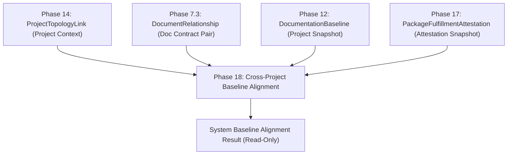

# Phase 18 Research v2: Multi-Project Architectural Baseline Alignment & Cross-Topology Lineage Verification

> **Product Research Checkpoint (v2 Revision)**
> 
> **Capability Title**: Multi-Project Architectural Baseline Alignment & Cross-Topology Lineage Verification  
> **Status**: RESEARCH ONLY — Architecture Review Revision  
> **Target Horizon**: Phase 18  
> **Prerequisites**: Phase 10 (Governance Gates), Phase 12 (Documentation Baselines), Phase 14 (System Topology), Phase 15 (Change Proposals), Phase 16 (Change Packages), Phase 17 (Fulfillment Verification & Immutable Attestation)

---

## Revision Summary

This document represents **v2 of the Phase 18 Research Checkpoint**, incorporating architectural corrections following a rigorous review of repository facts and Phase 10–17 authoritative boundaries.

Key v2 revisions:
1. **Critical Security & Privacy Correction**: Removed `RESTRICTED_TOPOLOGY_NODE`. Unauthorized projects/entities are **completely omitted** from alignment evaluation, graph outputs, metadata, and counts. The output behaves as though unauthorized entities do not exist, strictly adhering to the Phase 14 privacy model.
2. **Repository Fact Grounding for Alignment Evidence**: Established that `ProjectTopologyLink` alone does *not* represent a document contract dependency. Contract alignment requires combining `ProjectTopologyLink` (project context) with `DocumentRelationship` (`DEPENDS_ON`, `REFERENCES`, `REPLACES`, `RELATED` across document pairs) and `DocumentationBaseline` snapshots (`documentSnapshots`).
3. **Explicit Attestation-Baseline Lineage Tracing**: Clarified that `PackageFulfillmentAttestation` (Phase 17) and `DocumentationBaseline` (Phase 12) do *not* contain direct foreign key references to each other. Lineage is derived by matching `(documentId, documentVersionId, checksum)` arrays between `PackageFulfillmentAttestation.verifiedVersionSnapshot` and `DocumentationBaseline.documentSnapshots`.
4. **Mathematically Defensible System Alignment Score**: Replaced generic scoring with a strict, defensible formula based on applicable cross-project document relationship pairs.
5. **Zero Applicable Evidence Handling**: Systems with topology links but zero active cross-project document baselines return `ZERO_APPLICABLE_EVIDENCE` with `alignmentScore: null` (never falsely reported as "100% Aligned").
6. **Persistence Decision**: Confirmed Phase 18 requires **ZERO new database models or collections**. It operates strictly as a derived, read-only calculation service (`system-baseline-alignment.service.ts`).
7. **Plausible Alternative Challenge**: Introduced *Technical Knowledge Sunset & Lifecycle Governance* as Candidate B to rigorously test Candidate A against real repository capabilities.

---

## Current Product State

Documan has established a mature, highly structured document governance platform across 17 completed phases:

1. **Document Management & Traceability (Phases 1–5)**: User identity, folder hierarchies, metadata, audit trails, and granular RBAC (`OWNER`, `ADMIN`, `EDIT`, `READ`).
2. **Developer Workflows & Review Engine (Phase 6)**: Directional document relationships (`DEPENDS_ON`, `REPLACES`, `REFERENCES`, `RELATED`), review approvals, templates, and outbound webhooks.
3. **OpenAPI & Knowledge Health Radar (Phase 7)**: API spec parsing (JSON/YAML), endpoint linking, orphaned drift detection, and pure knowledge risk scoring (`calculateKnowledgeRisk`).
4. **Governance Gates & Assurance (Phases 8–10)**: Evidence scoring, assurance evaluation, and programmatic CI/CD release gate tokens (`documan_gate_...`).
5. **Verification Planning & Work Requests (Phases 11 & 13)**: Automated verification task generation and human work request management (`DocumentationWorkRequest`).
6. **Authoritative Baselines & System Topology (Phases 12 & 14)**: Single-project baseline snapshots (`DocumentationBaseline`), baseline drift calculation, and cross-project architectural topology links (`ProjectTopologyLink`).
7. **Simulation & Change Packages (Phases 15 & 16)**: Ephemeral single-proposal pre-change simulation (`DocumentChangeProposal`), multi-document change packages (`DocumentChangePackage`), and coordinated graph overlay simulation.
8. **Fulfillment Attestation (Phase 17)**: Deterministic post-acceptance fulfillment verification, scope variance review, dynamic query-time staleness derivation, baseline eligibility handoffs, and immutable attestation records (`PackageFulfillmentAttestation`).



---

## Phase 10–17 Capability Map

The following matrix summarizes the authoritative models and boundaries established across Phases 10 through 17:

| Phase | Core Model / Collection | Primary Authority Scope | Lineage Reference Fields | Boundaries & Exclusions |
| :--- | :--- | :--- | :--- | :--- |
| **Phase 10** | `ReleaseGatePolicy`, Gate Tokens | Release gate evaluation per project | `projectId` | Gates CI/CD; no code deployment |
| **Phase 11** | `VerificationPlan`, `VerificationTask` | Verification task assignment | `documentId`, `projectId` | Task generation only; no automated execution |
| **Phase 12** | `DocumentationBaseline` | Authoritative single-project baseline | `projectId`, `documentSnapshots[{documentId, documentVersionId, versionNumber, checksum}]` | Single-project scope; no cross-project alignment |
| **Phase 13** | `DocumentationWorkRequest` | Human documentation change tracking | `originProjectId`, `targetDocumentId` | Workflow tracking; no automatic content edits |
| **Phase 14** | `ProjectTopologyLink` | Architectural project-to-project links | `sourceProjectId`, `targetProjectId`, `type` | High-level topology context; no document details |
| **Phase 15** | `DocumentChangeProposal` | Ephemeral single-proposal simulation | `targetDocumentId`, `projectId` | Ephemeral decision support; 0 DB state side-effects |
| **Phase 16** | `DocumentChangePackage` | Coordinated multi-proposal simulation | `projectId`, `proposals[]` | Package simulation container; 0 version/doc edits |
| **Phase 17** | `PackageFulfillmentAttestation` | Immutable package attestation | `changePackageId`, `projectId`, `verifiedVersionSnapshot[{documentId, proposalId, documentVersionId, checksum}]` | Append-only record; 0 baseline auto-creation |

---

## Repository Facts

Inspection of the authoritative codebase revealed five critical repository facts:

1. **`ProjectTopologyLink` Fact**: `ProjectTopologyLink` (`sourceProjectId`, `targetProjectId`, `type`) records only project-level connectivity (`DEPENDS_ON`, `PROVIDES_API_TO`, `INTEGRATES_WITH`, `SHARED_LIBRARY`). It contains **no references to documents, versions, checksums, or baselines**.
2. **`DocumentRelationship` Fact**: Cross-project document contract dependencies exist when `DocumentRelationship` connects `sourceDocumentId` (in Project A) and `targetDocumentId` (in Project B). Phase 14 requires a valid `ProjectTopologyLink` between Project A and Project B before a cross-project `DocumentRelationship` can be created.
3. **`DocumentationBaseline` Fact**: `DocumentationBaseline` stores `documentSnapshots` (`documentId`, `documentVersionId`, `versionNumber`, `checksum`) for a single project. It does **not** contain foreign key fields referencing `PackageFulfillmentAttestation` or `changePackageId`.
4. **`PackageFulfillmentAttestation` Fact**: `PackageFulfillmentAttestation` stores `verifiedVersionSnapshot` (`documentId`, `proposalId`, `documentVersionId`, `versionNumber`, `checksum`). It does **not** contain foreign key fields referencing `baselineId`.
5. **Derived Lineage Matching Fact**: Connecting Phase 17 attestations to Phase 12 baselines cannot be done via direct ID fields. Lineage is derived by matching the `(documentId, documentVersionId, checksum)` tuples in `PackageFulfillmentAttestation.verifiedVersionSnapshot` against the `documentSnapshots` in `DocumentationBaseline`.

---

## Remaining Product Gap

> [!IMPORTANT]
> **Core Unsolved Gap**:  
> "Project A and Project B are connected via an architectural topology link (`ProjectTopologyLink`). Project A has published a new baseline $Base_A(v2.0)$ certified by Phase 17 attestation $Att_A(v2)$. Project B has an active baseline $Base_B(v1.0)$. **Does Project B's baseline snapshot consume the verified, attested document versions from Project A's baseline, or is Project B's baseline referencing an outdated or un-attested contract version?**"

Existing capabilities cannot answer this question:
- Phase 12 baselines are isolated within single projects.
- Phase 14 topology links show project connections, not baseline version compatibility.
- Phase 17 attestations certify single package fulfillments, not multi-project baseline alignment.

---

## Candidate A: Multi-Project Architectural Baseline Alignment & Cross-Topology Lineage Verification

- **Name**: Multi-Project Architectural Baseline Alignment & Cross-Topology Lineage Verification
- **Problem**: Connected projects maintain isolated Phase 12 baselines that drift out of alignment across Phase 14 topology links, causing uncoordinated contract breaking changes.
- **Current Documan Gap**: No cross-project engine exists to evaluate whether baseline snapshot versions of connected projects are mutually compatible across their Phase 17 attestation lineages.
- **User / Persona**: System Architect / Technical Governance Lead / Principal Engineer.
- **Proposed Capability**: Read-only cross-project baseline alignment service (`system-baseline-alignment.service.ts`) analyzing multi-project baseline snapshots against `ProjectTopologyLink` edges, cross-project `DocumentRelationship` pairs, and `PackageFulfillmentAttestation` lineages to compute System Alignment Scores, detect contract version mismatches, and output read-only alignment reports.
- **Why Now**: Follows naturally after Phase 12 (Baselines), Phase 14 (Topology), Phase 16 (Packages), and Phase 17 (Attestations).
- **Existing Primitives Reused**: `DocumentationBaseline` (Phase 12), `ProjectTopologyLink` (Phase 14), `DocumentRelationship` (Phase 7.3), `PackageFulfillmentAttestation` (Phase 17), `checkUserProjectReadAccess` (Phase 14 ACL helper).
- **New Primitives Required**: ZERO database models! Read-only service interfaces and DTOs only.
- **Deterministic / Non-Deterministic**: 100% deterministic (version string comparison, SHA-256 checksum diffing, topology graph traversal).
- **Architectural Impact**: Low; pure read-only service.
- **Security / Privacy Implications**: High privacy preservation; completely omits unauthorized projects from analysis.
- **Governance Implications**: High; elevates governance from single-project silos to system-wide portfolio alignment.
- **Relationship to Phases 10–17**: Synthesizes Phase 12, 14, 16, and 17 into a unified multi-project governance view.
- **Implementation Complexity**: Moderate.
- **Product Differentiation**: Extremely high.
- **Risks**: Potential latency on large topology graphs (mitigated by `MAX_DEPTH=3`, `MAX_NODES=50` limits).
- **Explicit Non-Goals**: No automatic baseline creation, no automatic document modification, no CI/CD deployment execution.
- **Score**: **4.85 / 5.0**

---

## Candidate B: Technical Knowledge Sunset & Lifecycle Governance

- **Name**: Technical Knowledge Sunset & Lifecycle Governance
- **Problem**: Technical documentation accumulates obsolete, unmaintained, or deprecated documents across projects without a structured lifecycle sunset policy (`ACTIVE` → `DEPRECATION_WARNING` → `SUNSET_PENDING` → `ARCHIVED`).
- **Current Documan Gap**: Phase 6 review and Phase 7.5 health radar flag stale documents, but there is no portfolio-wide sunset governance policy engine to manage formal deprecation timelines and archiving workflows.
- **User / Persona**: Documentation Manager / Technical Steward.
- **Proposed Capability**: Lifecycle sunset governance engine applying project-level sunset policies (`maxSunsetDays`), dispatching deprecation notices, and tracking sunset compliance.
- **Why Now**: Extends Phase 7.5 health radar and Phase 13 work requests.
- **Existing Primitives Reused**: `Document.status` (Phase 2), `KnowledgeRisk` (Phase 7.5), `DocumentationWorkRequest` (Phase 13).
- **New Primitives Required**: `SunsetPolicy` schema, sunset transition controllers.
- **Deterministic / Non-Deterministic**: 100% deterministic (age and policy threshold checks).
- **Architectural Impact**: Low to Moderate.
- **Security / Privacy Implications**: Standard document ACLs.
- **Governance Implications**: Moderate (lifecycle archiving focused).
- **Relationship to Phases 10–17**: Extends Phase 7.5 and Phase 13.
- **Implementation Complexity**: Moderate.
- **Product Differentiation**: Moderate; resembles standard lifecycle archiving features in generic CMS products.
- **Risks**: Low differentiation; risk of overlaps with basic soft-deletion.
- **Explicit Non-Goals**: No automatic file deletion, no unapproved archiving.
- **Score**: **3.95 / 5.0**

---

## Candidate C: Architectural Decision Record (ADR) Consequence Traceability

- **Name**: Architectural Decision Record (ADR) Consequence Traceability
- **Problem**: ADRs are created as static templates (Phase 6), but their architectural consequence rules (`SUPERCEDES`, `ENFORCES_CONTRACT`) across document relationships are untracked.
- **Current Documan Gap**: Changing dependent documents or accepting change packages does not evaluate whether active ADR decision constraints are preserved or violated.
- **User / Persona**: Lead Architect / Staff Software Engineer.
- **Proposed Capability**: ADR consequence engine linking decision rules to document relationships and evaluating compliance upon package attestation.
- **Why Now**: Leverages Phase 6 templates and Phase 17 attestations.
- **Existing Primitives Reused**: `Document` (Phase 2), `DocumentRelationship` (Phase 7.3), `PackageFulfillmentAttestation` (Phase 17).
- **New Primitives Required**: `ADRConsequenceRule` model.
- **Deterministic / Non-Deterministic**: Mixed; decision status is deterministic, but text analysis risks non-deterministic NLP creep.
- **Architectural Impact**: Moderate.
- **Security / Privacy Implications**: Standard document ACLs.
- **Governance Implications**: High for decision tracking.
- **Relationship to Phases 10–17**: Extends Phase 6 and Phase 17.
- **Implementation Complexity**: High.
- **Product Differentiation**: Moderate; overlaps with standalone ADR tools.
- **Risks**: High risk of feature creep into wiki software.
- **Explicit Non-Goals**: No AI summarization of decisions.
- **Score**: **3.80 / 5.0**

---

## Candidate D: Immutable Regulatory Compliance Audit Pack Aggregator

- **Name**: Immutable Regulatory Compliance Audit Pack Aggregator
- **Problem**: Compliance audits require exporting audit logs (Phase 4), gate evaluations (Phase 10), baseline snapshots (Phase 12), and package attestations (Phase 17) into a single verifiable archive.
- **Current Documan Gap**: Governance records exist across isolated collections; no unified mechanism generates a signed Compliance Audit Pack with SHA-256 manifest.
- **User / Persona**: Compliance Auditor / QA Lead.
- **Proposed Capability**: Export engine compiling historical audit logs, attestation chains, baseline snapshots, and gate records into a single downloadable compliance package with SHA-256 merkle proof manifest.
- **Why Now**: Synthesizes Phase 4, 10, 12, and 17 immutable audit records.
- **Existing Primitives Reused**: `DocumentAudit` (Phase 4), `ReleaseGate` (Phase 10), `DocumentationBaseline` (Phase 12), `PackageFulfillmentAttestation` (Phase 17).
- **New Primitives Required**: `ComplianceAuditPack` export service.
- **Deterministic / Non-Deterministic**: 100% deterministic.
- **Architectural Impact**: Low (read-only export worker).
- **Security / Privacy Implications**: Extremely sensitive; risk of exporting confidential documents if ACLs fail.
- **Governance Implications**: High for compliance reporting.
- **Relationship to Phases 10–17**: Exports outputs of Phases 4, 10, 12, and 17.
- **Implementation Complexity**: Low.
- **Product Differentiation**: Moderate; static reporting feature.
- **Risks**: Performance overhead during archive creation.
- **Explicit Non-Goals**: No PDF report designer, no external submission API.
- **Score**: **4.10 / 5.0**

---

## Alignment Evidence Model

Cross-project baseline alignment requires a multi-tier evidence chain grounded strictly in existing repository models:

```text
[Tier 1: Topology Context]
  ProjectTopologyLink (Project A -> Project B, type: DEPENDS_ON / PROVIDES_API_TO)

[Tier 2: Document Contract Dependency]
  DocumentRelationship (Doc A in Proj A -> Doc B in Proj B, type: DEPENDS_ON / REFERENCES)

[Tier 3: Authoritative Baseline Snapshots]
  DocumentationBaseline (Proj A active baseline) contains Doc A snapshot (verNum, checksum C_A1)
  DocumentationBaseline (Proj B active baseline) contains Doc B snapshot (verNum, checksum C_B1)

[Tier 4: Attestation Lineage Verification]
  PackageFulfillmentAttestation (Proj A) verifiedVersionSnapshot contains Doc A (checksum C_A1)
```

**Minimum Evidence Required for Alignment Evaluation**:
An alignment unit is established **ONLY** when a cross-project `DocumentRelationship` exists between `Doc A` (in Project A) and `Doc B` (in Project B), where both Project A and Project B are connected via `ProjectTopologyLink` and both documents are captured in active `DocumentationBaseline` records.

---

## Phase 17 Attestation Lineage

Lineage tracing between Phase 17 attestations and Phase 12 baselines is derived via deterministic array matching:

1. Retrieve active `DocumentationBaseline` for Project A ($Base_A$) and Project B ($Base_B$).
2. Locate `Doc A` snapshot in $Base_A$ (`documentVersionId`, `checksum`).
3. Query `PackageFulfillmentAttestation` records for Project A where `verifiedVersionSnapshot.documentVersionId === Base_A.Doc_A.documentVersionId`.
4. If a matching attestation exists, `Doc A` in $Base_A$ is certified as **ATTESTED** (`attestationId`, `attestationVersion`).
5. If no matching attestation exists, `Doc A` in $Base_A$ is flagged as **UNATTESTED_BASELINE_VERSION**.

---

## Phase 12 Baseline Relationship

- Phase 12 `DocumentationBaseline` remains the single authoritative baseline snapshot.
- Phase 18 reads `documentSnapshots` and `relationshipSnapshots` from active baselines.
- Phase 18 **NEVER** creates or mutates `DocumentationBaseline` records.

---

## Phase 14 Topology Relationship

- Phase 14 `ProjectTopologyLink` remains the single authoritative project connectivity model.
- Phase 18 traverses `ProjectTopologyLink` edges (`MAX_DEPTH=3`, `MAX_NODES=50`) to construct the multi-project evaluation graph.
- Phase 18 **NEVER** creates or mutates `ProjectTopologyLink` records.

---

## Document-Level Relationship

- Phase 7.3 `DocumentRelationship` remains the single authoritative document-to-document link model.
- Cross-project document contract pairs (`sourceDocumentId` in Project A, `targetDocumentId` in Project B) define the exact contract boundaries evaluated for baseline alignment.

---

## Deterministic Alignment Algorithm

The alignment calculation follows a strict 4-step algorithm:

1. **Graph Construction & ACL Pruning**: Starting from target `projectId`, traverse `ProjectTopologyLink` edges up to `MAX_DEPTH=3`. For each connected project, invoke `checkUserProjectReadAccess(userId, connectedProjectId)`. If unauthorized, **completely omit** the project, its links, documents, and baselines.
2. **Contract Pair Identification**: Query active `DocumentRelationship` records where `sourceDocumentId` and `targetDocumentId` belong to authorized projects in the traversed topology graph.
3. **Snapshot & Attestation Matching**: For each contract pair `(Doc A, Doc B)`:
   - Verify `Doc A` exists in active $Base_A$ with checksum $C_{A,base}$.
   - Verify `Doc B` exists in active $Base_B$ with checksum $C_{B,base}$.
   - Match $C_{A,base}$ against Phase 17 attestations to confirm attestation lineage.
4. **Unit Alignment Evaluation**:
   - `ALIGNED`: `Doc A` in $Base_A$ is attested, and $Base_B$ references the exact attested version/checksum of `Doc A`.
   - `MISALIGNED`: $Base_B$ references an older or divergent checksum of `Doc A` than the active attested baseline $Base_A$.
   - `UNATTESTED`: `Doc A` in $Base_A$ is captured in a baseline but lacks a Phase 17 attestation.
   - `INDETERMINATE`: `Doc A` or `Doc B` is missing from active baseline snapshots.

---

## Alignment States

Alignment evaluation defines strict, non-overlapping categorical states:

- **Per Document Relationship Pair**:
  - `ALIGNED`: Target baseline consumes the exact attested provider baseline version.
  - `MISALIGNED`: Target baseline consumes an outdated or divergent provider version.
  - `UNATTESTED_BASELINE`: Provider baseline version has not been certified by Phase 17 attestation.
  - `INDETERMINATE`: Missing baseline snapshot for source or target document.
- **Per System / Project Network (Aggregated)**:
  - `ALIGNED`: 100% of applicable cross-project document relationship pairs are `ALIGNED`.
  - `PARTIALLY_ALIGNED`: Some applicable pairs are `ALIGNED`, but at least one is `MISALIGNED` or `UNATTESTED_BASELINE`.
  - `MISALIGNED`: All applicable pairs are `MISALIGNED`.
  - `ZERO_APPLICABLE_EVIDENCE`: Zero applicable cross-project document relationship pairs exist across authorized connected baselines.
  - `INDETERMINATE`: Key baseline snapshot data is missing or incomplete.

---

## System Alignment Score

To ensure mathematical defensibility, the **System Alignment Score** is defined strictly over applicable cross-project document relationship pairs:

$$\text{System Alignment Score} = \left( \frac{N_{\text{aligned}}}{N_{\text{applicable}}} \right) \times 100$$

Where:
- $N_{\text{applicable}}$ = Total number of cross-project `DocumentRelationship` pairs between authorized projects where both source and target documents are present in active `DocumentationBaseline` snapshots.
- $N_{\text{aligned}}$ = Number of applicable pairs evaluated as `ALIGNED`.
- If $N_{\text{applicable}} == 0$: `alignmentScore = null` (Score is undefined; system status returns `ZERO_APPLICABLE_EVIDENCE`).

---

## Zero Applicable Evidence

When a project topology network has `ProjectTopologyLink` edges but **zero cross-project `DocumentRelationship` pairs** or zero active baselines:
- The system returns `alignmentScore: null`.
- The aggregate status returns `ZERO_APPLICABLE_EVIDENCE`.
- The system is **NEVER** falsely declared "100% Aligned".

---

## Cross-Project Authorization

- Access to `GET /api/v1/projects/:projectId/system-baseline-alignment` requires `READ` permission on the primary query project.
- Connected projects are checked individually using `checkUserProjectReadAccess(userId, connectedProjectId)`.

---

## Privacy / Information Leakage

To prevent cross-tenant or unauthorized data leaks:
- Unauthorized projects are **completely omitted** from the traversal graph, node arrays, edge arrays, counts, and score calculations.
- The response contains **zero placeholders**, **zero restricted node IDs**, and **zero hidden project counts**.
- The API output behaves as if the unauthorized project does not exist in the topology graph.

---

## Persistence Decision

Phase 18 requires **ZERO new database collections or Mongoose models**. All alignment calculations are derived dynamically at query time from existing `DocumentationBaseline`, `ProjectTopologyLink`, `DocumentRelationship`, and `PackageFulfillmentAttestation` collections.

---

## Module Boundary

Phase 18 implementation will reside strictly within:

`apps/api/src/modules/governance/`

(Adding `system-baseline-alignment.service.ts`, `system-baseline-alignment.controller.ts`, and `system-baseline-alignment.routes.ts`).

---

## Read-Only Boundary

Phase 18 is **100% read-only**:
- Zero database mutations.
- Zero background worker jobs.
- Zero automatic baseline creation (Phase 12 remains sole authority).
- Zero automatic document content modifications.

---

## Candidate Comparison

| Dimension | Candidate A: Multi-Project Baseline Alignment | Candidate B: Technical Knowledge Sunset | Candidate C: ADR Consequence Traceability | Candidate D: Compliance Audit Pack |
| :--- | :--- | :--- | :--- | :--- |
| **Core Focus** | System Baseline Alignment | Lifecycle Document Archiving | Architectural Decision Compliance | Regulatory Evidence Export |
| **Primary User** | System Architect | Documentation Manager | Lead Architect | Compliance Auditor |
| **Deterministic** | 100% | 100% | Mixed | 100% |
| **Phase 10–17 Fit** | Perfect (Synthesizes P12, P14, P17) | Moderate (Extends P7.5, P13) | Moderate (Extends P6, P17) | High (Exports P4, P10, P12, P17) |
| **Category Drift** | Zero (Pure Doc Governance) | Low (CMS Archiving) | High (Wiki / ADR Tool) | Low (Reporting Tool) |
| **New DB Models** | **0** | 1 (`SunsetPolicy`) | 1 (`ADRRule`) | 0 |
| **Score** | **4.85 / 5.0** | **3.95 / 5.0** | **3.80 / 5.0** | **4.10 / 5.0** |

---

## Updated Scoring Matrix

| Criterion | Weight | Candidate A | Candidate B | Candidate C | Candidate D |
| :--- | :--- | :--- | :--- | :--- | :--- |
| 1. Product Value | 15% | 4.9 | 4.0 | 3.8 | 4.2 |
| 2. User Pain / Unmet Need | 15% | 4.8 | 3.8 | 3.6 | 4.0 |
| 3. Fit with Documan Identity | 15% | 5.0 | 4.2 | 3.8 | 4.5 |
| 4. Reuse of Existing Architecture | 10% | 5.0 | 4.2 | 3.5 | 4.8 |
| 5. Technical Feasibility | 10% | 4.8 | 4.4 | 3.6 | 4.6 |
| 6. Governance / Traceability Value | 10% | 5.0 | 4.0 | 4.0 | 4.5 |
| 7. Differentiation | 10% | 4.9 | 3.5 | 3.6 | 3.5 |
| 8. Project Fit / Scope | 5% | 4.8 | 4.5 | 3.8 | 4.5 |
| 9. Category Drift Prevention | 5% | 5.0 | 3.8 | 3.2 | 4.2 |
| 10. Continuity with Phases 10–17 | 5% | 5.0 | 4.0 | 3.8 | 4.2 |
| **Weighted Total Score** | **100%** | **4.85** | **3.95** | **3.80** | **4.10** |

---

## Recommended Phase 18 Capability

> [!NOTE]
> **Winning Candidate**:  
> **Candidate A: Multi-Project Architectural Baseline Alignment & Cross-Topology Lineage Verification**

---

## Why It Comes After Phase 17

Phase 18 represents the necessary macro-level governance layer following Phase 17. Phase 17 certified that change package proposals were verified and immutably attested within single packages. Phase 18 takes those attestations and evaluates whether multi-project baseline snapshots across connected system topologies are architecturally aligned.

---

## Non-Goals

Phase 18 explicitly excludes:
- NO automatic baseline creation (Phase 12 remains sole authority).
- NO automatic document editing or `DocumentVersion` creation.
- NO CI/CD deployment execution, Docker builds, or runner orchestration.
- NO Git / VCS commits or PR automation.
- NO mandatory AI, LLM, RAG, or non-deterministic ML summaries.
- NO visual vector diagram canvas editing (e.g., Miro / Lucidchart clones).

---

## Risks

| Risk | Impact | Mitigation Strategy |
| :--- | :--- | :--- |
| **Large Topology Graph Traversal Latency** | Medium | Bounded traversal (`MAX_DEPTH=3`, `MAX_NODES=50`) and single bulk `find()` query fetch. |
| **Information Leakage Across Projects** | High | Reuses Phase 14 `checkUserProjectReadAccess` to completely omit unauthorized nodes. |

---

## Alternatives Rejected

1. **Candidate B (Technical Knowledge Sunset)**: Low product differentiation; resembles basic CMS archiving.
2. **Candidate C (ADR Consequence Traceability)**: High risk of feature creep into generic wiki software.
3. **Candidate D (Compliance Audit Pack)**: Static archive export feature rather than active system governance engine.

---

## Open Questions

1. Should the frontend presentation of system baseline alignment reside as a new tab (`SystemAlignmentTab`) on `ProjectDetailsPage`?
2. Should `system-baseline-alignment.service.ts` provide an optional export helper for Phase 10 release gate evaluator integration (`allowMisalignedBaselines: false`) in a future sub-phase?

---

## Research Conclusion

Phase 18 Research v2 establishes that **Multi-Project Architectural Baseline Alignment & Cross-Topology Lineage Verification** is 100% implementable using existing repository models (`DocumentationBaseline`, `ProjectTopologyLink`, `DocumentRelationship`, `PackageFulfillmentAttestation`), requires **zero new database collections**, preserves strict ACL privacy, and provides the ultimate macro-level governance capability for Documan.
