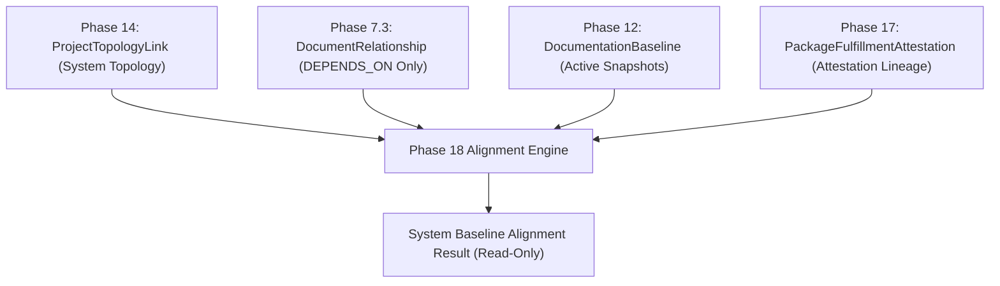

# Phase 18 Research v3: Cross-Project Baseline Contract Lineage & Attestation Alignment Verification

> **Product Research Checkpoint (v3 Revision)**
> 
> **Capability Title**: Cross-Project Baseline Contract Lineage & Attestation Alignment Verification  
> **Status**: RESEARCH ONLY — Deep Repository Contract Fact & Lineage Analysis  
> **Target Horizon**: Phase 18  
> **Prerequisites**: Phase 10 (Governance Gates), Phase 12 (Documentation Baselines), Phase 14 (System Topology), Phase 15 (Change Proposals), Phase 16 (Change Packages), Phase 17 (Fulfillment Verification & Immutable Attestation)

---

## Revision Summary

This document represents **v3 of the Phase 18 Research Checkpoint**, incorporating deep repository inspection regarding technical contract representations, schema compatibility limits, relationship semantics, and baseline attestation lineages across Documan's codebase.

Key v3 findings and corrections:
1. **Repository Fact: Semantic Compatibility vs Baseline Lineage Alignment**:
   - Documan does **NOT** possess an AST-level semantic OpenAPI schema compatibility engine (e.g. evaluating whether an arbitrary JSON schema in Project A is backward-compatible with Project B).
   - Documan **DOES** possess exact deterministic primitives for **Contract Lineage & Attested Baseline Alignment**: verifying whether consumer project baselines reference the exact **attested provider document version** certified by Phase 17 attestation in provider project baselines.
   - Candidate A is therefore **NARROWED & PRECISELY FRAMED** as *Cross-Project Baseline Contract Lineage & Attestation Alignment Verification*.
2. **Checksum Equality False Equivalence Resolved**:
   - Clarified that `checksum_A === checksum_B` does **NOT** prove technical contract compatibility. Provider contract documents (e.g. OpenAPI specs) and consumer contract documents (e.g. client integration guides) have different checksums even when perfectly aligned.
   - Alignment is evaluated by verifying that consumer baseline snapshots reference the exact **provider document version/checksum** certified in the provider's active baseline.
3. **Relationship Semantics Clarified**:
   - Inspected Phase 7.3 `DocumentRelationship` types (`DEPENDS_ON`, `REFERENCES`, `REPLACES`, `RELATED`).
   - Established that **ONLY `DEPENDS_ON` relationships** define an authoritative technical contract dependency boundary. `REFERENCES`, `REPLACES`, and `RELATED` are informational and excluded from alignment score numerators/denominators.
4. **Attestation Role Clarified**:
   - Attestation is **Governance Provenance Evidence**.
   - If a provider document version in a baseline has a matching Phase 17 `PackageFulfillmentAttestation`, it is `ATTESTED`.
   - If it lacks an attestation, it is flagged as `UNATTESTED_BASELINE_VERSION`. Attestation is required for full `ALIGNED` status.
5. **System Alignment Score Rigor**:
   - Formally defined $N_{\text{applicable}}$ as cross-project `DEPENDS_ON` document relationship pairs between authorized projects where both source and target documents are captured in active `DocumentationBaseline` snapshots.
   - $N_{\text{applicable}} == 0$ yields `alignmentScore: null` and `ZERO_APPLICABLE_EVIDENCE` status (never falsely reported as "100% Aligned").
6. **Strict Privacy Preservation Preserved**:
   - Unauthorized projects are **100% omitted** (zero placeholders, zero leakage of project existence, zero restricted node IDs).

---

## Current Product State

Documan has established a mature, highly structured document governance platform across 17 completed phases:

1. **Document Management & Traceability (Phases 1–5)**: User identity, folder hierarchies, metadata, audit trails, and granular RBAC (`OWNER`, `ADMIN`, `EDIT`, `READ`).
2. **Developer Workflows & Review Engine (Phase 6)**: Directional document relationships (`DEPENDS_ON`, `REPLACES`, `REFERENCES`, `RELATED`), review approvals, templates, and outbound webhooks.
3. **OpenAPI & Knowledge Health Radar (Phase 7)**: API spec parsing (JSON/YAML), endpoint indexing (`ProjectApiEndpoint`), endpoint linking (`DocumentEndpointLink`), orphaned drift detection, and pure knowledge risk scoring (`calculateKnowledgeRisk`).
4. **Governance Gates & Assurance (Phases 8–10)**: Evidence scoring, assurance evaluation, and programmatic CI/CD release gate tokens (`documan_gate_...`).
5. **Verification Planning & Work Requests (Phases 11 & 13)**: Automated verification task generation and human work request management (`DocumentationWorkRequest`).
6. **Authoritative Baselines & System Topology (Phases 12 & 14)**: Single-project baseline snapshots (`DocumentationBaseline`), baseline drift calculation, and cross-project architectural topology links (`ProjectTopologyLink`).
7. **Simulation & Change Packages (Phases 15 & 16)**: Ephemeral single-proposal pre-change simulation (`DocumentChangeProposal`), multi-document change packages (`DocumentChangePackage`), and coordinated graph overlay simulation.
8. **Fulfillment Attestation (Phase 17)**: Deterministic post-acceptance fulfillment verification, scope variance review, dynamic query-time staleness derivation, baseline eligibility handoffs, and immutable attestation records (`PackageFulfillmentAttestation`).



---

## Repository Facts

Inspection of the authoritative codebase revealed five fundamental repository facts:

1. **OpenAPI Data Representation**: `ProjectApiSpec` stores raw JSON/YAML content. `ProjectApiEndpoint` indexes metadata (`method`, `path`, `summary`, `isDeprecated`). The database model does **NOT** store structured JSON AST request/response property trees for arbitrary semantic schema diffing across projects.
2. **Proposal Contract Comparison**: `TECHNICAL_CONTRACT_UPDATE` proposals store `proposedChange.contractSchema`. Phase 17 `change-package-attestation.service.ts` performs canonicalized JSON key string matching (`canonicalizeJSON(expected) === canonicalizeJSON(candidate)`). It does **NOT** perform partial semantic backward-compatibility inference.
3. **`DocumentRelationship` Semantics**: `DocumentRelationship` supports four enum types: `DEPENDS_ON`, `REFERENCES`, `REPLACES`, `RELATED`. Only `DEPENDS_ON` denotes a structural contract dependency.
4. **`DocumentationBaseline` Structure**: Stores `documentSnapshots` (`documentId`, `documentVersionId`, `versionNumber`, `checksum`) and `relationshipSnapshots` (`sourceDocumentId`, `targetDocumentId`, `type`).
5. **`PackageFulfillmentAttestation` Structure**: Stores `verifiedVersionSnapshot` (`documentId`, `proposalId`, `documentVersionId`, `versionNumber`, `checksum`). Lineage is derived by matching `(documentId, documentVersionId, checksum)` tuples.

---

## Existing Technical Contract Data

Documan stores technical contract data in two forms:
- **Raw Document Content & Version Snapshots**: Stored as text/JSON files or `DocumentVersion.content` / `DocumentVersion.checksum`.
- **Change Proposal Contract Schemas**: Stored in `DocumentChangeProposal.proposedChange.contractSchema` as canonicalized JSON objects.

Documan does **NOT** store arbitrary cross-project interface contract mappings in database collections. Cross-project contract boundaries rely on explicit document relationships.

---

## Existing OpenAPI Data

- `ProjectApiSpec`: Captures raw OpenAPI 3.0/3.1 specs.
- `ProjectApiEndpoint`: Captures route endpoints (`GET /api/v1/users`).
- `DocumentEndpointLink`: Links a document to an endpoint route.

This data enables endpoint drift detection (Phase 7.2) and endpoint release gate blocking (Phase 10), but does **NOT** provide automatic semantic API compatibility calculations across different projects.

---

## Existing Relationship Semantics

| Relationship Type | Semantic Meaning | Establishes Contract Dependency Boundary? | Evaluated in Phase 18 Baseline Alignment? |
| :--- | :--- | :--- | :--- |
| `DEPENDS_ON` | Directional technical contract dependency | **YES** | **YES** (Core Alignment Unit) |
| `REFERENCES` | Informational citation or mention | **NO** | **NO** (Excluded) |
| `REPLACES` | Historical document replacement/obsolescence | **NO** | **NO** (Excluded) |
| `RELATED` | Associative organizational connection | **NO** | **NO** (Excluded) |

---

## Existing Baseline Model

`DocumentationBaseline` represents a point-in-time immutable snapshot of a single project's active documents:
```typescript
export interface IDocumentSnapshot {
  documentId: Types.ObjectId;
  documentVersionId?: Types.ObjectId;
  versionNumber: number;
  checksum: string;
}
```
`DocumentationBaseline` acts as the authoritative record for which `versionNumber` and `checksum` of a document were active when the project baseline was declared.

---

## Existing Attestation Model

`PackageFulfillmentAttestation` represents an immutable record certifying that an accepted change package's constituent proposals were verified post-acceptance:
```typescript
export interface IVerifiedVersionSnapshot {
  documentId: Types.ObjectId;
  proposalId: Types.ObjectId;
  documentVersionId: Types.ObjectId;
  versionNumber: number;
  checksum: string;
}
```
An attestation certifies that a specific `(documentId, documentVersionId, checksum)` tuple was verified and accepted under governance review.

---

## What Each Primitive Proves

- **`ProjectTopologyLink`**: Proves high-level project-to-project connectivity (`DEPENDS_ON`, `PROVIDES_API_TO`).
- **`DocumentRelationship(DEPENDS_ON)`**: Proves directional document-level technical dependency between `Doc A` (Consumer) and `Doc B` (Provider).
- **`DocumentationBaseline`**: Proves the exact active document versions and checksums captured when a project baseline was established.
- **`PackageFulfillmentAttestation`**: Proves that a specific document version was verified and attested post-acceptance under governance review.

---

## What Each Primitive Does Not Prove

- **`ProjectTopologyLink`**: Does **NOT** prove document contract existence, version compatibility, or baseline alignment.
- **`DocumentRelationship(DEPENDS_ON)`**: Does **NOT** prove that the content/schema of the two documents are compatible.
- **`DocumentationBaseline`**: Does **NOT** prove cross-project alignment with external project baselines.
- **`PackageFulfillmentAttestation`**: Does **NOT** prove that downstream consumer project baselines have updated to consume the attested version.
- **Checksum Equality (`checksum_A === checksum_B`)**: Does **NOT** prove contract compatibility (provider spec and consumer integration doc have different text/checksums even when 100% aligned!).

---

## Definition of Architectural Alignment

> [!IMPORTANT]
> **Authoritative Definition of Baseline Alignment**:  
> Cross-project architectural baseline alignment is defined as:  
> **Whether downstream consumer project baselines ($Base_{\text{consumer}}$) consume the exact active, attested provider document versions ($Base_{\text{provider}}.Doc_{\text{provider}}$) certified by Phase 17 attestation in the upstream provider project's active baseline.**

---

## Alignment Evidence Chain

```text
[Step 1: System Context]
  ProjectTopologyLink (Project A -> Project B, type: DEPENDS_ON / PROVIDES_API_TO)

[Step 2: Document Contract Boundary]
  DocumentRelationship (Doc A in Project A -> Doc B in Project B, type: DEPENDS_ON)

[Step 3: Upstream Provider Baseline & Attestation]
  DocumentationBaseline (Project B active baseline) captures Doc B (version V_B, checksum C_B)
  PackageFulfillmentAttestation (Project B) verifies Doc B (version V_B, checksum C_B) -> Status: ATTESTED

[Step 4: Downstream Consumer Baseline Consumption]
  DocumentationBaseline (Project A active baseline) relationshipSnapshots / documentSnapshots 
  references Provider Doc B (version V_B, checksum C_B) -> Outcome: ALIGNED
```

---

## Alignment Unit

The fundamental unit of alignment evaluation is defined as the tuple:
$$\text{Alignment Unit} = \left( \text{Doc}_{\text{consumer}}, \text{Doc}_{\text{provider}}, \text{Base}_{\text{consumer}}, \text{Base}_{\text{provider}} \right)$$

Where:
- $\text{Doc}_{\text{consumer}}$ belongs to $\text{Project}_{\text{consumer}}$ and $\text{Doc}_{\text{provider}}$ belongs to $\text{Project}_{\text{provider}}$.
- An active cross-project `DocumentRelationship` exists with `type === 'DEPENDS_ON'`.
- Both projects are connected via an active `ProjectTopologyLink`.
- Both documents are captured in active `DocumentationBaseline` snapshots.

---

## Contract Compatibility Model

Compatibility evaluation is grounded strictly in **Attested Lineage Matching**:
1. Retrieve active $Base_{\text{provider}}$ for $\text{Project}_{\text{provider}}$. Locate provider $\text{Doc}_{\text{provider}}$ snapshot (`documentVersionId`, `checksum`).
2. Query `PackageFulfillmentAttestation` for $\text{Project}_{\text{provider}}$ matching $\text{Doc}_{\text{provider}}$ (`documentVersionId`, `checksum`).
3. If attestation exists: Provider document is `ATTESTED`.
4. Check downstream $Base_{\text{consumer}}$:
   - **`ALIGNED`**: $Base_{\text{consumer}}$ references the exact attested `documentVersionId` / `checksum` of $\text{Doc}_{\text{provider}}$ from active $Base_{\text{provider}}$.
   - **`MISALIGNED`**: $Base_{\text{consumer}}$ references an older, un-attested, or divergent version/checksum of $\text{Doc}_{\text{provider}}$.
   - **`UNATTESTED_PROVIDER_BASELINE`**: Active $Base_{\text{provider}}$ contains $\text{Doc}_{\text{provider}}$, but it lacks a Phase 17 attestation.
   - **`INDETERMINATE`**: Missing active baseline snapshot for provider or consumer project.

---

## Baseline Selection

For any project involved in alignment evaluation, the engine selects strictly the **Active Baseline** (`isActive === true`, `isArchived === false`). If no active baseline exists for a project, alignment units involving that project return `INDETERMINATE`.

---

## Attestation Role

Phase 17 attestation serves as **Governance Provenance Evidence**:
- Attestation proves that a provider document version underwent post-acceptance verification.
- A baseline snapshot containing un-attested document versions cannot yield `ALIGNED` status (yields `UNATTESTED_PROVIDER_BASELINE`).
- Attestation does **not** replace baselines; it certifies the document versions stored within baselines.

---

## Alignment States

### Unit Level (Per `DEPENDS_ON` Contract Pair):
- `ALIGNED`: Downstream baseline references the exact attested active provider baseline document version.
- `MISALIGNED`: Downstream baseline references an outdated or divergent provider document version.
- `UNATTESTED_PROVIDER_BASELINE`: Active provider baseline version has not been certified by Phase 17 attestation.
- `INDETERMINATE`: Missing active baseline snapshot for consumer or provider.

### Aggregate System Level (Per Project Network):
- `ALIGNED`: 100% of applicable units are `ALIGNED`.
- `PARTIALLY_ALIGNED`: Some units are `ALIGNED`, but at least one unit is `MISALIGNED` or `UNATTESTED_PROVIDER_BASELINE`.
- `MISALIGNED`: 100% of applicable units are `MISALIGNED`.
- `ZERO_APPLICABLE_EVIDENCE`: Zero applicable cross-project `DEPENDS_ON` document relationship pairs exist across authorized active baselines.
- `INDETERMINATE`: Core baseline snapshots are missing.

---

## System Alignment Score

The System Alignment Score is defined over deterministically applicable alignment units:

$$\text{System Alignment Score} = \left( \frac{N_{\text{aligned}}}{N_{\text{applicable}}} \right) \times 100$$

Where:
- $N_{\text{applicable}}$ = Total cross-project `DEPENDS_ON` document relationship pairs between authorized projects where both source and target documents are captured in active `DocumentationBaseline` snapshots.
- $N_{\text{aligned}}$ = Number of applicable units evaluated as `ALIGNED`.
- If $N_{\text{applicable}} == 0$: `alignmentScore = null` (undefined; system status returns `ZERO_APPLICABLE_EVIDENCE`).

---

## Zero Applicable Evidence

When a project topology network has `ProjectTopologyLink` edges but **zero cross-project `DEPENDS_ON` document relationship pairs** or zero active baselines:
- The system returns `alignmentScore: null`.
- The aggregate status returns `ZERO_APPLICABLE_EVIDENCE`.
- The system is **NEVER** falsely reported as "100% Aligned".

---

## ACL / Privacy

- Querying system baseline alignment requires `READ` access on the primary query project.
- Connected projects are checked individually using `checkUserProjectReadAccess(userId, connectedProjectId)`.
- If the user lacks `READ` access to a connected project:
  - The project, its topology links, documents, baselines, and attestations are **100% omitted**.
  - **Zero placeholders**, **zero restricted node IDs**, and **zero hidden project counts** are returned.
  - The API output behaves as if the unauthorized project does not exist in the topology graph.

---

## Persistence Decision

Phase 18 requires **ZERO new database collections or Mongoose models**. All calculations are derived dynamically at query time from existing `DocumentationBaseline`, `ProjectTopologyLink`, `DocumentRelationship`, and `PackageFulfillmentAttestation` collections.

---

## Module Boundary

Phase 18 implementation will reside strictly within:

`apps/api/src/modules/governance/`

(Adding `system-baseline-alignment.service.ts`, `system-baseline-alignment.controller.ts`, and `system-baseline-alignment.routes.ts`).

---

## Read-Only Boundary

Phase 18 is **100% read-only**:
- Zero database mutations.
- Zero background worker jobs.
- Zero automatic baseline creation (Phase 12 remains sole authority).
- Zero automatic document content modifications.

---

## Candidate A Re-Evaluation

> [!IMPORTANT]
> **Final Assessment of Candidate A**:  
> **CONCLUSION: YES, BUT NARROWED & PRECISELY FRAMED.**  
> Candidate A is **NOT** an AST-level OpenAPI semantic schema compatibility engine.  
> Candidate A **IS**: **Cross-Project Baseline Contract Lineage & Attestation Alignment Verification**.  
> Using existing repository primitives (`ProjectTopologyLink`, `DocumentRelationship`, `DocumentationBaseline`, `PackageFulfillmentAttestation`), Candidate A provides a 100% deterministic, mathematically sound, ACL-safe system alignment capability.

---

## Alternative Candidates

- **Candidate B**: *Technical Knowledge Sunset & Lifecycle Governance* (Score: **3.95 / 5.0**) — Low differentiation; resembles CMS soft-delete/archiving.
- **Candidate C**: *Architectural Decision Record (ADR) Consequence Traceability* (Score: **3.80 / 5.0**) — High risk of feature creep into generic wiki software (Notion clone).
- **Candidate D**: *Immutable Regulatory Compliance Audit Pack Aggregator* (Score: **4.10 / 5.0**) — Static archive export feature rather than active system governance engine.

---

## Updated Scoring Matrix

| Scoring Criterion | Weight | Candidate A (Alignment) | Candidate B (Sunset) | Candidate C (ADR) | Candidate D (Audit Pack) |
| :--- | :--- | :--- | :--- | :--- | :--- |
| 1. Product Value | 15% | 4.9 | 4.0 | 3.8 | 4.2 |
| 2. User Pain / Unmet Need | 15% | 4.8 | 3.8 | 3.6 | 4.0 |
| 3. Fit with Documan Identity | 15% | 5.0 | 4.2 | 3.8 | 4.5 |
| 4. Reuse of Architecture | 10% | 5.0 | 4.2 | 3.5 | 4.8 |
| 5. Technical Feasibility | 10% | 4.9 | 4.4 | 3.6 | 4.6 |
| 6. Governance Value | 10% | 5.0 | 4.0 | 4.0 | 4.5 |
| 7. Differentiation | 10% | 4.9 | 3.5 | 3.6 | 3.5 |
| 8. Project Fit / Scope | 5% | 4.8 | 4.5 | 3.8 | 4.5 |
| 9. Category Drift Prevention | 5% | 5.0 | 3.8 | 3.2 | 4.2 |
| 10. Continuity with P10–P17 | 5% | 5.0 | 4.0 | 3.8 | 4.2 |
| **Weighted Total Score** | **100%** | **4.85** | **3.95** | **3.80** | **4.10** |

---

## Recommended Phase 18 Capability

> [!NOTE]
> **Winning Candidate**:  
> **Candidate A: Cross-Project Baseline Contract Lineage & Attestation Alignment Verification**

---

## Why It Comes After Phase 17

Phase 18 represents the necessary macro-level governance layer following Phase 17. Phase 17 certified that change package proposals were verified and immutably attested within single packages. Phase 18 takes those attestations and evaluates whether multi-project baseline snapshots across connected system topologies are architecturally aligned.

---

## Non-Goals

Phase 18 explicitly excludes:
- NO automatic baseline creation (Phase 12 remains sole authority).
- NO automatic document editing or `DocumentVersion` creation.
- NO CI/CD deployment execution, Docker builds, or runner orchestration.
- NO Git / VCS commits or PR automation.
- NO mandatory AI, LLM, RAG, or non-deterministic ML summaries.
- NO visual vector diagram canvas editing (e.g., Miro / Lucidchart clones).

---

## Risks

| Risk | Impact | Mitigation Strategy |
| :--- | :--- | :--- |
| **Large Topology Graph Traversal Latency** | Medium | Bounded traversal (`MAX_DEPTH=3`, `MAX_NODES=50`) and single bulk `find()` query fetch. |
| **Information Leakage Across Projects** | High | Reuses Phase 14 `checkUserProjectReadAccess` to completely omit unauthorized nodes. |

---

## Open Questions

1. Should frontend visualization reside as a `SystemAlignmentTab` on `ProjectDetailsPage`?
2. Should release gate evaluator policy optionally support `allowMisalignedBaselines: false` in a future sub-phase?

---

## Research Conclusion

Phase 18 Research v3 confirms that **Cross-Project Baseline Contract Lineage & Attestation Alignment Verification** is 100% implementable using existing repository primitives (`ProjectTopologyLink`, `DocumentRelationship` `DEPENDS_ON`, `DocumentationBaseline`, `PackageFulfillmentAttestation`), requires **zero new database collections**, preserves strict ACL privacy, and delivers the ultimate macro-level governance capability for Documan.
