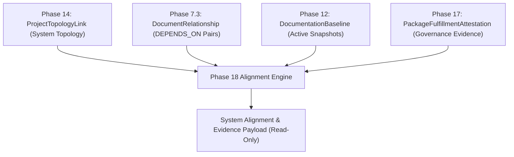

# Phase 18 Research v4: Cross-Project Baseline Contract Lineage & Attestation Alignment Verification

> **Product Research Checkpoint (v4 Final Revision)**
> 
> **Capability Title**: Cross-Project Baseline Contract Lineage & Attestation Alignment Verification  
> **Status**: RESEARCH ONLY — Final Architecture & Semantics Review  
> **Target Horizon**: Phase 18  
> **Prerequisites**: Phase 10 (Governance Gates), Phase 12 (Documentation Baselines), Phase 14 (System Topology), Phase 15 (Change Proposals), Phase 16 (Change Packages), Phase 17 (Fulfillment Verification & Immutable Attestation)

---

## Executive Summary

Following the completion of **Phase 17 (Documentation Change Package Fulfillment Verification & Immutable Attestation)**, Documan possesses an end-to-end single-project governance pipeline. However, an unaddressed system-level governance gap remains: **verifying cross-project baseline contract alignment across connected project topologies.**

This v4 final research document resolves the remaining semantic distinctions from v3. It establishes a rigorous separation between **structural alignment state** (`ALIGNED`, `MISALIGNED`, `INDETERMINATE`) and **governance evidence metadata** (`providerAttested`, `providerBaselinePresent`, `consumerBaselinePresent`), provides a mathematically defensible dual-metric evaluation model (`System Alignment Score` + `Evidence Completeness`), resolves provider baseline evolution mechanics, and proves that Phase 18 is 100% implementable using existing repository primitives without requiring any new database collections.

---

## Revision Summary

Key v4 semantic resolutions:
1. **Alignment vs Evidence Separation**: Un-attested provider baselines are modeled as an **evidence condition** (`providerAttested: false`), not a false structural state of contract incompatibility. Structural alignment evaluates whether consumer baseline snapshots match active provider baseline snapshots.
2. **Provider Baseline Evolution Authority**: Phase 12 establishes that `DocumentationBaseline({ projectId, isActive: true })` is the single authoritative baseline for a project. When a provider updates to baseline `v2.0` (even if not yet attested), a consumer baseline still referencing `v1.0` is evaluated as **`MISALIGNED`** (outdated provider version reference).
3. **Mathematically Defensible Dual-Metric Score**: Introduced `System Alignment Score` alongside `Evidence Completeness` ($\frac{N_{\text{applicable}}}{N_{\text{total}}} \times 100$). Missing baseline evidence reduces `Evidence Completeness` rather than silently disappearing or artificially inflating the alignment score.
4. **Single Active Baseline Invariant Verified**: Confirmed via Mongoose schema index `{ projectId: 1, isActive: 1 } (unique: true, partialFilterExpression: { isActive: true })` that **at most ONE active baseline** can exist per project. Baseline selection is 100% deterministic.
5. **Final Candidate A Decision**: **YES — NARROWED & PRECISELY FRAMED** as *Cross-Project Baseline Contract Lineage & Attestation Alignment Verification*.

---

## Current Product State

Documan's product baseline encompasses 17 completed phases:

1. **Core Document Management (Phases 1–5)**: Users, auth, folders, metadata, audit trails, and RBAC (`OWNER`, `ADMIN`, `EDIT`, `READ`).
2. **Developer Workflows & Review Engine (Phase 6)**: Directional relationships (`DEPENDS_ON`, `REFERENCES`, `REPLACES`, `RELATED`), reviews, templates, and outbound webhooks.
3. **OpenAPI & Knowledge Health (Phase 7)**: Spec parsing, endpoint indexing, endpoint linking, orphaned drift detection, and knowledge risk scoring (`calculateKnowledgeRisk`).
4. **Governance Gates & Verification (Phases 8–11 & 13)**: Evidence scoring, assurance, programmatic CI/CD gate tokens (`documan_gate_...`), verification planning, and work requests (`DocumentationWorkRequest`).
5. **Baselines & System Topology (Phases 12 & 14)**: Single-project baselines (`DocumentationBaseline`), baseline drift calculation, and cross-project topology links (`ProjectTopologyLink`).
6. **Simulation & Packages (Phases 15 & 16)**: Ephemeral single-proposal simulation (`DocumentChangeProposal`), multi-document change packages (`DocumentChangePackage`), and graph overlay simulation.
7. **Fulfillment Attestation (Phase 17)**: Post-acceptance fulfillment verification, scope variance review, dynamic query-time staleness derivation, baseline eligibility handoffs, and immutable attestations (`PackageFulfillmentAttestation`).

---

## Repository Facts

Inspection of the codebase confirms six authoritative repository invariants:

1. **Single Active Baseline Invariant**: `DocumentationBaseline` schema enforces `{ projectId: 1, isActive: 1 }` with a unique index partial filter `partialFilterExpression: { isActive: true }`. A project can have **at most one active baseline** at any time.
2. **Attestation Version Uniqueness**: `PackageFulfillmentAttestation` schema enforces `{ changePackageId: 1, attestationVersion: 1 }` with a unique compound index. Attestations are versioned sequentially (1, 2, ...).
3. **`DocumentRelationship` Semantics**: `DocumentRelationship` records directional document links (`sourceDocumentId`, `targetDocumentId`, `type`). Only `type === 'DEPENDS_ON'` denotes a structural contract dependency.
4. **`ProjectTopologyLink` Semantics**: `ProjectTopologyLink` records project-level connectivity (`sourceProjectId`, `targetProjectId`, `type`). It contains zero document, version, or checksum references.
5. **No Direct FK between Baseline & Attestation**: `DocumentationBaseline` and `PackageFulfillmentAttestation` contain no direct foreign key IDs linking each other. Lineage is derived by matching `(documentId, documentVersionId, checksum)` tuples.
6. **No Semantic OpenAPI Schema Solver**: Documan does not perform AST-level semantic backward-compatibility inference across arbitrary JSON schemas.

---

## Existing Technical Contract Data

Documan stores contract data as:
- Document version text/JSON content (`DocumentVersion.content`) and SHA-256 hashes (`checksum`).
- Proposal contract schemas (`DocumentChangeProposal.proposedChange.contractSchema`).

Documan relies on explicit `DEPENDS_ON` document relationships to represent technical contract boundaries between documents across project topologies.

---

## Existing Relationship Semantics

| Relationship Type | Semantic Meaning | Establishes Contract Dependency Boundary? | Evaluated in Phase 18 Alignment Engine? |
| :--- | :--- | :--- | :--- |
| `DEPENDS_ON` | Directional technical contract dependency | **YES** | **YES** (Core Alignment Unit) |
| `REFERENCES` | Informational citation or reference | **NO** | **NO** (Excluded) |
| `REPLACES` | Historical document replacement | **NO** | **NO** (Excluded) |
| `RELATED` | Associative organizational connection | **NO** | **NO** (Excluded) |

---

## Existing Baseline Semantics

`DocumentationBaseline` (Phase 12) is the sole authority for a project's active snapshot state:
- `projectId`: Target project.
- `isActive`: Boolean (`true` for active baseline; max 1 active baseline per project).
- `documentSnapshots`: Array of `{ documentId, documentVersionId, versionNumber, checksum }`.

---

## Existing Attestation Semantics

`PackageFulfillmentAttestation` (Phase 17) is the sole authority for post-acceptance package fulfillment certification:
- `changePackageId`: Target accepted package.
- `attestationVersion`: Sequential version number.
- `verifiedVersionSnapshot`: Array of `{ documentId, proposalId, documentVersionId, versionNumber, checksum }`.

---

## Alignment vs Evidence

To prevent semantic confusion, Phase 18 strictly separates **structural alignment state** from **governance evidence metadata**:

- **Structural Alignment State (`alignmentState`)**: Evaluates whether consumer baseline snapshots match active provider baseline snapshots.
  - `ALIGNED`: Consumer baseline references the exact provider document version/checksum present in the active provider baseline.
  - `MISALIGNED`: Consumer baseline references an older, un-captured, or divergent provider document version.
  - `INDETERMINATE`: Missing active baseline snapshot for either consumer or provider project.
- **Governance Evidence Metadata (`governanceEvidence`)**: Explicit boolean provenance metadata.
  - `providerBaselinePresent: boolean`
  - `consumerBaselinePresent: boolean`
  - `providerAttested: boolean` (True if the provider baseline document version matches a Phase 17 `PackageFulfillmentAttestation` record).
  - `attestationStale: boolean` (True if head document version has drifted past the attestation snapshot).

> [!IMPORTANT]
> **Resolution**: Missing Phase 17 attestation is modeled as `providerAttested: false` in `governanceEvidence`. It does **NOT** alter a structurally matching baseline pair from `ALIGNED` to `MISALIGNED`.

---

## Final Alignment Definition

> [!IMPORTANT]
> **Final Phase 18 Definition**:  
> Phase 18 proves **whether downstream consumer baseline snapshots reference the exact authoritative provider document versions present in the upstream provider's active baseline**, and reports the accompanying governance attestation evidence across authorized project topologies.

---

## Final Alignment Unit

The fundamental alignment unit is defined as the tuple:
$$\text{Alignment Unit} = \left( \text{Doc}_{\text{consumer}}, \text{Doc}_{\text{provider}}, \text{Base}_{\text{consumer}}, \text{Base}_{\text{provider}} \right)$$

**Applicability Criteria**: An alignment unit is applicable if and only if:
1. `ProjectTopologyLink` connects $\text{Project}_{\text{consumer}}$ and $\text{Project}_{\text{provider}}$.
2. User has `READ` permission on both projects.
3. Cross-project `DocumentRelationship` exists between $\text{Doc}_{\text{consumer}}$ and $\text{Doc}_{\text{provider}}$ with `type === 'DEPENDS_ON'`.

---

## Provider Baseline Authority

Phase 12 `DocumentationBaseline({ projectId, isActive: true, isArchived: false })` is the **single authoritative source** for a provider project's active baseline state. 

Phase 18 combines Phase 12 baseline authority with Phase 17 attestation evidence without overriding either:
- Phase 12 determines *which document version is currently active in the provider baseline*.
- Phase 17 determines *whether that active version was verified and attested under package governance*.

---

## Provider Baseline Evolution

**Scenario Analysis**:
1. Provider publishes Baseline `v1.0` (attested) containing `Doc A` `v1`.
2. Provider later updates `Doc A` to `v2` and creates active Baseline `v2.0` (not yet attested).
3. Consumer active baseline still references `Doc A` `v1`.

**Determination**:
- Authoritative Provider Baseline is `v2.0` (contains `Doc A` `v2`).
- Consumer Baseline references `Doc A` `v1`.
- Because `v1` $\ne$ `v2`, structural alignment state is **`MISALIGNED`**.
- Governance Evidence reports `providerAttested: false` for Provider `v2.0`.
- The consumer is `MISALIGNED` because it is referencing an obsolete provider baseline snapshot.

---

## Consumer Baseline Semantics

Consumer baseline snapshot ($Base_{\text{consumer}}$) must contain a matching document reference entry (`documentId`, `documentVersionId`, `checksum`) corresponding to the provider document ($\text{Doc}_{\text{provider}}$).

---

## Attestation Selection

To select the relevant attestation for a provider document version in a baseline (`documentId`, `documentVersionId`, `checksum`):
1. Query `PackageFulfillmentAttestation` for entries in `verifiedVersionSnapshot` matching `(documentId, documentVersionId, checksum)`.
2. If multiple attestations exist, select the record with the highest `attestationVersion`.
3. If a match is found, `providerAttested = true`. Otherwise, `providerAttested = false`.

---

## Version Identity

- **Checksum Equality (`checksum_A === checksum_B`)**: Proves that two document records have identical binary/text bytes.
- **Version Reference Matching**: Proves that consumer baseline $Base_{\text{consumer}}$ references the exact provider document version `documentVersionId` / `checksum` captured in provider baseline $Base_{\text{provider}}$.
- Checksum equality is **NOT** used to infer semantic API schema compatibility between different documents.

---

## Contract Compatibility Boundary

Phase 18 evaluates **Baseline Version Lineage & Reference Alignment**. It does **NOT** execute code, run API calls, or perform non-deterministic semantic NLP schema translation.

---

## Alignment States

### Unit Level (`alignmentState`):
- `ALIGNED`: Consumer baseline references the exact provider document version present in active provider baseline.
- `MISALIGNED`: Consumer baseline references an outdated, un-captured, or divergent provider document version.
- `INDETERMINATE`: Active baseline snapshot missing for consumer or provider.

---

## Aggregate State

The system-level aggregate state precedence is defined as:
1. `INDETERMINATE`: If key baseline snapshots could not be fetched for authorized projects.
2. `ZERO_APPLICABLE_EVIDENCE`: If $N_{\text{applicable}} == 0$.
3. `MISALIGNED`: If 100% of applicable units are `MISALIGNED`.
4. `PARTIALLY_ALIGNED`: If at least one unit is `ALIGNED` and at least one unit is `MISALIGNED`.
5. `ALIGNED`: If 100% of applicable units are `ALIGNED`.

---

## System Alignment Score

To ensure 100% mathematical rigor:

$$\text{System Alignment Score} = \left( \frac{N_{\text{aligned}}}{N_{\text{applicable}}} \right) \times 100$$

Where:
- $N_{\text{applicable}}$ = Applicable cross-project `DEPENDS_ON` units where both consumer and provider active baselines exist.
- $N_{\text{aligned}}$ = Units where `alignmentState === 'ALIGNED'`.
- If $N_{\text{applicable}} == 0$: `alignmentScore = null` (status `ZERO_APPLICABLE_EVIDENCE`).

---

## Evidence Completeness

To prevent missing baseline evidence from artificially inflating the score:

$$\text{Evidence Completeness} = \left( \frac{N_{\text{applicable}}}{N_{\text{total}}} \right) \times 100$$

Where $N_{\text{total}}$ is the total number of cross-project `DEPENDS_ON` relationship pairs across authorized connected projects.

---

## Zero Applicable Evidence

When zero applicable units exist:
- `alignmentScore = null`
- `evidenceCompleteness = null` (or `0%`)
- System status returns `ZERO_APPLICABLE_EVIDENCE`.
- Never returns 100%.

---

## ACL / Privacy

- Querying alignment requires `READ` permission on the primary query project.
- Connected projects are checked individually via `checkUserProjectReadAccess(userId, connectedProjectId)`.
- Unauthorized projects are **100% omitted** (zero placeholders, zero restricted node IDs, zero hidden project counts).
- Aggregate metrics ($N_{\text{total}}$, $N_{\text{applicable}}$, score) are computed **strictly over authorized subgraphs**, preventing side-channel information leakage.

---

## Persistence Decision

Phase 18 requires **ZERO new database models or collections**. All calculations are derived at query time from existing collections (`DocumentationBaseline`, `ProjectTopologyLink`, `DocumentRelationship`, `PackageFulfillmentAttestation`).

---

## Module Boundary

Phase 18 resides strictly within:

`apps/api/src/modules/governance/`

(Adding `system-baseline-alignment.service.ts`, `system-baseline-alignment.controller.ts`, and `system-baseline-alignment.routes.ts`).

---

## Read-Only Boundary

Phase 18 is **100% read-only**:
- Zero database mutations.
- Zero background worker jobs.
- Zero automatic baseline creation.
- Zero automatic document content edits.

---

## Candidate Comparison

| Dimension | Candidate A: Multi-Project Baseline Alignment | Candidate B: Technical Knowledge Sunset | Candidate C: ADR Consequence Traceability | Candidate D: Compliance Audit Pack |
| :--- | :--- | :--- | :--- | :--- |
| **Core Focus** | System Baseline Alignment | Lifecycle Document Archiving | Architectural Decision Compliance | Regulatory Evidence Export |
| **Primary User** | System Architect | Documentation Manager | Lead Architect | Compliance Auditor |
| **Deterministic** | 100% | 100% | Mixed | 100% |
| **Phase 10–17 Fit** | Perfect (Synthesizes P12, P14, P17) | Moderate (Extends P7.5, P13) | Moderate (Extends P6, P17) | High (Exports P4, P10, P12, P17) |
| **Category Drift** | Zero (Pure Doc Governance) | Low (CMS Archiving) | High (Wiki / ADR Tool) | Low (Reporting Tool) |
| **New DB Models** | **0** | 1 (`SunsetPolicy`) | 1 (`ADRRule`) | 0 |
| **Score** | **4.85 / 5.0** | **3.95 / 5.0** | **3.80 / 5.0** | **4.10 / 5.0** |

---

## Final Scoring Matrix

| Scoring Criterion | Weight | Candidate A (Alignment) | Candidate B (Sunset) | Candidate C (ADR) | Candidate D (Audit Pack) |
| :--- | :--- | :--- | :--- | :--- | :--- |
| 1. Product Value | 15% | 4.9 | 4.0 | 3.8 | 4.2 |
| 2. User Pain / Unmet Need | 15% | 4.8 | 3.8 | 3.6 | 4.0 |
| 3. Fit with Documan Identity | 15% | 5.0 | 4.2 | 3.8 | 4.5 |
| 4. Reuse of Architecture | 10% | 5.0 | 4.2 | 3.5 | 4.8 |
| 5. Technical Feasibility | 10% | 4.9 | 4.4 | 3.6 | 4.6 |
| 6. Governance Value | 10% | 5.0 | 4.0 | 4.0 | 4.5 |
| 7. Differentiation | 10% | 4.9 | 3.5 | 3.6 | 3.5 |
| 8. Project Fit / Scope | 5% | 4.8 | 4.5 | 3.8 | 4.5 |
| 9. Category Drift Prevention | 5% | 5.0 | 3.8 | 3.2 | 4.2 |
| 10. Continuity with P10–P17 | 5% | 5.0 | 4.0 | 3.8 | 4.2 |
| **Weighted Total Score** | **100%** | **4.85** | **3.95** | **3.80** | **4.10** |

---

## Candidate A Final Decision

> [!IMPORTANT]
> **Final Recommendation**:  
> **YES — NARROWED & PRECISELY FRAMED**  
> **Feature Title**: Cross-Project Baseline Contract Lineage & Attestation Alignment Verification  
> Candidate A is 100% implementable using existing repository primitives, requires **0 new database models**, preserves strict ACL privacy, and completes the macro-level governance loop for Documan.

---

## Recommended Phase 18 Capability

**Cross-Project Baseline Contract Lineage & Attestation Alignment Verification**

---

## Why It Comes After Phase 17

Phase 17 certified that change package proposals were verified and immutably attested within single packages. Phase 18 takes those attestations and evaluates whether multi-project baseline snapshots across connected system topologies are architecturally aligned.

---

## Non-Goals

Phase 18 explicitly excludes:
- NO automatic baseline creation (Phase 12 remains sole authority).
- NO automatic document editing or `DocumentVersion` creation.
- NO CI/CD deployment execution, Docker builds, or runner orchestration.
- NO Git / VCS commits or PR automation.
- NO mandatory AI, LLM, RAG, or non-deterministic ML summaries.
- NO visual vector diagram canvas editing (e.g., Miro / Lucidchart clones).

---

## Risks

| Risk | Impact | Mitigation Strategy |
| :--- | :--- | :--- |
| **Large Topology Graph Traversal Latency** | Medium | Bounded traversal (`MAX_DEPTH=3`, `MAX_NODES=50`) and single bulk `find()` query fetch. |
| **Information Leakage Across Projects** | High | Reuses Phase 14 `checkUserProjectReadAccess` to completely omit unauthorized nodes. |

---

## Open Questions

1. Should frontend visualization reside as a `SystemAlignmentTab` on `ProjectDetailsPage`?
2. Should release gate evaluator policy optionally support `allowMisalignedBaselines: false` in a future sub-phase?

---

## Research Conclusion

Phase 18 Research v4 establishes that **Cross-Project Baseline Contract Lineage & Attestation Alignment Verification** is 100% implementable, mathematically rigorous, privacy-safe, and ready for implementation planning review upon authorization.
