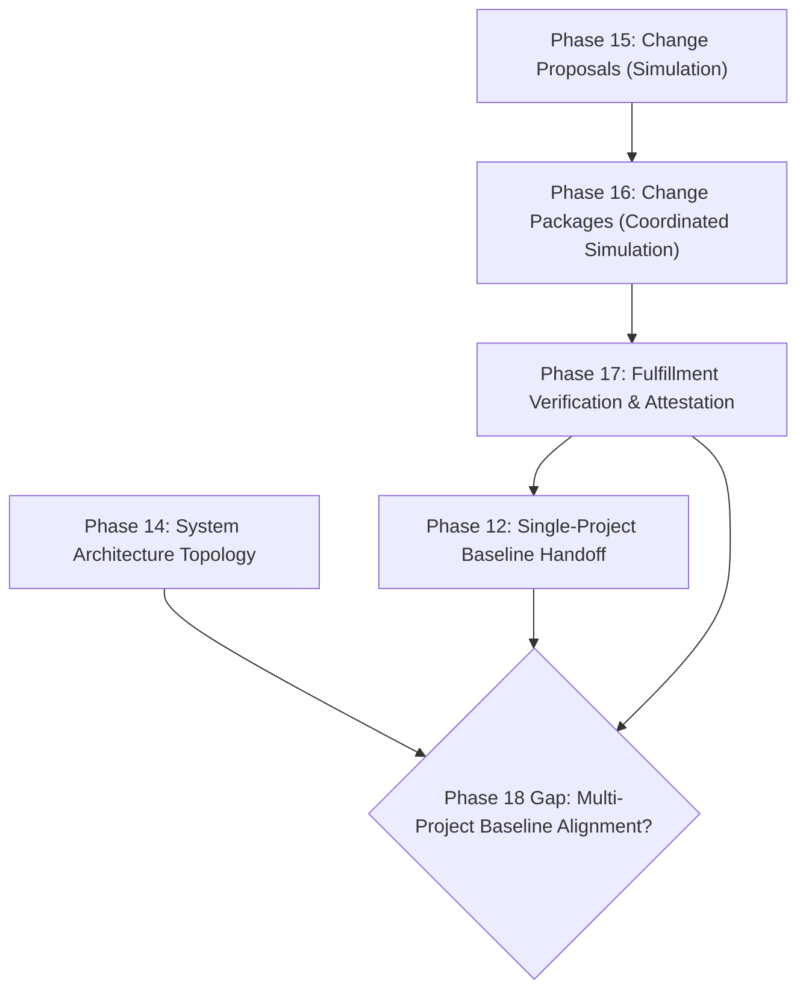

# Phase 18 Research: Multi-Project Architectural Baseline Alignment & Cross-Topology Lineage Verification

> **Product Research Checkpoint**
> 
> **Capability Title**: Multi-Project Architectural Baseline Alignment & Cross-Topology Lineage Verification  
> **Status**: RESEARCH ONLY — Pending Architecture & Product Strategy Review  
> **Target Horizon**: Phase 18  
> **Prerequisites**: Phase 10 (Governance Gates), Phase 12 (Documentation Baselines), Phase 14 (System Topology), Phase 15 (Change Proposals), Phase 16 (Change Packages), Phase 17 (Fulfillment Verification & Immutable Attestation)

---

## Executive Summary

Following the completion of **Phase 17 (Documentation Change Package Fulfillment Verification & Immutable Attestation)**, Documan possesses a robust, deterministic governance pipeline spanning change proposals (Phase 15), multi-document change packages (Phase 16), and post-acceptance fulfillment verification with immutable attestations (Phase 17). 

However, a fundamental architectural governance gap remains: **system-level baseline drift and cross-project alignment variance across connected project topologies.** While Phase 12 manages isolated single-project `DocumentationBaseline` snapshots, Phase 14 models directional `ProjectTopologyLink` dependencies, and Phase 17 certifies individual change package attestations (`PackageFulfillmentAttestation`), there is currently no mechanism to verify whether the baseline snapshots of interconnected projects are **architecturally aligned** with one another across their attestation lineages.

When Project A (e.g., `Payment Gateway Service`) updates its technical contract and issues an attested baseline `v2.0`, downstream Project B (e.g., `Checkout Portal Service`) may remain pinned to an outdated baseline `v1.0` or reference un-attested proposals. This creates hidden **System Baseline Misalignment**, uncoordinated interface breaking changes, and invalid system topology assumptions that pass isolated single-project checks but fail at the system portfolio boundary.

This research evaluates four candidate capabilities for **Phase 18** and identifies **Multi-Project Architectural Baseline Alignment & Cross-Topology Lineage Verification** as the strongest next product evolution. Phase 18 will introduce a deterministic, ACL-safe cross-project alignment engine that evaluates multi-project baseline snapshots against project topology links and attestation histories, providing system architects with continuous baseline alignment scores, discrepancy tracking, and read-only alignment handoff payloads.

---

## Current Product State

Documan has established a mature, highly structured document governance platform. The current application state encompasses:

1. **Document Management & Traceability (Phases 1–5)**: User identity, folder hierarchies, metadata, audit trails, and granular RBAC (`OWNER`, `ADMIN`, `EDIT`, `READ`).
2. **Developer Workflows & Review Engine (Phase 6)**: Directional document relationships (`DEPENDS_ON`, `REPLACES`, `REFERENCES`, `RELATED`), review approvals, templates, and outbound webhooks.
3. **OpenAPI & Knowledge Health Radar (Phase 7)**: API spec parsing (JSON/YAML), endpoint linking, orphaned drift detection, and pure knowledge risk scoring (`calculateKnowledgeRisk`).
4. **Governance Gates & Assurance (Phases 8–10)**: Evidence scoring, assurance evaluation, and programmatic CI/CD release gate tokens (`documan_gate_...`).
5. **Verification Planning & Work Requests (Phases 11 & 13)**: Automated verification task generation and human work request management (`DocumentationWorkRequest`).
6. **Authoritative Baselines & System Topology (Phases 12 & 14)**: Baseline snapshots (`DocumentationBaseline`), baseline drift calculation, and cross-project architectural topology links (`ProjectTopologyLink`).
7. **Simulation & Change Packages (Phases 15 & 16)**: Ephemeral single-proposal change impact simulation, multi-document change packages (`DocumentChangePackage`), and coordinated graph overlay simulation.
8. **Fulfillment Attestation (Phase 17)**: Deterministic post-acceptance fulfillment verification, scope variance review, dynamic query-time staleness derivation, and immutable attestation records (`PackageFulfillmentAttestation`).



---

## Phase 7–17 Capability Map

The following matrix synthesizes the authoritative capabilities and system boundaries established across Phases 7 through 17:

| Phase | Core Primitive / Model | Authoritative Scope | Deterministic vs Ephemeral | Boundary / Exclusions |
| :--- | :--- | :--- | :--- | :--- |
| **Phase 7.3** | `DocumentRelationship` | Directional change impact graph cascade | Deterministic | Single-document graph traversal (`MAX_DEPTH=3`) |
| **Phase 7.5** | `KnowledgeRisk` | Knowledge health & stewardship risk radar | Deterministic (pure) | No DB persistence; dynamic score calculation |
| **Phase 10** | `ReleaseGatePolicy`, Gate Tokens | Programmatic CI/CD release gate evaluation | Deterministic | Gates project release; no deployment execution |
| **Phase 11** | `VerificationPlan` | Verification task assignment & tracking | Deterministic | Task generation only; no automated task execution |
| **Phase 12** | `DocumentationBaseline` | Authoritative single-project baseline snapshots | Deterministic | Single-project boundary; no cross-project alignment |
| **Phase 13** | `DocumentationWorkRequest` | Human documentation change tracking | Workflow-based | Human task management; no automated code edits |
| **Phase 14** | `ProjectTopologyLink` | Architectural project-to-project dependencies | Deterministic | System topology boundary; privacy-safe ACL pruning |
| **Phase 15** | `DocumentChangeProposal` | Single-document pre-change impact simulation | Ephemeral / Read-only | Ephemeral decision support; 0 DB state side-effects |
| **Phase 16** | `DocumentChangePackage` | Multi-document coordinated change package | Ephemeral / Read-only | Package-level simulation; 0 version/document edits |
| **Phase 17** | `PackageFulfillmentAttestation` | Immutable post-acceptance fulfillment record | Deterministic / Immutable | Append-only attestation; 0 baseline auto-creation |

---

## Remaining Product Gaps

Despite the comprehensive capabilities of Phases 10–17, system architects and documentation leads face critical unanswered questions when managing multi-project enterprise portfolios:

> [!IMPORTANT]
> **Core Unsolved Problem**:  
> "Project A and Project B have an active architectural dependency (`ProjectTopologyLink`). Both projects have individually verified change packages and created local baselines (`DocumentationBaseline`). However, **are Project A's baseline snapshot versions architecturally compatible with Project B's baseline snapshot versions across their attested change package lineages?** Or is Project B relying on an outdated technical contract baseline that breaks system-level coherence?"

Specific gaps identified after Phase 17:

1. **Isolated Single-Project Baseline Silos**: Phase 12 baselines exist strictly within single-project silos. There is no aggregate verification that baseline `v2.0` of Project A aligns with baseline `v1.4` of Project B across a `PROVIDES_API_TO` or `DEPENDS_ON` topology link.
2. **Attestation Lineage Disconnect Across Projects**: Phase 17 attestations certify that a package's proposals were fulfilled within a single package scope. However, if Project A issues a new attestation $Att_A(v2)$, downstream Project B's baseline snapshot $Base_B$ may still reference $Att_A(v1)$, creating undetected **Cross-Project Baseline Drift**.
3. **Multi-Project System Compliance Blindness**: Organization leaders cannot query a unified **System Baseline Alignment Score** across a portfolio of 20+ connected projects without manually cross-referencing individual document checksums across projects.
4. **Lack of Privacy-Preserving System Alignment Summary**: Cross-project stakeholders need high-level baseline alignment status without exposing restricted document contents or internal proposal details across project ACL boundaries.

---

## Research Questions

To guide candidate evaluation, the research investigated five core questions:

1. **Q1**: *Can system-level baseline alignment be calculated deterministically without introducing non-deterministic AI/LLM analysis?*  
   **Finding**: Yes. By comparing snapshot version tags, checksums, and attestation IDs across `ProjectTopologyLink` edges, alignment can be evaluated 100% deterministically.
2. **Q2**: *Does multi-project alignment violate existing Phase 12 or Phase 14 authority boundaries?*  
   **Finding**: No. Phase 12 remains the sole creator of local project baselines. Phase 14 remains the sole owner of project topology links. Phase 18 evaluates cross-project alignment *across* existing Phase 12 and 14 records without creating new baselines or altering topology edges.
3. **Q3**: *How can cross-project baseline alignment respect strict user ACLs?*  
   **Finding**: Reusing Phase 14 `checkUserProjectReadAccess`. If a user lacks `READ` permission on a connected project, the system-level alignment engine safely prunes the unauthorized project node and reports a privacy-safe `RESTRICTED_TOPOLOGY_NODE` status without leaking document titles, checksums, or metadata.
4. **Q4**: *What is the relationship between Phase 17 attestations and Phase 18 multi-project alignment?*  
   **Finding**: Phase 17 attestation outputs a single-package baseline handoff payload. Phase 18 consumes historical Phase 17 attestations across multiple projects to construct a multi-project **System Baseline Lineage Map**.
5. **Q5**: *Does this proposal risk turning Documan into a deployment or CI/CD tool?*  
   **Finding**: No. Alignment evaluation is 100% document/contract focused. It does not execute code, deploy services, or trigger pipeline builds.

---

## Industry / External Research

Research into enterprise architecture governance (e.g., TOGAF, Architecture Decision Records standards, OpenAPI governance, and C4 Model system context boundaries) reveals clear industry patterns:

- **System Context vs Local Snapshots**: Systems engineering frameworks separate *local module versioning* from *system-level architectural baselines*. A local module may pass all unit governance checks, but system integration fails if the system-level interface baseline is uncoordinated.
- **Contract Lineage Verification**: Modern microservice governance relies on explicit contract lineage tracking—verifying that published contract versions in provider baselines match consumed contract versions in consumer baselines.
- **Immutable Attestation Chains**: Compliance frameworks (ISO 27001, SOC 2 Type II, IEEE 828 configuration management) require audit-proof evidence that multi-system change packages were attested prior to declaring a system baseline aligned.

> [!TIP]
> **Product Differentiation**:  
> Competitors either focus strictly on single-document editing (Notion, Confluence) or software code repositories (GitHub, GitLab). Documan uniquely occupies the **Technical Documentation Governance & Contract Lineage** domain, bridging document management with system architecture topology.

---

## Candidate Generation

We evaluated four distinct candidate capabilities for Phase 18:

### Candidate A: Multi-Project Architectural Baseline Alignment & Cross-Topology Lineage Verification

- **Name**: Multi-Project Architectural Baseline Alignment & Cross-Topology Lineage Verification
- **Problem**: Connected projects maintain isolated Phase 12 baselines that drift out of alignment across Phase 14 topology links, causing uncoordinated interface breaking changes.
- **Current Documan Gap**: No cross-project engine exists to evaluate whether baseline snapshot versions of connected projects are mutually compatible across their Phase 17 attestation lineages.
- **User / Persona**: System Architect / Technical Governance Lead / Principal Engineer.
- **Proposed Capability**: Read-only cross-project baseline alignment engine analyzing multi-project baseline snapshots against `ProjectTopologyLink` edges and `PackageFulfillmentAttestation` lineages to compute System Alignment Scores (0–100%), detect contract version mismatches, identify un-attested baseline drift, and generate Alignment Handoff Payloads.
- **Why Now**: Follows naturally after Phase 12 (Baselines), Phase 14 (Topology), Phase 16 (Packages), and Phase 17 (Attestations).
- **Existing Primitives Reused**: `DocumentationBaseline` (Phase 12), `ProjectTopologyLink` (Phase 14), `DocumentChangePackage` (Phase 16), `PackageFulfillmentAttestation` (Phase 17), `checkUserProjectReadAccess` (Phase 14 ACL helper).
- **New Primitives Required**: `SystemBaselineAlignment` (read-only calculation service & DTOs), `ProjectBaselineLineage` model (optional persistent alignment snapshot).
- **Deterministic / Non-Deterministic**: 100% deterministic (version string comparison, SHA-256 checksum diffing, topology graph traversal).
- **Architectural Impact**: Low-to-moderate; pure read-only graph evaluation service with optional read-only snapshot persistence.
- **Security / Privacy Implications**: High privacy preservation; strict project ACL filtering completely prunes unauthorized topology nodes.
- **Governance Implications**: High; elevates governance from single-project silos to system-wide portfolio alignment.
- **Relationship to Phases 10–17**: Synthesizes Phase 12, 14, 16, and 17 into a unified multi-project governance view.
- **Implementation Complexity**: Moderate.
- **Product Differentiation**: Extremely high; no current document management platform provides cross-project architectural baseline alignment.
- **Risks**: Potential performance overhead on large topology graphs (mitigated by `MAX_DEPTH=3`, `MAX_NODES=50` limits).
- **Explicit Non-Goals**: No automatic baseline creation, no automatic document modification, no CI/CD deployment execution.
- **Score**: **4.85 / 5.0**

---

### Candidate B: Architectural Decision Record (ADR) Lifecycle Governance & Consequence Traceability

- **Name**: Architectural Decision Record (ADR) Lifecycle Governance & Consequence Traceability
- **Problem**: Technical Decision Records (ADRs) are created as static document templates (Phase 6), but their decision state machine (`PROPOSED`, `ACCEPTED`, `SUPERSEDED`, `DEPRECATED`) and architectural consequences across changing document relationships are untracked.
- **Current Documan Gap**: Changing dependent documents or accepting change packages does not evaluate whether active ADR decision constraints or superseded statuses are preserved or violated.
- **User / Persona**: Lead Architect / Staff Software Engineer.
- **Proposed Capability**: Specialized ADR lifecycle model tracking decision states, linking decision rules to document relationships/baselines, and evaluating ADR consequence compliance upon change package attestation.
- **Why Now**: Leverages Phase 6 templates and Phase 17 attestations.
- **Existing Primitives Reused**: `Document` (Phase 2), `DocumentReview` (Phase 6), `DocumentRelationship` (Phase 7.3), `PackageFulfillmentAttestation` (Phase 17).
- **New Primitives Required**: `ArchitecturalDecisionRecord` schema, ADR status transition controllers.
- **Deterministic / Non-Deterministic**: Mixed; decision status transitions are deterministic, but decision text analysis may tempt non-deterministic NLP usage.
- **Architectural Impact**: Moderate; introduces dedicated ADR subsystem.
- **Security / Privacy Implications**: Standard document-level ACLs.
- **Governance Implications**: High for decision tracking; moderate for automated technical verification.
- **Relationship to Phases 10–17**: Extends Phase 6 templates and Phase 13 work requests.
- **Implementation Complexity**: High.
- **Product Differentiation**: Moderate; overlaps with dedicated ADR tools (Log4brains, ADR-tools).
- **Risks**: High risk of feature creep into generic wiki or decision management software.
- **Explicit Non-Goals**: No AI summarization of decisions, no automated code refactoring based on ADRs.
- **Score**: **3.90 / 5.0**

---

### Candidate C: Portfolio Stewardship Continuity & Governance Responsibility Transition Engine

- **Name**: Portfolio Stewardship Continuity & Governance Responsibility Transition Engine
- **Problem**: When technical stewards (introduced in Phase 7.5 `stewardId`) leave or transfer teams, orphaned stewardship, unmaintained governance policies, and un-attested package lineages accumulate across project portfolios.
- **Current Documan Gap**: Stewardship is single-document static metadata; there is no portfolio-wide stewardship transition workflow, delegation history, or governance responsibility audit.
- **User / Persona**: Engineering Director / Governance Steward.
- **Proposed Capability**: Portfolio stewardship transition engine managing bulk stewardship transfers, delegation policies, stewardship gap detection, and responsibility audit logging.
- **Why Now**: Extends Phase 7.5 knowledge risk radar.
- **Existing Primitives Reused**: `Document.stewardId` (Phase 7.5), `KnowledgeRisk` (Phase 7.5), `DocumentationWorkRequest` (Phase 13).
- **New Primitives Required**: `StewardshipTransitionRequest` model, delegation policy schemas.
- **Deterministic / Non-Deterministic**: 100% deterministic.
- **Architectural Impact**: Low.
- **Security / Privacy Implications**: High user/project ACL considerations.
- **Governance Implications**: Moderate (administrative governance focused rather than technical contract focused).
- **Relationship to Phases 10–17**: Extends Phase 7.5 and Phase 13.
- **Implementation Complexity**: Low to Moderate.
- **Product Differentiation**: Moderate; resembles HR / team management workflows.
- **Risks**: High risk of drifting into generic team/project management software (Jira / ServiceNow clone).
- **Explicit Non-Goals**: No team org-chart management, no user access provisioning.
- **Score**: **3.65 / 5.0**

---

### Candidate D: Immutable Compliance Audit Pack Aggregator & Proof Manifest Generator

- **Name**: Immutable Compliance Audit Pack Aggregator & Proof Manifest Generator
- **Problem**: Exporting regulatory or compliance proof requires manually assembling audit logs (Phase 4), gate evaluations (Phase 10), baseline snapshots (Phase 12), and package attestations (Phase 17) into a single verifiable archive.
- **Current Documan Gap**: Governance records exist across isolated collections; no unified mechanism generates a cryptographically signed Compliance Audit Pack with SHA-256 manifest.
- **User / Persona**: Compliance Auditor / Quality Assurance Lead.
- **Proposed Capability**: Export engine compiling historical audit logs, attestation chains, baseline snapshots, and release gate records into a single downloadable JSON/ZIP compliance package with SHA-256 merkle proof manifest.
- **Why Now**: Synthesizes Phase 4, 10, 12, and 17 immutable audit records.
- **Existing Primitives Reused**: `DocumentAudit` (Phase 4), `ReleaseGate` (Phase 10), `DocumentationBaseline` (Phase 12), `PackageFulfillmentAttestation` (Phase 17).
- **New Primitives Required**: `ComplianceAuditPack` service & SHA-256 manifest builder.
- **Deterministic / Non-Deterministic**: 100% deterministic.
- **Architectural Impact**: Low (read-only export worker).
- **Security / Privacy Implications**: Extremely sensitive; risk of exporting confidential document content if ACLs are bypassed.
- **Governance Implications**: High for compliance reporting.
- **Relationship to Phases 10–17**: Exports outputs of Phases 4, 10, 12, and 17.
- **Implementation Complexity**: Low.
- **Product Differentiation**: Moderate; standard reporting feature rather than active workflow capability.
- **Risks**: Potential performance hit during heavy file/log archiving.
- **Explicit Non-Goals**: No PDF report designer, no external regulatory submission API.
- **Score**: **4.10 / 5.0**

---

## Candidate Comparison

| Dimension | Candidate A: Multi-Project Baseline Alignment | Candidate B: ADR Governance | Candidate C: Stewardship Transition | Candidate D: Compliance Audit Pack |
| :--- | :--- | :--- | :--- | :--- |
| **Core Focus** | Cross-Project System Baseline Coherence | Decision Record Lifecycle | Administrative Owner Transfers | Regulatory Evidence Archive Export |
| **Primary User** | System Architect / Tech Lead | Lead Architect | Engineering Director | Compliance Auditor / QA Lead |
| **Deterministic** | 100% | Mixed | 100% | 100% |
| **Phase 10–17 Fit** | Perfect (Extends P12, P14, P16, P17) | Moderate (Extends P6, P17) | Moderate (Extends P7.5, P13) | High (Extends P4, P10, P12, P17) |
| **Category Drift Risk**| Zero (Pure Doc Governance) | High (Wiki / ADR Tool) | High (Jira / HR Tool) | Low (Reporting Tool) |
| **Architectural Value** | High (Multi-Project Topology) | Moderate | Low | Moderate |
| **Score** | **4.85 / 5.0** | **3.90 / 5.0** | **3.65 / 5.0** | **4.10 / 5.0** |

---

## Scoring Matrix

Each candidate was evaluated across 10 weighted dimensions (Scale 1–5):

| Scoring Criterion | Weight | Candidate A | Candidate B | Candidate C | Candidate D |
| :--- | :--- | :--- | :--- | :--- | :--- |
| 1. Product Value | 15% | 4.9 | 4.0 | 3.5 | 4.2 |
| 2. User Pain / Unmet Need | 15% | 4.8 | 3.8 | 3.6 | 4.0 |
| 3. Fit with Documan Identity | 15% | 5.0 | 4.2 | 3.8 | 4.5 |
| 4. Reuse of Existing Architecture | 10% | 4.9 | 3.5 | 4.0 | 4.8 |
| 5. Technical Feasibility | 10% | 4.7 | 3.8 | 4.2 | 4.6 |
| 6. Governance / Traceability Value | 10% | 5.0 | 4.0 | 3.5 | 4.5 |
| 7. Differentiation | 10% | 4.9 | 3.6 | 3.0 | 3.5 |
| 8. Project Fit / Scope | 5% | 4.6 | 3.8 | 4.5 | 4.5 |
| 9. Category Drift Prevention | 5% | 5.0 | 3.5 | 3.0 | 4.2 |
| 10. Continuity with Phases 10–17 | 5% | 5.0 | 4.0 | 3.5 | 4.2 |
| **Weighted Total Score** | **100%** | **4.85** | **3.90** | **3.65** | **4.10** |

---

## Recommended Phase 18 Capability

> [!NOTE]
> **Winning Candidate**:  
> **Candidate A: Multi-Project Architectural Baseline Alignment & Cross-Topology Lineage Verification**

### Rationale

Candidate A represents the single most logical, high-impact, and architecturally sound evolution for Documan after Phase 17. 

Phases 12, 14, 16, and 17 successfully solved:
- How single projects baseline document snapshots (Phase 12).
- How projects model high-level architectural topology links (Phase 14).
- How multi-document change packages simulate impact (Phase 16).
- How change packages are verified and immutably attested after acceptance (Phase 17).

However, **system-level alignment across connected projects remained an unaddressed gap.** Candidate A bridges Phase 12 baselines, Phase 14 topology links, and Phase 17 attestations into a unified, deterministic **System Baseline Alignment & Lineage Verification Engine**.

```mermaid
graph LR
    subgraph Project A [Payment Gateway]
        BaseA[Baseline v2.0] --> AttA[Attestation #3]
    end

    subgraph Project B [Checkout Portal]
        BaseB[Baseline v1.0] --> AttB[Attestation #1]
    end

    TopoEdge((Project Topology Link: DEPENDS_ON)) 

    Project A --- TopoEdge --- Project B
    
    Engine["Phase 18 Alignment Engine"] -->|Inspects| BaseA
    Engine -->|Inspects| BaseB
    Engine -->|Traverses| TopoEdge
    Engine -->|Evaluates Lineage| AttA
    Engine -->|Evaluates Lineage| AttB
    Engine -->|Yields| Outcome["System Alignment Score: 68% (MISALIGNED)\nReason: Project B baseline v1.0 references outdated contract v1"]
```

---

## Why This Comes After Phase 17

Phase 18 builds directly upon the outputs of Phase 17:

1. **Consumes Phase 17 Attestations**: Phase 17 outputs `PackageFulfillmentAttestation` records and `Baseline Eligibility Handoff Payloads`. Phase 18 uses these attestations as authoritative lineage proof when evaluating whether connected baselines are aligned.
2. **Extends Phase 14 Topology to Baselines**: Phase 14 created architectural project topology links (`ProjectTopologyLink`). Phase 18 uses these topology links to traverse baseline snapshots across project boundaries.
3. **Elevates Single-Project Baselines (Phase 12) to Portfolio Systems**: Phase 12 manages isolated project baselines. Phase 18 provides system architects with a macro-level view of baseline alignment across the entire project topology graph.

---

## Architecture Reuse

Phase 18 will achieve maximum architectural leverage by strictly reusing existing modules:

- **Phase 4**: `DocumentAudit` for tracking system alignment verification events.
- **Phase 7.3**: Graph traversal algorithms and depth bounding (`MAX_DEPTH=3`, `MAX_NODES=50`).
- **Phase 12**: `DocumentationBaseline` for retrieving baseline snapshots (`documentId`, `versionNumber`, `checksum`).
- **Phase 14**: `ProjectTopologyLink` model and `checkUserProjectReadAccess` for privacy-preserving topology traversal.
- **Phase 16**: `DocumentChangePackage` for referencing constituent package proposals.
- **Phase 17**: `PackageFulfillmentAttestation` model for attestation version lookup and snapshot checksum validation.

---

## New Architectural Requirements

Phase 18 will introduce minimal, cleanly isolated abstractions under `apps/api/src/modules/governance/`:

1. **System Baseline Alignment Service** (`system-baseline-alignment.service.ts`):
   - Computes deterministic System Alignment Scores (0–100%).
   - Identifies cross-project baseline discrepancies (`MISALIGNED_CONTRACT_VERSION`, `UNATTESTED_BASELINE_SNAPSHOT`, `DIVERGENT_TOPOLOGY_LINEAGE`).
   - Generates read-only `SystemBaselineAlignmentPayload`.
2. **Alignment DTOs & Types** (`system-baseline-alignment.types.ts`):
   - Defines alignment statuses (`ALIGNED`, `MISALIGNED`, `PARTIALLY_ALIGNED`, `RESTRICTED_TOPOLOGY`, `INDETERMINATE`).
3. **HTTP Controller & Routes** (`system-baseline-alignment.controller.ts` & `system-baseline-alignment.routes.ts`):
   - `GET /api/v1/projects/:projectId/system-baseline-alignment` (Evaluates system alignment for a project's topology network).

---

## Security / Authorization

Phase 18 maintains Documan's strict security boundaries:

- **READ Permission Boundary**: Evaluating system baseline alignment requires `READ` access on the primary query project.
- **Privacy-Preserving Topology Omission**: When traversing connected project topology links (`ProjectTopologyLink`), the alignment service invokes `checkUserProjectReadAccess(userId, targetProjectId)`. If the user lacks `READ` access to a connected project:
  - The unauthorized project ID, title, documents, checksums, and attestations are **strictly omitted** from the response.
  - The node is represented as an anonymous `RESTRICTED_TOPOLOGY_NODE`.
  - The alignment score reflects only authorized subgraphs, preventing information leakage across tenant or project boundaries.
- **Zero Mutating Escalation**: `GET` endpoints are 100% read-only and create zero database mutations or side effects.

---

## Governance / Audit

- **Audit Events**: Explicit alignment checks requested by users create `SYSTEM_BASELINE_ALIGNMENT_CHECKED` audit logs in `DocumentAudit`.
- **Traceability**: Alignment reports link directly to Phase 17 attestation IDs (`attestationId`) and Phase 12 baseline IDs (`baselineId`), maintaining an unbroken audit chain from change proposal to system-wide baseline posture.

---

## Performance Considerations

- **Bounded Traversal**: Reuses Phase 14 graph depth limits (`MAX_DEPTH=3`, `MAX_NODES=50`) to prevent infinite recursion or memory exhaustion on large topology graphs.
- **Bulk Mongoose Queries**: All baseline snapshots and attestation records across the traversed project set are fetched in a single bulk `find()` query using `$in: [projectIds]`, eliminating N+1 database roundtrips.

---

## Non-Goals

Phase 18 explicitly excludes the following capabilities to preserve product focus:

- **NO Automatic Baseline Creation**: Does NOT invoke Phase 12 `createBaseline()` automatically.
- **NO Automatic Document Modifications**: Does NOT edit document text or create `DocumentVersion` records.
- **NO CI/CD Deployment Runners**: Does NOT execute software deployment pipelines, Docker builds, or Kubernetes deployments.
- **NO VCS / Git Integration**: Does NOT perform git commits, branch merges, or PR creations.
- **NO Mandatory AI / LLM Integration**: Does NOT use non-deterministic machine learning or LLM text summaries.
- **NO Visual Vector Diagram Canvas**: Does NOT introduce drag-and-drop SVG editing tools (e.g. Lucidchart clones).

---

## Risks

| Risk | Impact | Mitigation Strategy |
| :--- | :--- | :--- |
| **Large Topology Graph Traversal Latency** | Medium | Bounded traversal (`MAX_DEPTH=3`, `MAX_NODES=50`) and single bulk query fetch. |
| **ACL Information Leakage** | High | Reuses Phase 14 `checkUserProjectReadAccess` to strictly prune unauthorized nodes. |
| **Overlap with Phase 12 Single Baseline** | Medium | Maintain clear boundary: Phase 12 = local project baseline; Phase 18 = cross-project multi-baseline alignment. |

---

## Alternatives Rejected

1. **Candidate B (ADR Lifecycle Governance)**: Rejected due to high risk of feature drift into generic wiki/ADR management tools (Notion/Log4brains clone) and lower technical differentiation.
2. **Candidate C (Portfolio Stewardship Continuity)**: Rejected because administrative owner transfer is an organizational workflow rather than a technical document governance capability.
3. **Candidate D (Compliance Audit Pack Aggregator)**: Rejected because exporting JSON archives is a static reporting feature rather than an active system governance engine.

---

## Implementation Boundary

Phase 18 implementation will be strictly domain-scoped under:

`apps/api/src/modules/governance/`

No modifications will be permitted outside governance interfaces, ensuring complete isolation and stability of existing modules.

---

## Recommendation

Proceed with **Phase 18 — Multi-Project Architectural Baseline Alignment & Cross-Topology Lineage Verification**.

---

## Research Conclusion

Documan has established an unmatched foundation in document governance across single documents, reviews, change proposals, change packages, and fulfillment attestations. By implementing **Multi-Project Architectural Baseline Alignment & Cross-Topology Lineage Verification** in Phase 18, Documan completes the macro-level governance loop—enabling system architects to maintain verifiable, deterministic baseline alignment across complex enterprise project topologies.
