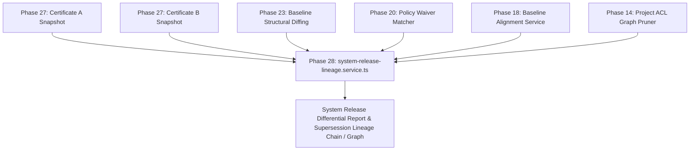

# Phase 28 Research — System-Wide Release Certificate Lineage & Multi-Release System Evolution Engine

> **Product Source of Truth**: [`docs/PRODUCT-ROADMAP.md`](file:///c:/MERN_STACK/Documan/documan/docs/PRODUCT-ROADMAP.md)  
> **Previous Phase**: Phase 27 — System-Wide Release Readiness Certification & Immutable System Release Snapshot Engine (COMPLETED & MERGED, Commit `0d25925`, Merge `48765cc`)  
> **Research Phase**: Phase 28 — RESEARCH ONLY  

---

## 1. Executive Summary

Phase 27 delivered the **System-Wide Release Readiness Certification & Immutable System Release Snapshot Engine** ([`system-release-certificate.service.ts`](file:///c:/MERN_STACK/Documan/documan/apps/api/src/modules/governance/system-release-certificate.service.ts)), enabling Project Owners and System Admins to perform pre-certification readiness checks, evaluate Phase 19 system release gate safety across multi-project topology graphs, capture frozen certification-time snapshots ($T_{\text{cert}}$) of topology, active baselines, attestations, and active waivers, issue cryptographically verifiable release certificates ([`SystemReleaseCertificate`](file:///c:/MERN_STACK/Documan/documan/apps/api/src/modules/governance/system-release-certificate.model.ts)) with SHA-256 integrity hashes (`certificateHash`), maintain append-only lifecycle event histories (`ACTIVE` $\rightarrow$ `REVOKED`), support unidirectional backward certificate supersession (`supersedesCertificateId`), and independently verify certificate snapshot integrity, lifecycle validity, and live system alignment at $T_{\text{now}}$.

With Phase 27 completed, Documan provides a continuous, highly mature governance pipeline:
- Single-project release gates & assurance scores (Phase 10)
- Documentation change verification planning (Phase 11)
- Authoritative single-project baselines & drift control (Phase 12)
- Human work request workflows (Phase 13)
- System architecture topology & cross-project contract governance (Phase 14)
- Pre-change impact simulation & proposals (Phase 15)
- Multi-document change packages & conflict matrix (Phase 16)
- Package fulfillment attestation (Phase 17)
- Cross-project baseline contract alignment (Phase 18)
- Multi-project system topology governance gates (Phase 19)
- System governance policy waiver lifecycle (Phase 20)
- Pre-release what-if topology simulation (Phase 21)
- Un-certified historical point-in-time gate lineage & timeline (Phase 22)
- Baseline structural contract evolution diffing (Phase 23)
- Traceability completeness gap audit (Phase 24)
- Cross-project contract interoperability matrix (Phase 25)
- System-wide contract change planning & package synthesis (Phase 26)
- System-wide release readiness certification & immutable release snapshots (Phase 27)

### Core Research Finding

Phase 27 preserves and verifies individual certified system states, but Documan does not yet provide a system-level analytical view of how those certified states evolved from one milestone to another. When enterprise software ecosystems evolve across multiple release milestones or release branches (e.g. `REL-2026-Q1` vs `REL-2026-Q2`, or `v2.0-LTS` vs `v3.0-MAIN`), system architects, release leads, and compliance auditors face a critical unresolved product gap:

> **The Multi-Release System Evolution & Certificate Lineage Differential Gap**:  
> While Phase 27 establishes authoritative individual historical certifications, Documan currently lacks a multi-release comparative evolution analysis engine to compare two or more immutable `SystemReleaseCertificate` snapshots, analyze structural contract evolution across certified releases, evaluate waiver reliance trajectory, track topology shifts between certified milestones, and navigate backward supersession lineage chains or graphs.

Without comparative evolution analysis across historical certifications, enterprise users cannot answer questions such as:
1. *"What structurally changed in our technical contract topology between certified Release v1.0 and certified Release v2.0?"*
2. *"Did our system's reliance on policy waivers increase or decrease across certified release milestones?"*
3. *"Which specific project baseline updates contributed to contract drift between certified releases?"*
4. *"What is the full backward supersession lineage chain / graph of our production release certificates?"*

This research document evaluates **5 candidate capabilities** across 10 weighted product and technical dimensions and recommends **Candidate 1: System-Wide Release Certificate Lineage & Multi-Release System Evolution Engine** (`system-release-lineage.service.ts`) as the next logical product phase for Documan.

---

## 2. Current Product State After Phase 27

### Repository State Facts
Verification executed prior to research:
- **Current Branch**: `main`
- **Working Tree**: `clean` (0 untracked or modified implementation files)
- **HEAD Commit**: `48765cc` (`Merge pull request #27 from feature/system-release-certification`)
- **Remote Synchronization**: `HEAD == origin/main`
- **Completed Phases in Log History**:
  - Phase 27: Commit `0d25925`, Merge `48765cc`
  - Phase 26: Commit `de6277b`, Merge `dcedc25`, Docs `aa7223d`
  - Phase 25: Commit `30c3397`, Merge `c4deba2`, Docs `4fd5321`
  - Phase 24: Commit `16fc6eb`, Merge `7d7d642`
  - Phase 23: Commit `2f3aed1`, Merge `78cf2d9`
  - Phase 22: Commit `cdfdacb`, Merge `30746cd`
  - Phase 21: Commit `6ffffa2`, Merge `e0607a3`
  - Phase 20: Commit `9cbeafc`, Merge `b1c6d40`

### Active System Architecture Baseline

```text
[Phase 14 Topology & Contracts]
         │
[Phase 18 Baseline Lineage] ──► [Phase 19 System Gate] ──► [Phase 20 Waivers]
         │                              │
[Phase 25 Interop Matrix]               ▼
         │                 [Phase 27 Release Certificate]
[Phase 26 Change Plan]           (Immutable Snapshot @ T_cert)
         │                              │
[Phase 16 Change Packages]              │  ◄── (PRODUCT GAP)
         │                              │      Individual certification exists (Phase 27),
[Phase 17 Attestations]                 ▼      but comparative evolution analysis across
                                               Cert_A & Cert_B does not.
```

The active system governance layer is composed of:
1. **Topology & Cross-Project Dependencies**: Project connections (`ProjectTopologyLink`) and cross-project technical contract links (`DocumentRelationship` with `CROSS_PROJECT_TOPOLOGY_REQUIRED`).
2. **Baselines & Attestations**: Project baseline snapshots (`DocumentationBaseline`, Phase 12) and change package fulfillment attestations (`PackageFulfillmentAttestation`, Phase 17).
3. **Gates & Exceptions**: Multi-project release safety evaluation (`system-topology-governance-gate.service.ts`, Phase 19) and time-bounded policy waivers (`SystemGovernanceWaiver`, Phase 20).
4. **Analysis & Intelligence**: In-memory what-if simulations (Phase 21), un-certified historical gate timelines (Phase 22), baseline contract diffing (Phase 23), traceability completeness gap audits (Phase 24), contract interoperability matrices (Phase 25), and change planning synthesis (Phase 26).
5. **Release Certification**: Immutable system release sign-off certificates (`SystemReleaseCertificate`, Phase 27) binding frozen topology, baseline, attestation, and waiver snapshots at $T_{\text{cert}}$ with cryptographic SHA-256 hash validation and a backward `supersedesCertificateId` relationship from newer certificates to older certificates.

---

## 3. End-to-End Capability Gap Analysis

### Unsolved Enterprise User Workflows

Phase 27 preserves and verifies individual certified system states, but Documan does not yet provide a system-level analytical view of how those certified states evolved from one milestone to another. Enterprise users operating Documan across complex multi-project topologies encounter critical unsolved workflow gaps when managing software releases over time:

#### 1. Multi-Release Differential Audit
*User Question*: *"We certified System Release v1.0 three months ago and are now certifying System Release v2.0. How can we generate an exact differential report showing every topology link added/removed, every project baseline version change, every structural contract delta, and every waiver change between these two certified snapshots?"*
*Current Limitation*: Phase 27 preserves and verifies individual historical certifications ($T_{\text{cert}}$). Phase 23 diffs *single-project document baselines* ($BL_A$ vs $BL_B$), but Documan lacks a multi-release comparative evolution analysis engine to diff multi-project system release certificates.

#### 2. Systemic Waiver Reliance Trajectory
*User Question*: *"Is our enterprise engineering organization successfully tech-debt-reducing over time? Are we reducing our reliance on policy waivers across consecutive certified release milestones, or are waivers accumulating across releases?"*
*Current Limitation*: Phase 20 models individual active waivers. Phase 27 captures active waivers inside a frozen certificate. No capability exists to track waiver lifecycle shifts (resolved vs new vs carried-over waivers) across comparative release milestones.

#### 3. Certificate Supersession Lineage Chain / Graph Navigation
*User Question*: *"System Release v2.1 supersedes v2.0, which superseded v1.5. How can release managers visualize and audit the complete backward supersession lineage chain / graph of certified production releases, verifying unbroken chain-of-trust provenance?"*
*Current Limitation*: Phase 27 currently provides a backward `supersedesCertificateId` relationship from the newer certificate to the older certificate. Phase 28 must consume that existing relationship rather than create a new lineage authority. If the analysis presents the lineage hierarchically, this is strictly a presentation/analysis representation and not a replacement for the Phase 27 persistence model.

#### 4. Systemic Interoperability Trajectory Analysis
*User Question*: *"Did the structural contract changes introduced between Release v1.0 and Release v2.0 make our cross-project system topology more aligned or more brittle?"*
*Current Limitation*: Phase 25 generates a *live* $N \times N$ matrix at $T_{\text{now}}$. It cannot perform comparative evolution analysis comparing the historical contract matrix derived from Certificate A against the historical contract matrix derived from Certificate B.

### Empirical Repository Evidence

Inspecting the codebase confirms these limitations are structural gaps, not missing UI toggles:

1. **[`apps/api/src/modules/governance/system-release-certificate.service.ts`](file:///c:/MERN_STACK/Documan/documan/apps/api/src/modules/governance/system-release-certificate.service.ts)** (Phase 27)
   - Contains `createReleaseCertificate`, `getReleaseCertificateById`, `verifyReleaseCertificate`, `revokeReleaseCertificate`, `listReleaseCertificates`.
   - Operates strictly on a **single certificate ID** per query. Does **not** contain functions to perform multi-release comparative evolution analysis or calculate multi-certificate deltas.

2. **[`apps/api/src/modules/governance/system-contract-evolution.service.ts`](file:///c:/MERN_STACK/Documan/documan/apps/api/src/modules/governance/system-contract-evolution.service.ts)** (Phase 23)
   - Diffs two single-project baseline versions (`baselineIdA` vs `baselineIdB`).
   - Requires baseline IDs for a single target project. Cannot ingest two multi-project `SystemReleaseCertificate` snapshots containing dozens of project baseline pairs.

3. **[`apps/api/src/modules/governance/system-governance-lineage.service.ts`](file:///c:/MERN_STACK/Documan/documan/apps/api/src/modules/governance/system-governance-lineage.service.ts)** (Phase 22)
   - Reconstructs un-certified point-in-time gate evaluations at timestamp $T$ using log events.
   - Explicitly designed as a diagnostic timeline query service over *un-certified live states*. Does not analyze certified `SystemReleaseCertificate` records.

---

## 4. Authoritative Capabilities To Preserve (Non-Duplication Audit)

To maintain architectural integrity, Phase 28 must consume existing phase authorities without duplicating or bypassing their logic:

| Phase | Authoritative Subsystem | Preservation Requirement for Phase 28 |
| :--- | :--- | :--- |
| **Phase 7.3** | `document-impact-cascade.service.ts` | Must remain sole authoritative single-doc relationship cascade engine. |
| **Phase 10** | `release-gate-evaluator.service.ts` | Must remain sole single-project release gate and assurance calculator. |
| **Phase 11** | `verification-plan.service.ts` | Must remain sole verification task generator. |
| **Phase 12** | `baseline.service.ts` | Must remain sole baseline creation and single-project snapshot engine. |
| **Phase 13** | `work-request.service.ts` | Must remain sole human work request lifecycle system. |
| **Phase 14** | `ProjectTopologyLink` & `checkUserProjectReadAccess` | Must remain sole project topology model and graph ACL boundary. |
| **Phase 15** | `runChangeProposalSimulation` | Must remain sole single-proposal pre-change simulation adapter. |
| **Phase 16** | `DocumentChangePackage` | Must remain sole package container and multi-proposal conflict engine. |
| **Phase 17** | `PackageFulfillmentAttestation` | Must remain sole single-package fulfillment verification model. |
| **Phase 18** | `system-baseline-alignment.service.ts` | Must remain sole cross-project contract baseline alignment engine. |
| **Phase 19** | `system-topology-governance-gate.service.ts` | Must remain sole multi-project system release gate evaluator. |
| **Phase 20** | `SystemGovernanceWaiver` | Must remain sole persistent policy waiver model and matcher. |
| **Phase 21** | `system-topology-simulation.service.ts` | Must remain sole in-memory what-if topology simulation sandbox. |
| **Phase 22** | `system-governance-lineage.service.ts` | Must remain sole un-certified historical point-in-time gate timeline service. |
| **Phase 23** | `system-contract-evolution.service.ts` | Must remain sole baseline structural contract diffing engine. |
| **Phase 24** | `system-traceability-audit.service.ts` | Must remain sole document traceability completeness gap auditor. |
| **Phase 25** | `system-contract-matrix.service.ts` | Must remain sole cross-project contract interoperability matrix engine. |
| **Phase 26** | `system-contract-plan.service.ts` | Must remain sole contract change planning and package synthesizer. |
| **Phase 27** | `system-release-certificate.service.ts` & `SystemReleaseCertificate` | Must remain sole release certificate issuer, snapshot freezer, verifier, and sole owner of the backward `supersedesCertificateId` persistence relationship. |

---

## 5. Overview and Evaluation of 5 Candidate Capabilities

We identify **5 distinct candidate capabilities** addressing potential product gaps after Phase 27:

```text
Candidates Evaluated:
├── Candidate 1: System-Wide Release Certificate Lineage & Multi-Release System Evolution Engine (RECOMMENDED)
├── Candidate 2: Multi-Release System Baseline Drift & Continuous Topology Alignment Auditor
├── Candidate 3: Multi-Project System Release Dependency & Cascade Propagation Engine
├── Candidate 4: System Governance Waiver Renewal & Post-Certificate Expiration Impact Governor
└── Candidate 5: Cross-Project Contract Compliance & Regulatory Standard Governance Audit Engine
```

---

### Candidate 1: System-Wide Release Certificate Lineage & Multi-Release System Evolution Engine

#### Problem Statement
Phase 27 preserves and verifies individual certified system states, but Documan does not yet provide a system-level analytical view of how those certified states evolved from one milestone to another. There is no mechanism to perform multi-certificate differential audits, track waiver reliance trajectories, analyze structural contract evolution across certified release boundaries, or navigate backward supersession lineage chains / graphs by consuming the Phase 27 `supersedesCertificateId` relationship.

#### 10-Point Evaluation

1. **User & Problem Value**: **Extremely High**. Fulfills the governance lifecycle by providing multi-release comparative evolution analysis over historical certifications. Enables release managers and auditors to verify exactly what evolved between certified release sign-offs.
2. **Product Differentiation**: **Distinct & Defensible**. Solves multi-project technical contract evolution and governance lineage diffing without copying git-centric code diffing or generic CI/CD pipelines.
3. **Architectural Fit**: **Perfect Fit**. Operates as a request-scoped, read-only analysis service (`system-release-lineage.service.ts`) consuming Phase 27 `SystemReleaseCertificate` snapshots and composing Phase 23 contract diffing. Consumes the existing `supersedesCertificateId` relationship without creating a new lineage authority.
4. **Dependency on Existing Phases**: Direct consumer of Phase 27 (Certificates and supersession relationship), Phase 23 (Baseline Contract Diffs), Phase 20 (Waivers), Phase 18 (Baseline Alignments), and Phase 14 (ACL Pruning).
5. **Overlap Risk**: **Zero Overlap**. Phase 27 preserves and verifies individual historical certifications; Phase 22 reconstructs un-certified past gate logs; Phase 23 diffs single-project baselines. Candidate 1 is the ONLY service providing multi-release comparative evolution analysis across system release certificates.
6. **Implementation Complexity**: Moderate. In-memory snapshot diffing, graph node mapping, contract delta aggregation, and supersession lineage chain / graph traversal.
7. **Persistence Requirements**: **Zero New Models (Persistence = 0)**. Operates 100% dynamically over existing `SystemReleaseCertificate` records.
8. **Governance Implications**: Substantially enhances governance auditability, providing mathematically defensible release evolution metrics and waiver reliance tracking.
9. **Scalability Implications**: Excellent. Operates over bounded JSON snapshots stored directly inside indexed `SystemReleaseCertificate` documents. Bounded by `MAX_AUTHORIZED_PROJECTS = 50`.
10. **Scope Drift Risk**: **Zero Drift**. Contains no CI/CD runners, no deployment execution, no git operations, no task boards, no generic compliance checklists.

---

### Candidate 2: Multi-Release System Baseline Drift & Continuous Topology Alignment Auditor

#### Problem Statement
Continuous background polling and alerting engine to detect live divergence between current system state ($T_{\text{now}}$) and active release certificates.

#### 10-Point Evaluation

1. **User & Problem Value**: Moderate. Notifies users when live state drifts from certified state.
2. **Product Differentiation**: Low. Similar to standard file watcher or alerting systems.
3. **Architectural Fit**: Poor. Requires persistent background queue workers, cron schedulers, and active polling loops, violating Documan's clean request-response architecture.
4. **Dependency on Existing Phases**: Consumes Phase 27 live verification (`matchesCertifiedState`).
5. **Overlap Risk**: High overlap with Phase 27 `POST /api/v1/release-certificates/:id/verify` (which already computes live alignment at $T_{\text{now}}$) and Phase 12 single-project drift control.
6. **Implementation Complexity**: High (requires background workers, state polling, alert queue).
7. **Persistence Requirements**: High (requires alert job schemas, state tracking models).
8. **Governance Implications**: Moderate.
9. **Scalability Implications**: Poor (continuous background polling over N projects).
10. **Scope Drift Risk**: **High Risk** of drifting into infrastructure monitoring, APM agents, or generic alerting tools.

---

### Candidate 3: Multi-Project System Release Dependency & Cascade Propagation Engine

#### Problem Statement
Predictive engine to analyze how hypothetical baseline updates in Provider Project A will invalidate certified release snapshots of Consumer Projects B, C, D across release trees.

#### 10-Point Evaluation

1. **User & Problem Value**: Moderate to High.
2. **Product Differentiation**: Moderate.
3. **Architectural Fit**: Moderate.
4. **Dependency on Existing Phases**: Heavy overlap with Phase 15/16 pre-change simulation, Phase 21 what-if topology simulation, and Phase 23 blast radius calculation.
5. **Overlap Risk**: **High Overlap**. Phase 21 already simulates hypothetical baseline updates over topology graphs; Phase 23 already calculates topological blast radius.
6. **Implementation Complexity**: High.
7. **Persistence Requirements**: Minimal.
8. **Governance Implications**: Moderate.
9. **Scalability Implications**: Moderate.
10. **Scope Drift Risk**: **High Risk** of drifting into deployment dependency orchestration and build graph runners.

---

### Candidate 4: System Governance Waiver Renewal & Post-Certificate Expiration Impact Governor

#### Problem Statement
Automated workflow system for requesting, approving, renewing, and tracking post-expiration compliance actions for policy waivers embedded in release certificates.

#### 10-Point Evaluation

1. **User & Problem Value**: Low to Moderate.
2. **Product Differentiation**: Low. Resembles standard ticket renewal workflows.
3. **Architectural Fit**: Poor.
4. **Dependency on Existing Phases**: Consumes Phase 20 waivers and Phase 27 certificates.
5. **Overlap Risk**: High overlap with Phase 20 waiver lifecycle (which already handles temporal expiration `expiresAt` and revocation `isRevoked`).
6. **Implementation Complexity**: Moderate.
7. **Persistence Requirements**: High (requires renewal ticket models, approval workflow schemas).
8. **Governance Implications**: Low.
9. **Scalability Implications**: Moderate.
10. **Scope Drift Risk**: **Extreme Risk** of turning Documan into Jira / ticket approval / generic task management software.

---

### Candidate 5: Cross-Project Contract Compliance & Regulatory Standard Governance Audit Engine

#### Problem Statement
Generic policy engine to evaluate document content and release certificates against external regulatory frameworks (SOC2, ISO27001, HIPAA, PCI-DSS) via compliance checklists.

#### 10-Point Evaluation

1. **User & Problem Value**: Low for technical document governance; high for generic GRC teams.
2. **Product Differentiation**: Poor. Copies generic GRC (Governance, Risk, Compliance) platforms (Vanta, Drata).
3. **Architectural Fit**: Poor. Abandons technical document contract and topology focus in favor of generic compliance questionnaires.
4. **Dependency on Existing Phases**: Minimal connection to core document contract evolution.
5. **Overlap Risk**: Low overlap, but completely outside product scope.
6. **Implementation Complexity**: Very High.
7. **Persistence Requirements**: High (requires regulatory framework models, compliance controls, evidence mapping).
8. **Governance Implications**: Distorted (shifts focus from document architecture to generic legal compliance).
9. **Scalability Implications**: Poor.
10. **Scope Drift Risk**: **Extreme Risk** of turning Documan into generic compliance software (explicitly forbidden by product guidelines).

---

## 6. Weighted Evaluation Matrix & Scoring

### Evaluation Framework & Criteria Weights

Candidates are scored from **1 (Poor / High Risk)** to **10 (Excellent / Low Risk)** across 10 weighted dimensions:

1. **User & Problem Value (15%)**: Severity of the unsolved problem for target technical users.
2. **Product Differentiation & Identity Preservation (15%)**: Uniqueness of solution; preservation of document-centric identity.
3. **Architectural Fit & Clean Layering (15%)**: Alignment with request-scoped, layered backend design.
4. **Leverage of Existing Phase Authorities (10%)**: Reuses Phase 10–27 engines without duplication.
5. **Overlap Risk Avoidance (10%)**: Absence of duplication with existing capabilities.
6. **Implementation Feasibility & Scalability (10%)**: Low implementation friction; linear scaling.
7. **Zero/Minimal Persistence Overhead (10%)**: Minimal or zero new database collections.
8. **Governance & Audit Value (5%)**: Enhancement of technical governance and auditability.
9. **Avoidance of Scope Drift (10%)**: Zero drift into Jira, CI/CD, Postman, APM, or generic GRC software.

### Comparative Scoring Matrix

| Criterion (Weight) | Cand 1: Cert Lineage & Multi-Release | Cand 2: Continuous Drift Auditor | Cand 3: Release Cascade Engine | Cand 4: Waiver Renewal Governor | Cand 5: Regulatory Compliance |
| :--- | :---: | :---: | :---: | :---: | :---: |
| **User Value (15%)** | 9.5 | 6.5 | 7.0 | 5.0 | 4.0 |
| **Product Differentiation (15%)** | 9.5 | 5.0 | 6.0 | 4.0 | 3.0 |
| **Architectural Fit (15%)** | 10.0 | 4.0 | 6.5 | 4.0 | 3.0 |
| **Leverage Existing (10%)** | 10.0 | 7.0 | 8.0 | 6.5 | 3.0 |
| **Overlap Risk Avoidance (10%)**| 10.0 | 4.0 | 4.5 | 4.0 | 7.0 |
| **Implementation & Scaling (10%)**| 9.0 | 5.0 | 6.0 | 6.0 | 3.0 |
| **Zero/Low Persistence (10%)** | 10.0 | 4.0 | 9.0 | 3.0 | 2.0 |
| **Governance Value (5%)** | 10.0 | 7.0 | 7.0 | 5.0 | 5.0 |
| **Avoid Scope Drift (10%)** | 10.0 | 3.0 | 4.0 | 2.0 | 1.0 |
| **Weighted Total (100%)** | **9.68** | **5.08** | **6.35** | **4.20** | **3.20** |

---

## 7. Recommended Phase 28 Selection

### Primary Recommendation

**Candidate 1: System-Wide Release Certificate Lineage & Multi-Release System Evolution Engine** (`system-release-lineage.service.ts`) is unequivocally recommended as Phase 28.

### Why Candidate 1 is the Next Logical Product Capability

1. **Direct Evolutionary Extension of Phase 27**: Phase 27 preserves and verifies individual certified system states. Phase 28 logically extends this by enabling multi-release comparative evolution analysis, structural contract trajectory evaluation, waiver reliance tracking, and supersession lineage chain / graph visualization across certified releases.
2. **Consumes Phase 27 Persistence Without Duplicate Authority**: Phase 28 consumes the existing backward `supersedesCertificateId` relationship from Phase 27 rather than creating a new lineage authority. If analysis displays the lineage hierarchically, this is strictly a presentation/analysis representation and not a replacement for the Phase 27 persistence model.
3. **Pure Read-Only Architecture (Persistence = 0)**: Requires zero new Mongoose models, zero persistent schemas, zero background queue workers, and zero audit writes on GET queries. Operates 100% dynamically over existing `SystemReleaseCertificate` snapshots.
4. **Zero Overlap & High Synergy**: Consumes Phase 27 (Certificates and supersession relationship), Phase 23 (Structural Contract Diffs), Phase 20 (Waivers), Phase 18 (Baseline Alignments), and Phase 14 (ACL Pruning) while creating no competing or duplicate engines.

---

## 8. Rejected & Deferred Candidates

- **Candidate 2 (Continuous Drift Auditor)**: **REJECTED**. High overlap with Phase 27 live verification (`POST /verify`); violates request-response architecture by requiring persistent background polling workers; risks drifting into APM/infrastructure monitoring.
- **Candidate 3 (Release Cascade Engine)**: **DEFERRED**. High overlap with Phase 15/16 change simulation and Phase 21 what-if topology simulation; risks shifting into deployment dependency build orchestration.
- **Candidate 4 (Waiver Renewal Governor)**: **REJECTED**. High overlap with Phase 20 waiver expiration mechanics; extreme risk of turning Documan into a generic Jira/ticket approval workflow tool.
- **Candidate 5 (Regulatory Compliance Audit Engine)**: **REJECTED**. Abandons technical document/contract focus in favor of generic legal/GRC compliance questionnaires (SOC2/ISO checklists), directly violating Documan's core product boundaries.

---

## 9. Architectural Boundaries & System Authority

### Request-Scoped Differential Service Layer

Phase 28 operates strictly as a request-scoped, read-only differential query service (`system-release-lineage.service.ts`) above existing Phase 10–27 authorities:

```text
Client Application (UI / REST API)
           │
           ▼
[system-release-lineage.service.ts] (Phase 28 Read-Only Differential Engine)
   ├── Consumes Phase 27 SystemReleaseCertificate Snapshots & supersedesCertificateId Links
   ├── Consumes Phase 23 system-contract-evolution.service.ts (Structural Diffs)
   ├── Consumes Phase 20 SystemGovernanceWaiver (Waiver Lifecycle Deltas)
   ├── Consumes Phase 18 system-baseline-alignment.service.ts (Alignment Deltas)
   └── Consumes Phase 14 checkUserProjectReadAccess (Permission Graph Pruning)
```

### Explicit Non-Scope & Boundaries

Phase 28 strictly avoids:
1. **No Software Deployment or Pipeline Execution**: Zero CI/CD runners, build execution, container orchestration, or deployment triggers.
2. **No Git / VCS Code Operations**: Zero git commit diffing, branch creation, or repository operations.
3. **No Automatic Database Mutations or Auto-Re-Certification**: Zero automatic creation of new release certificates, baselines, or version updates.
4. **No Background Queue Workers or Cron Sweeps**: 100% request-driven execution; zero background polling loops.
5. **No Generic Task Management or Ticket Boards**: Zero ticket renewal tasks, assignment boards, or notification spam.
6. **No AI / LLM Non-Deterministic Semantic Guessing**: Pure structural, version-based, and state-based comparison; zero non-deterministic text guessing.
7. **No Generic Compliance / GRC Questionnaires**: Focuses strictly on technical contract, baseline, topology, and waiver release differential intelligence.

---

## 10. Existing Authority Dependencies

Phase 28 builds directly upon established phase authorities:



- **Phase 27 (`SystemReleaseCertificate` & `system-release-certificate.service.ts`)**: Authoritative source for frozen release snapshots ($T_{\text{cert}}$), SHA-256 certificate hashes, and the backward `supersedesCertificateId` relationship from the newer certificate to the older certificate. Phase 28 consumes this existing relationship rather than creating a new lineage authority.
- **Phase 23 (`system-contract-evolution.service.ts`)**: Authoritative baseline structural diffing engine, invoked by Phase 28 to compute aggregated structural contract deltas (`ENDPOINT_REMOVED`, `FIELD_TYPE_CHANGED`, etc.) for every project baseline version shift between $Cert_A$ and $Cert_B$.
- **Phase 20 (`SystemGovernanceWaiver`)**: Authoritative waiver matcher, consumed to categorize waiver lifecycle shifts between $Cert_A$ and $Cert_B$ (`RESOLVED`, `NEWLY_GRANTED`, `CARRIED_OVER`, `EXPIRED`).
- **Phase 18 (`system-baseline-alignment.service.ts`)**: Authoritative cross-project baseline alignment evaluator, consumed to compute system alignment score deltas between certificates.
- **Phase 14 (`checkUserProjectReadAccess`)**: Authoritative ACL pruner, ensuring that any project in $Cert_A$ or $Cert_B$ for which the requesting user lacks `READ` access is 100% omitted from differential output.

---

## 11. Persistence & Data Model Considerations

### Research Finding: Zero New Database Models (Persistence = 0)

Phase 28 requires **zero new Mongoose models** and **zero database schema modifications**:
- `SystemReleaseCertificate` (persisted in Phase 27) already contains complete, frozen JSON snapshots of:
  - System topology graph (`topologyNodes`, `topologyLinks`)
  - Project active baseline IDs and version tags (`projectBaselines`)
  - Active fulfillment attestation IDs and checksums (`attestationSnapshots`)
  - Active policy waiver IDs, blocker types, target projects/documents, and expiration dates (`waiverSnapshots`)
  - Backward supersession pointer (`supersedesCertificateId`)

Phase 28 executes in-memory differential logic comparing two `SystemReleaseCertificate` documents fetched from MongoDB. It outputs a transient `SystemReleaseDifferentialDTO` response with zero database side-effects.

---

## 12. Key Architectural Questions for Implementation Planning

Implementation planning for Phase 28 must resolve the following technical questions:

1. **Non-Sequential & Cross-Branch Certificate Comparisons**:
   - How should the differential engine handle comparisons between non-sequential certificates (e.g. comparing Release `v1.0` directly to Release `v3.0` skipping `v2.0`), or between certificates on parallel release branches (e.g., `REL-v2.0-LTS` vs `REL-v3.0-MAIN`)?
   - *Initial Research Answer*: The differential engine should accept any two valid `certificateId` strings (`sourceCertificateId` vs `targetCertificateId`), regardless of sequential distance or release tag hierarchy, while noting topological path distance in metadata.

2. **Topology Node Variance & Asymmetric Project Sets**:
   - When Certificate A contains Project set $P_A$ and Certificate B contains Project set $P_B$ (where projects were added or removed from the system topology between releases), how should project baseline and contract diffs be categorized?
   - *Initial Research Answer*: Projects present in $P_B$ but missing in $P_A$ are classified as `ADDED_PROJECT_NODES`. Projects in $P_A$ missing in $P_B$ are classified as `REMOVED_PROJECT_NODES`. Baseline diffing is executed ONLY for project intersections ($P_A \cap P_B$).

3. **Performance Optimization for Aggregate Structural Diffing**:
   - In a 20-project topology where 15 project baseline versions advanced between Certificate A and Certificate B, running 15 sequential Phase 23 `system-contract-evolution` baseline diffs could introduce latency or database N+1 queries. How can this be optimized?
   - *Initial Research Answer*: Bulk-fetch all relevant `DocumentationBaseline` documents in a single `$in` query across `baselineId` sets, executing in-memory pure AST diffing asynchronously via `Promise.all`.

4. **Deterministic Systemic Evolution Metrics**:
   - What mathematical formulas should represent systemic governance trajectory between Certificate A and Certificate B?
   - *Initial Research Answer*: Define explicit, testable metrics:
     - **Net System Alignment Shift**: $\Delta \text{Alignment} = \text{AlignmentScore}(Cert_B) - \text{AlignmentScore}(Cert_A)$
     - **Net Waiver Reliance Shift**: $\Delta \text{WaiverReliance} = N_{\text{waivers}}(Cert_B) - N_{\text{waivers}}(Cert_A)$
     - **Attestation Coverage Shift**: $\Delta \text{AttestationCoverage} = \text{AttestationScore}(Cert_B) - \text{AttestationScore}(Cert_A)$

5. **ACL Permissions Across Time & Historical Access Shifts**:
   - If a user had `READ` permission on Project X when Certificate A was issued, but lost `READ` permission before Certificate B was issued, how should the differential engine handle ACL graph pruning?
   - *Initial Research Answer*: Enforce live ACL evaluation at request time ($T_{\text{now}}$). If the user currently lacks `READ` permission on Project X, Project X and its associated baseline/contract diffs are strictly omitted from both Certificate A and Certificate B in the differential response.

---

## 13. Proposed Phase 28 Scope & Feature Definition

### Proposed Phase Name
**Phase 28 — System-Wide Release Certificate Lineage & Multi-Release System Evolution Engine**

### Core Capabilities

1. **System Release Certificate Differential Engine (`compareReleaseCertificates`)**:
   - Computes multi-dimensional differential report between `sourceCertificateId` ($Cert_A$) and `targetCertificateId` ($Cert_B$).
   - Returns:
     - **Topology Deltas**: Added, removed, modified `ProjectTopologyLink` connections.
     - **Baseline Deltas**: Project-level baseline version advances/regressions ($BL_{A} \rightarrow BL_{B}$).
     - **Aggregate Structural Contract Deltas**: Consumes Phase 23 to report total `ENDPOINT_REMOVED`, `FIELD_TYPE_CHANGED`, `FIELD_REMOVED`, `ENUM_VALUE_REMOVED`, `ENDPOINT_ADDED` deltas across all modified project baselines.
     - **Waiver Lifecycle Deltas**: Categorized list of waivers: `RESOLVED_WAIVERS` (in $Cert_A$, absent/unneeded in $Cert_B$), `NEWLY_GRANTED_WAIVERS` (absent in $Cert_A$, present in $Cert_B$), `CARRIED_OVER_WAIVERS` (present in both), `EXPIRED_WAIVERS`.
     - **Attestation Coverage Deltas**: Fulfillment attestations added or removed between certificates.

2. **Systemic Release Trajectory & Evolution Metrics**:
   - Mathematical trajectory evaluation:
     - System Alignment Score Shift ($\Delta \text{AlignmentScore}$)
     - Waiver Reliance Shift ($\Delta \text{WaiverCount}$)
     - Attestation Coverage Shift ($\Delta \text{AttestCount}$)
     - System Governance Safety Class: `IMPROVED`, `STABLE`, `DEGRADED`.

3. **Supersession Lineage Chain / Graph Traversal (`getCertificateLineageGraph`)**:
   - Consumes existing backward `supersedesCertificateId` relationships (Phase 27) to construct ordered release certificate lineage chains or graphs for a root project or release branch.
   - Identifies root certificates, intermediate superseding certificates, and active head certificates.
   - *Clarification*: If the analysis UI presents the lineage hierarchically, this is strictly a presentation/analysis representation and not a replacement for the Phase 27 persistence model.

4. **REST API Surface**:
   - `POST /api/v1/release-certificates/compare` (Ingests `sourceCertificateId` and `targetCertificateId`, returns `SystemReleaseDifferentialDTO`).
   - `GET /api/v1/projects/:projectId/release-certificates/lineage` (Returns complete supersession lineage chain / graph for a root project).

5. **Frontend Integration**:
   - Interactive **`SystemReleaseLineageView.tsx`** component supporting side-by-side certificate comparison, differential tab navigation (Topology, Baselines, Contract Deltas, Waivers), trajectory health badges, and visual supersession lineage chain / graph rendering.

---

## 14. Explicit Non-Goals

Phase 28 strictly excludes the following to prevent scope creep:

1. **DO NOT** implement software deployment pipelines, release runners, or CI/CD execution.
2. **DO NOT** implement Git operations, VCS branch comparisons, or raw code diffing.
3. **DO NOT** perform automatic database mutations, baseline updates, or auto-re-certification.
4. **DO NOT** introduce background polling workers, cron sweeps, or asynchronous queue jobs.
5. **DO NOT** build Jira-like task boards, ticket assignment workflows, or renewal notification spam.
6. **DO NOT** introduce non-deterministic AI / LLM text analysis or semantic guessing.
7. **DO NOT** create generic compliance / GRC regulatory checklist software.
8. **DO NOT** create new database models or alter existing database schemas (Persistence = 0).

---

## 15. Research Conclusion & End-to-End Progression

### Progression from Phase 27 to Phase 28

```text
Phase 27: Single Release Readiness Certification
┌─────────────────────────────────────────────────────────┐
│ Freeze & Issue SystemReleaseCertificate Snapshot @ T_cert │
│  - Preserves & verifies individual certified system states│
│  - Generates cryptographic SHA-256 certificateHash      │
│  - Persists backward supersedesCertificateId link       │
└─────────────────────────────────────────────────────────┘
                            │
                            ▼
Phase 28: Multi-Release Evolution & Certificate Lineage
┌─────────────────────────────────────────────────────────┐
│ System-Wide Release Certificate Lineage & Evolution Engine│
│  - Diffs Certificate A vs Certificate B                 │
│  - Multi-release comparative evolution analysis          │
│  - Aggregate structural contract deltas (Phase 23)      │
│  - Waiver reliance trajectory (RESOLVED vs CARRIED)    │
│  - Supersession Lineage Chain / Graph (consumes P27 link)│
│  - Zero persistence, pure read-only analysis service   │
└─────────────────────────────────────────────────────────┘
```

### Research Conclusion Statement

Documan Phase 28 Research concludes that **System-Wide Release Certificate Lineage & Multi-Release System Evolution Engine** (`system-release-lineage.service.ts`) is the most valuable, architecturally sound, and differentiated product capability to follow Phase 27. Phase 27 preserves and verifies individual certified system states; Phase 28 introduces multi-release comparative evolution analysis to audit system evolution, track waiver reliance trajectories, analyze aggregate technical contract deltas, and visualize release certificate supersession lineage chains / graphs across multi-project topologies with **zero database persistence overhead** and **zero scope drift**.
