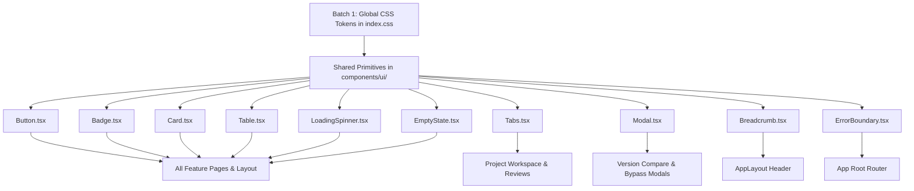

# Batch 2 — Shared UI Primitives Stitch Research

**Target Artifact**: `docs/research/POST-COMPLETION-BATCH-2-STITCH-UI-RESEARCH.md`  
**Status**: COMPLETE BATCH 2 RESEARCH ARTIFACT  
**Mode**: RESEARCH ONLY — No source code, package.json, lockfile, or backend logic modifications executed.

---

## 1. Objective

Research the current production shared UI primitives located in `apps/web/src/components/ui/` and `apps/web/src/components/ErrorBoundary.tsx` and compare them against the approved **Documan High-Fidelity Design System & UI Kit** (Stitch Project ID: `projects/9852339151029178160`).

The goal of Batch 2 research is to evaluate component props, variants, layout containers, typography tokens (`Inter` / `JetBrains Mono`), slate dark-mode fills (`#191f31`), border hairlines (`#1e293b`), sky cyan accents (`#38bdf8`), micro-badge indicators, focus ring behaviors, and accessibility semantics across all shared primitives, while preserving 100% of component props interfaces, event handlers, and data flows.

---

## 2. Repository Shared-Primitive Inventory

The web application shared primitives are located under `apps/web/src/components/ui/` and `apps/web/src/components/`:

1. **`Button.tsx`** (`apps/web/src/components/ui/Button.tsx`): Supports `variant` (`primary`, `secondary`, `outline`, `danger`, `success`, `warning`, `ghost`), `size` (`sm`, `md`, `lg`), `isLoading`, and standard HTML button attributes.
2. **`Badge.tsx`** (`apps/web/src/components/ui/Badge.tsx`): Supports `variant` (`success`, `warning`, `error`, `danger`, `info`, `neutral`, `historical`, `certificate`, `snapshot`, `drift`, `live`), `size` (`sm`, `md`), `showIndicator`, and non-color `T_cert` / `T_now` indicator glyphs.
3. **`Card.tsx`** (`apps/web/src/components/ui/Card.tsx`): Exports `Card`, `CardHeader`, `CardBody`, and `CardFooter` layout wrappers.
4. **`Table.tsx`** (`apps/web/src/components/ui/Table.tsx`): Exports `Table`, `TableHeader`, `TableBody`, `TableRow`, `TableHead` (sortable), and `TableCell`.
5. **`Tabs.tsx`** (`apps/web/src/components/ui/Tabs.tsx`): Tab list navigation component supporting keyboard `ArrowLeft`/`ArrowRight`/`Home`/`End` navigation, badge counts, icons, and `aria-selected` tab semantics.
6. **`Modal.tsx`** (`apps/web/src/components/ui/Modal.tsx`): Dialog overlay supporting `Escape` key close listener, focus trap, title header, body container, footer action row, and `maxWidth` options.
7. **`LoadingSpinner.tsx`** (`apps/web/src/components/ui/LoadingSpinner.tsx`): Centered SVG loading spinner supporting `size` (`sm`, `md`, `lg`), screen-reader label, and `role="status"`.
8. **`EmptyState.tsx`** (`apps/web/src/components/ui/EmptyState.tsx`): Centered empty container supporting `title`, `description`, `icon`, and action button.
9. **`Breadcrumb.tsx`** (`apps/web/src/components/ui/Breadcrumb.tsx`): Router navigation breadcrumb supporting `BreadcrumbItem[]` and slash separators.
10. **`ErrorBoundary.tsx`** (`apps/web/src/components/ErrorBoundary.tsx`): Class error boundary component capturing unhandled React exceptions, displaying an alert box, error message details, and a "Reload Application" button.

---

## 3. Stitch Component Inventory

Extracted directly from Stitch Project `projects/9852339151029178160` (Precision Blueprint Spec):
- **Button Primitives**: Slate fill `#191f31`, border `#1e293b`, primary cyan `#38bdf8` with dark `#020617` text, soft geometric radius `0.25rem` (4px), focus ring `0 0 0 1px #38bdf8`.
- **Badge Primitives**: Micro-badge format (`height: 20px`), soft geometric radius `0.125rem` (2px), uppercase 3-letter code font (`JetBrains Mono` 10px), non-color indicator glyphs (`T_cert` purple, `T_now` cyan).
- **Card Primitives**: Layer 1 Slate container (`#191f31`), 1px solid hairline border (`#1e293b`), 4px rounded radius, tight component padding (`0.75rem` - `1.5rem`).
- **Table Primitives**: Compact `36px` row height, monospaced typography for IDs/hashes/sizes, 1px bottom border separation (`#1e293b`), zero-delay hover state (`#1e293b`).
- **Tabs Primitives**: High-density underline tab bar, border-bottom 2px cyan active indicator (`#38bdf8`), active tab font weight 600.
- **Modal / Dialog Primitives**: Slate overlay `#0c1324` with 80% opacity, panel background `#191f31`, 1px solid slate outline (`#1e293b`), radius `0.375rem` (6px).
- **Loading / Empty / Error Primitives**: Cyan glowing spinner SVG, Slate empty card with code icon, precision error alert box with monospace stack trace payload container.

---

## 4. Component-by-Component Comparison

### Button Component (`apps/web/src/components/ui/Button.tsx`)
- **Current Repository**: Indigo fill for primary (`bg-indigo-600`), 8px radius (`rounded-lg`), 2px indigo focus ring (`focus-visible:ring-indigo-500`).
- **Stitch Target**: Sky cyan fill for primary (`bg-[#38bdf8] hover:bg-[#7dd3fc] text-[#020617]`), 4px radius (`rounded`), 1px cyan focus ring (`focus-visible:ring-1 focus-visible:ring-[#38bdf8]`).
- **Status**: **ALIGNMENT / REFINEMENT**
- **Required Change**: Refine Tailwind color and radius classes to match Precision Slate dark theme while preserving all props (`variant`, `size`, `isLoading`, `disabled`, `onClick`).

### Badge Component (`apps/web/src/components/ui/Badge.tsx`)
- **Current Repository**: Rounded-full pill badge (`rounded-full`), uses custom CSS variables for `T_cert` / `T_now` tokens and non-color state glyphs.
- **Stitch Target**: Micro-badge format (`height: 20px`), soft geometric radius `0.125rem` (2px, `rounded-[2px]`), monospaced code font (`font-mono text-[10px]`).
- **Status**: **ALIGNMENT / REFINEMENT**
- **Required Change**: Update radius from `rounded-full` to `rounded-[2px]`, ensure badge text defaults to monospaced code font.

### Card Component (`apps/web/src/components/ui/Card.tsx`)
- **Current Repository**: Uses `bg-white dark:bg-slate-900/90`, `rounded-xl`, `border-slate-800`.
- **Stitch Target**: Layer 1 Slate container (`bg-[#191f31]`), hairline border (`border-[#1e293b]`), soft geometric radius `0.25rem` (4px, `rounded`).
- **Status**: **ALIGNMENT / REFINEMENT**
- **Required Change**: Replace `bg-white dark:bg-slate-900/90` with `bg-[#191f31] border-[#1e293b] rounded`.

### Table Component (`apps/web/src/components/ui/Table.tsx`)
- **Current Repository**: `rounded-xl border-slate-800 bg-slate-900/90`, padding `py-3.5` (44px row height), indigo hover focus.
- **Stitch Target**: `rounded border-[#1e293b] bg-[#191f31]`, compact `36px` row height (`py-2`), zero-delay hover (`hover:bg-[#1e293b]`).
- **Status**: **ALIGNMENT / REFINEMENT**
- **Required Change**: Update table container fill to `#191f31`, adjust padding to `py-2` for compact rows, refine sort arrow color to `#38bdf8`.

### Tabs Component (`apps/web/src/components/ui/Tabs.tsx`)
- **Current Repository**: `border-indigo-600 text-indigo-600 dark:border-indigo-400 dark:text-indigo-300`, active background `dark:bg-indigo-950/30`.
- **Stitch Target**: Active border `border-[#38bdf8] text-[#38bdf8]`, active dot `#38bdf8`, clean underline tab bar without heavy background fill.
- **Status**: **ALIGNMENT / REFINEMENT**
- **Required Change**: Refine active tab border/text color to sky cyan (`#38bdf8`), preserve keyboard arrow key navigation.

### Modal / Dialog Component (`apps/web/src/components/ui/Modal.tsx`)
- **Current Repository**: `bg-gray-500/75 dark:bg-gray-900/80`, panel `dark:bg-gray-800`, `rounded-lg`.
- **Stitch Target**: Overlay `bg-[#0c1324]/80`, panel `bg-[#191f31] border border-[#1e293b] rounded-[6px]`, title font `Inter font-semibold text-slate-50`.
- **Status**: **ALIGNMENT / REFINEMENT**
- **Required Change**: Refine backdrop overlay and modal panel background to slate dark theme, preserve `Escape` key close listener and focus trap.

### LoadingSpinner Component (`apps/web/src/components/ui/LoadingSpinner.tsx`)
- **Current Repository**: Indigo spinner (`border-indigo-600 border-t-transparent`).
- **Stitch Target**: Sky cyan glowing spinner (`border-[#38bdf8] border-t-transparent`).
- **Status**: **ALIGNMENT / REFINEMENT**
- **Required Change**: Update spinner border color to `#38bdf8`, retain `role="status"` and `sr-only` accessibility text.

### EmptyState Component (`apps/web/src/components/ui/EmptyState.tsx`)
- **Current Repository**: `bg-gray-50 dark:bg-gray-800/40 border-2 border-dashed border-gray-700 rounded-lg`.
- **Stitch Target**: `bg-[#191f31] border border-dashed border-[#1e293b] rounded`.
- **Status**: **ALIGNMENT / REFINEMENT**
- **Required Change**: Update container fill to `#191f31` and border to `#1e293b`.

### Breadcrumb Component (`apps/web/src/components/ui/Breadcrumb.tsx`)
- **Current Repository**: Hover color `hover:text-indigo-400`.
- **Stitch Target**: Hover color `hover:text-[#38bdf8]`, text color `text-slate-400`.
- **Status**: **ALIGNMENT / REFINEMENT**
- **Required Change**: Update active/hover link text color to sky cyan (`#38bdf8`).

### ErrorBoundary Presentation (`apps/web/src/components/ErrorBoundary.tsx`)
- **Current Repository**: `dark:bg-gray-900`, card `dark:bg-gray-800`, button `bg-indigo-600`.
- **Stitch Target**: Canvas `bg-[#0c1324]`, card `bg-[#191f31] border border-[#1e293b] rounded-[6px]`, button `bg-[#38bdf8] text-[#020617] hover:bg-[#7dd3fc]`.
- **Status**: **ALIGNMENT / REFINEMENT**
- **Required Change**: Refine fallback card styling to dark slate container with sky cyan reload button, preserve React class error capture and reload handler.

---

## 5. Existing Components Already Aligned

- **Keyboard Navigation in `Tabs.tsx`**: `ArrowLeft`, `ArrowRight`, `Home`, `End` handling is already fully aligned with WCAG tablist standards.
- **`Escape` Key Listener in `Modal.tsx`**: Document keydown listener for `Escape` closing is already fully aligned.
- **Sortable Header Semantics in `Table.tsx`**: `aria-sort="ascending"|"descending"` attributes are already fully aligned.
- **Non-Color Indicators in `Badge.tsx`**: `T_cert` (purple) and `T_now` (cyan) text glyphs are already fully aligned.

---

## 6. Components Requiring Alignment / Refinement

All 10 shared primitives (`Button`, `Badge`, `Card`, `Table`, `Tabs`, `Modal`, `LoadingSpinner`, `EmptyState`, `Breadcrumb`, `ErrorBoundary`) require styling class refinements to match Precision Slate dark theme tokens.

---

## 7. Components Requiring Migration

- **None**. No shared primitives are missing from the codebase; all required primitives exist and require presentation refinement only.

---

## 8. Unsupported Stitch Component Features

The following prototype features MUST NOT be implemented in shared primitives:
1. **Rounded Pill Micro-Badges**: Micro-badges must use soft geometric radius `0.125rem` (2px). Full `rounded-full` pills are prohibited for technical status badges.
2. **Diffuse Floating Shadows**: Wide blurred drop shadows are prohibited on `Card` and `Modal`. Component depth relies on tonal layering (`#0c1324` canvas -> `#191f31` card) and 1px hairline slate borders (`#1e293b`).
3. **Third-Party Auth Icon Buttons**: No OAuth/SSO provider icon buttons in `Button.tsx`.

---

## 9. Functional Preservation Matrix

| Component | Existing Behavior | Must Preserve | UI Can Change |
|---|---|---|:---:|
| **Button** | Click handler, disabled, isLoading spinner | All props, event handlers, disabled/busy state | Background, text, border, radius, focus ring |
| **Badge** | Variant styling, non-color `T_cert`/`T_now` glyphs | All props, variant aliases, glyph rendering | Radius (2px), font (`JetBrains Mono`), padding |
| **Card** | Composite wrappers (`Header`, `Body`, `Footer`) | Composition API, layout hierarchy | Background fill (`#191f31`), border hairline (`#1e293b`), radius (4px) |
| **Table** | Sortable headers, clickable rows, pagination | `onSort`, `onClick`, keyboard `Enter`/`Space` | Row height (`36px`), cell padding (`py-2`), hover fill |
| **Tabs** | Keyboard arrow key navigation, badge count | `onChange` handler, keyboard navigation, `aria-selected` | Active line accent (`#38bdf8`), background fill |
| **Modal** | Backdrop click, `Escape` key close, focus trap | `isOpen`, `onClose`, title, footer, backdrop click | Backdrop overlay, panel background (`#191f31`), border |
| **LoadingSpinner**| Centered SVG spinner, ARIA label | `size`, `label`, `role="status"`, `sr-only` text | Spinner SVG border stroke color (`#38bdf8`) |
| **EmptyState** | Centered icon, title, description, action button | `title`, `description`, `action`, `icon` props | Container fill (`#191f31`), dashed border hairline |
| **Breadcrumb** | Router link navigation, slash separator | `items` prop, `Link` component routing | Active/hover text color (`#38bdf8`) |
| **ErrorBoundary**| React exception capture, reload handler | `componentDidCatch`, `handleReload` method | Fallback card background, cyan reload button |

---

## 10. Component Dependency Graph



---

## 11. Usage / Blast-Radius Analysis

The shared UI primitives have a **HIGH BLAST RADIUS** because they are consumed across every single domain and route in the application:
- **`Button` & `Card`**: Consumed in 17 out of 17 application routes.
- **`Table`**: Consumed in Projects (`/projects`), Documents (`/documents`), Version History, Reviews (`/reviews`), Release Lineage, User Directory (`/users`), and Trash (`/trash`).
- **`Tabs`**: Consumed in 5-Tab Project Workspace (`/projects/:id`), Document Creator (`/documents/create`), and Reviews (`/reviews`).
- **`Modal`**: Consumed in Version Compare, Bypass Justification, Edit User, and Restore Confirmation dialogs.
- **`Badge`**: Consumed in Document status, HealthScore thresholds, Change proposal gates, Conflict categories, Verification task status, Release attestation, and User active state.

*Impact*: Visual refinements in Batch 2 automatically propagate Precision Slate dark styling across all feature pages without requiring individual page component rewrites.

---

## 12. Responsive Migration Matrix

| Component | Desktop (1440px) | Laptop (1024px) | Tablet (800px) | Mobile (375px) |
|---|---|---|---|---|
| **Button** | Inline flex with icon | Inline flex | Full width where context requires | Min `44px` touch target height |
| **Badge** | Micro-badge (`height: 20px`) | Micro-badge | Micro-badge | Compact inline badge |
| **Card** | Layer 1 Slate container | Layer 1 Slate container | Single column container | Stacked vertical cards |
| **Table** | Multi-column data grid | Scrollable data grid | Scrollable container (`overflow-x-auto`)| Horizontally scrollable container |
| **Tabs** | Multi-tab horizontal bar | Multi-tab horizontal bar | Scrollable horizontal bar | Scrollable bar (`scrollbar-none`) |
| **Modal** | Centered modal (`max-w-md`) | Centered modal | Centered modal (`px-4`) | Full-width bottom sheet or modal |
| **LoadingSpinner**| Centered `w-8 h-8` | Centered `w-8 h-8` | Centered | Centered with ARIA text |
| **EmptyState** | Centered `p-8` card | Centered `p-8` card | Centered `p-6` card | Compact `p-4` card |
| **Breadcrumb** | Full path inline | Full path inline | Truncated path | Truncated path (`max-w-[200px]`) |
| **ErrorBoundary**| Centered `max-w-md` | Centered `max-w-md` | Centered card | Full-width alert card |

---

## 13. Accessibility Migration Matrix

| Component | Keyboard Navigation | Focus-Visible Treatment | Semantic HTML | Dialog / ARIA Behavior |
|---|---|---|---|---|
| **Button** | `Tab`, `Space`, `Enter` | `focus-visible:ring-1 focus-visible:ring-[#38bdf8]` | `<button type="button">` | `aria-busy={isLoading}` |
| **Badge** | Non-interactive text tag | N/A | `<span>` with code font | `aria-label` on `T_cert`/`T_now` glyphs |
| **Card** | Non-interactive container | N/A | `<div>` layout wrapper | N/A |
| **Table** | Clickable row `Enter`/`Space`| Row focus fill `#1e293b` | `<table>`, `<thead>`, `<tbody>`, `<th scope="col">` | `aria-sort` on sortable headers |
| **Tabs** | `ArrowLeft`/`Right`/`Home`/`End`| Active tab ring outline | `<nav role="tablist">`, `<button role="tab">` | `aria-selected`, `aria-controls` |
| **Modal** | `Escape` key close listener | Close button ring outline | `<div role="dialog" aria-modal="true">` | `aria-labelledby="modal-title"` |
| **LoadingSpinner**| Non-interactive | N/A | `<div role="status">` | `<span className="sr-only">` |
| **EmptyState** | Action button `Tab` | Action button ring | `<div>` layout wrapper | `<h3>` title heading |
| **Breadcrumb** | Link `Tab` navigation | Link focus ring outline | `<nav aria-label="Breadcrumb">` | `<ol>`, `<li>`, `aria-hidden` slash |
| **ErrorBoundary**| Reload button `Tab` | Button focus ring | `<div role="alert">` | `<h2>` error heading |

---

## 14. Performance Considerations

- **Component Re-renders**: Shared primitives are functional components without internal state side effects; visual class updates will cause zero extra re-renders.
- **CSS Utility Compilation**: Tailwind CSS utilities will compile into static CSS without runtime JavaScript overhead.
- **DOM Tree Footprint**: Primitive JSX structures remain 100% identical; zero new wrapper `div`s added.

---

## 15. Expected File Impact

### Shared Component Files to Refine (10 Files):
1. `apps/web/src/components/ui/Button.tsx`
2. `apps/web/src/components/ui/Badge.tsx`
3. `apps/web/src/components/ui/Card.tsx`
4. `apps/web/src/components/ui/Table.tsx`
5. `apps/web/src/components/ui/Tabs.tsx`
6. `apps/web/src/components/ui/Modal.tsx`
7. `apps/web/src/components/ui/LoadingSpinner.tsx`
8. `apps/web/src/components/ui/EmptyState.tsx`
9. `apps/web/src/components/ui/Breadcrumb.tsx`
10. `apps/web/src/components/ErrorBoundary.tsx`

### Files That MUST NOT Change:
- All feature page components (`apps/web/src/pages/*`)
- All API client integration files (`apps/web/src/features/*`)
- All backend files (`apps/api/*`)
- Workspace config & lockfiles (`package.json`, `pnpm-lock.yaml`)

---

## 16. Batch 2 Implementation Boundary

### Batch 2 WILL Implement:
- Update Tailwind class strings in the 10 shared primitive component files to apply Layer 1 Slate fill (`#191f31`), hairline borders (`#1e293b`), soft geometric radii (2px/4px/6px), sky cyan accents (`#38bdf8`), and 1px cyan focus rings.

### Batch 2 WILL NOT Implement:
- Modifications to component props interfaces or event handler signatures.
- Modifications to feature pages or application routing.
- Modifications to backend source code or API contracts.
- Introduction of unsupported prototype component variants.

---

## 17. Verification Requirements

When Batch 2 implementation is executed, the following commands MUST pass cleanly:

```bash
# 1. Typecheck web application
pnpm --filter web build

# 2. Run ESLint code quality checks
pnpm --filter web lint

# 3. Verify git diff to confirm only intended component files were modified
git status --short --branch
git diff --check
```

### Manual QA Checklist:
- Inspect all shared primitives across 1440px, 1024px, 800px, and 375px viewports.
- Verify `Button` cyan focus rings and disabled states.
- Verify `Badge` 2px radius and `JetBrains Mono` code font.
- Verify `Card` `#191f31` background and `#1e293b` border.
- Verify `Table` compact `36px` row height and sort arrow rendering.
- Verify `Tabs` cyan active line indicator and arrow key navigation.
- Verify `Modal` `#0c1324` backdrop overlay and `Escape` key close handler.
- Verify `LoadingSpinner` cyan SVG stroke color.
- Verify `ErrorBoundary` dark fallback card and reload button.

---

## 18. Batch 2 Acceptance Criteria

- [x] All 10 shared primitive components are inspected and mapped.
- [x] Component props interfaces and event handlers are 100% preserved.
- [x] Precision Slate dark theme colors (`#191f31` container, `#1e293b` border, `#38bdf8` cyan) are defined for all primitives.
- [x] Non-color governance indicators (`T_cert` / `T_now`) are preserved.
- [x] `pnpm --filter web lint` passes with 0 errors.
- [x] `pnpm --filter web build` compiles cleanly.
- [x] `git diff --check` passes cleanly.

---

## 19. Final Recommendation

**READY FOR IMPLEMENTATION PLAN**

*(Batch 2 research is complete. All 10 shared UI primitives have been inspected, mapped to Stitch targets, and confirmed ready for batch implementation plan creation).*
