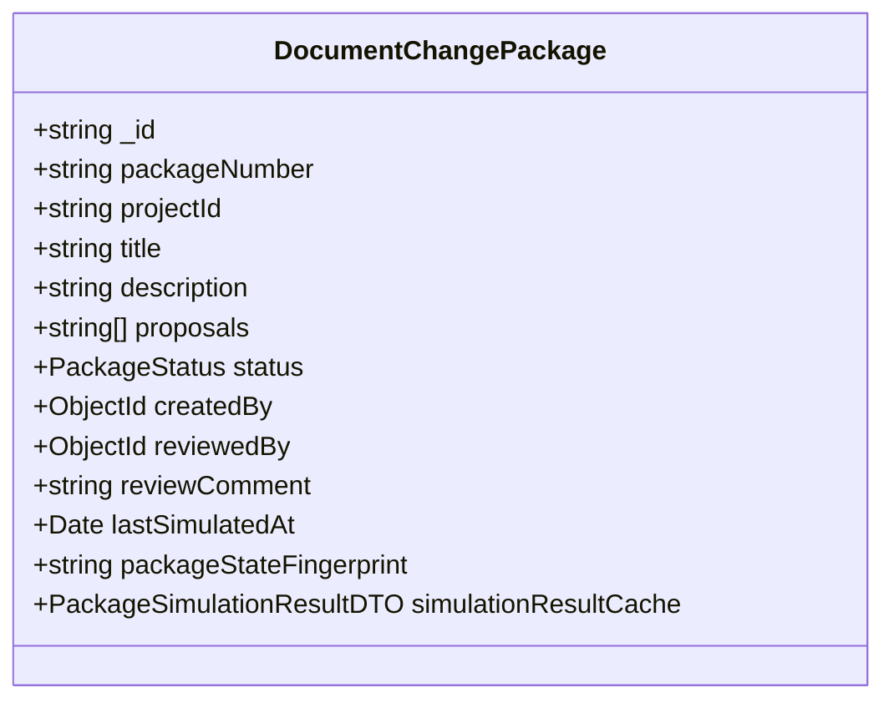
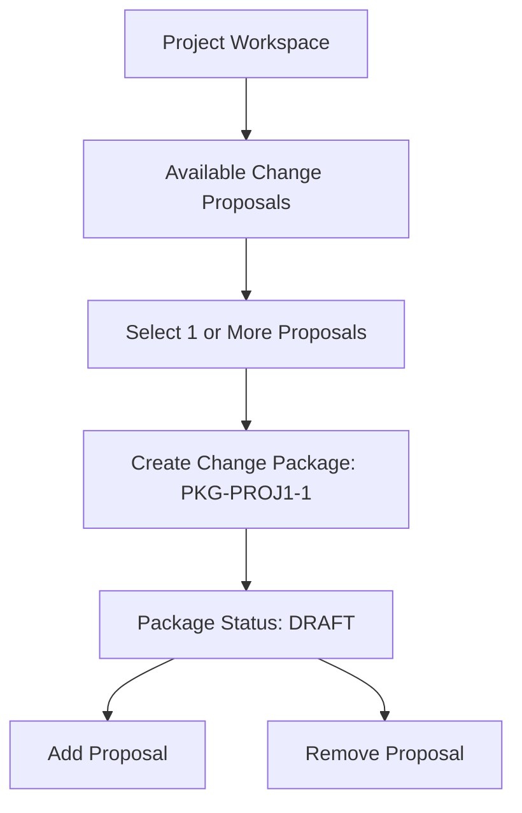
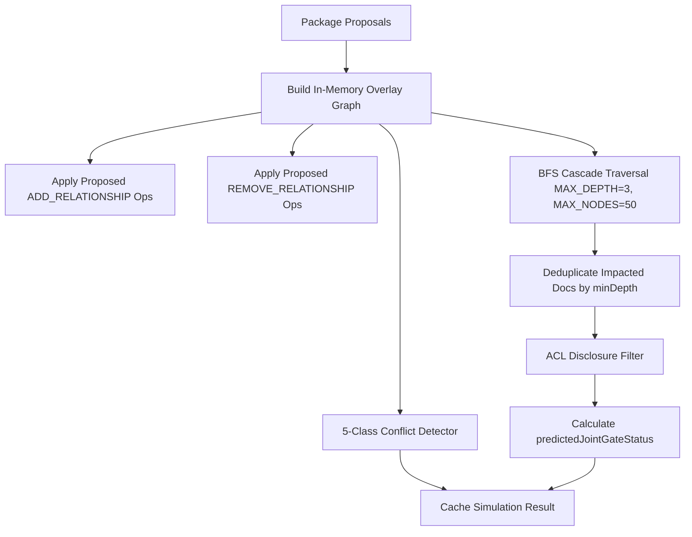

# Post-Completion Change Packages & Release Planning Design Research

> **Document Status**: COMPLETED & VERIFIED  
> **Research Focus**: Change Packages, Multi-Proposal Coordination, Conflict Detection, Coordinated Blast Radius & Release Planning  
> **Output Artifact**: `docs/research/POST-COMPLETION-CHANGE-PACKAGES-RELEASE-PLANNING-DESIGN-RESEARCH.md`  
> **Baseline Commit**: `93cf49d` (Main Branch Synchronized)  

---

## 1. Executive Summary

This research document establishes the authoritative baseline for **Change Packages & Release Planning** in Documan.

The objective is to guide the visual and interactive design for Google Stitch screen `14_CHANGE_PACKAGES_AND_RELEASE_PLANNING` based strictly on verified repository implementations.

Documan provides a persisted **Change Package model**, **multi-proposal conflict analysis**, and a **coordinated in-memory impact simulation engine**. It allows architects and release engineers to group multiple `DocumentChangeProposals`, simulate aggregate blast radius across combined graph overlays, evaluate joint governance release gate readiness (`predictedJointGateStatus`), and resolve conflicts before approving release packages.

---

## 2. Authoritative Repository Evidence

### Frontend Components & Features (`apps/web/src/`)
- [`apps/web/src/features/change-packages/change-package.types.ts`](file:///c:/MERN_STACK/Documan/documan/apps/web/src/features/change-packages/change-package.types.ts) — TypeScript definitions for Change Packages, Conflicts, Deduplicated Impact, and Coordinated Simulations.
- [`apps/web/src/features/change-packages/change-package.api.ts`](file:///c:/MERN_STACK/Documan/documan/apps/web/src/features/change-packages/change-package.api.ts) — API client for package creation, proposal membership management, simulation, and review status transitions.
- [`apps/web/src/features/change-packages/components/CreatePackageModal.tsx`](file:///c:/MERN_STACK/Documan/documan/apps/web/src/features/change-packages/components/CreatePackageModal.tsx) — Modal dialog for bundling proposals into a new named Change Package.
- [`apps/web/src/features/change-packages/components/ChangePackageDetailsDrawer.tsx`](file:///c:/MERN_STACK/Documan/documan/apps/web/src/features/change-packages/components/ChangePackageDetailsDrawer.tsx) — Slide-out workspace displaying package proposals, conflict analysis warnings, coordinated blast radius, and review approval controls.
- [`apps/web/src/features/change-packages/components/ProjectChangePackagesTab.tsx`](file:///c:/MERN_STACK/Documan/documan/apps/web/src/features/change-packages/components/ProjectChangePackagesTab.tsx) — Project-level tab in `ProjectDetailsPage.tsx` listing change packages, proposal counts, and lifecycle badges.

### Backend Services & Models (`apps/api/src/modules/`)
- [`apps/api/src/modules/change-packages/change-package.model.ts`](file:///c:/MERN_STACK/Documan/documan/apps/api/src/modules/change-packages/change-package.model.ts) — Mongoose model for `DocumentChangePackage`.
- [`apps/api/src/modules/change-packages/change-package-simulation.service.ts`](file:///c:/MERN_STACK/Documan/documan/apps/api/src/modules/change-packages/change-package-simulation.service.ts) — Coordinated multi-proposal BFS impact simulation, 5-class conflict detector, and deduplicated impact aggregator.
- [`apps/api/src/modules/change-packages/change-package.service.ts`](file:///c:/MERN_STACK/Documan/documan/apps/api/src/modules/change-packages/change-package.service.ts) — Package CRUD, proposal membership mutation (`addProposalToPackage`/`removeProposalFromPackage`), staleness tracking, and approval handoffs.
- [`apps/api/src/modules/change-packages/change-package.routes.ts`](file:///c:/MERN_STACK/Documan/documan/apps/api/src/modules/change-packages/change-package.routes.ts) — Express router for `/api/v1/change-packages` and `/api/v1/projects/:projectId/change-packages`.
- [`apps/api/src/modules/change-packages/change-package-fingerprint.ts`](file:///c:/MERN_STACK/Documan/documan/apps/api/src/modules/change-packages/change-package-fingerprint.ts) — Composite state fingerprinting for detecting package staleness when constituent proposals or underlying document states change.

---

## 3. Change Package Model

A **Change Package** is a persisted entity grouping multiple `DocumentChangeProposals` for coordinated simulation, conflict detection, and joint release evaluation (`change-package.model.ts`).



### Key Attributes & Rules
- **Package Number**: Unique sequential identifier (e.g. `PKG-PROJ1-1-4829`).
- **Proposals List**: Array of `DocumentChangeProposal` ObjectIDs (`proposals`).
- **Status Lifecycle**: `DRAFT` $\rightarrow$ `SIMULATED` $\rightarrow$ `UNDER_REVIEW` $\rightarrow$ `ACCEPTED` / `REJECTED` / `DISCARDED`.
- **Membership Mutability**: Proposals can be added or removed ONLY while package status is `DRAFT`. Adding or removing a proposal invalidates `packageStateFingerprint`.
- **Staleness Guard**: Accepting a package (`acceptChangePackage`) is blocked if `stalenessResult.isStale === true`, requiring a fresh simulation run.

---

## 4. Package Composition

Users compose change packages by selecting existing draft/simulated proposals within a project workspace (`CreatePackageModal.tsx` & `addProposalToPackage`):



---

## 5. Proposal Coordination & Staleness

Proposals within a package are evaluated together in a single in-memory graph overlay (`change-package-simulation.service.ts`):

- **State Fingerprinting**: `computePackageStateFingerprint` generates a composite SHA-256 hash across all constituent proposal IDs and target document versions.
- **Staleness Trigger**: If any target document in the package is edited, approved, or superseded outside the package, `isStale` becomes `true` and the UI alerts: `"Change package is STALE. Please re-run simulation before accepting"`.

---

## 6. Coordinated Impact Analysis

When `simulateChangePackage` is executed, the simulation engine runs `runChangePackageSimulation`:



### Coordinated Blast Radius Output (`PackageSimulationResultDTO`)
- `predictedJointGateStatus`: `PASSED` | `WARNING` | `FAILED` | `GOVERNANCE_DISABLED`
- `predictedDriftStatus`: `IN_SYNC` | `DRIFTED` | `NO_BASELINE`
- `predictedEvidenceScore`: Minimum evidence score % across constituent proposals.
- `impactCascade.impactedDocuments`: `DeduplicatedImpactedDocument[]` displaying `minDepth`, `contributingProposalIds`, and detailed `impactDetails`.
- `predictedCrossProjectBlastRadius`: `impactedProjectsCount`, `crossProjectNodes` (`{ projectId, projectName }`).

---

## 7. Conflict & Dependency Analysis (5 Classes)

The engine evaluates 5 deterministic conflict classes (`change-package-simulation.service.ts#L100-L240`):

| Conflict Class | Severity | Trigger Description |
| :--- | :---: | :--- |
| **`MUTUALLY_EXCLUSIVE_TARGET`** | `BLOCKING` | Multiple proposals in the package target the exact same document with conflicting operations (e.g., deprecation alongside content/schema edits). |
| **`INCOMPATIBLE_CONTRACT_SCHEMA`** | `BLOCKING` | Multiple contract proposals target the same document with incompatible structural JSON Schema definitions. |
| **`CONTRADICTORY_RELATIONSHIP`** | `BLOCKING` | Proposal A adds a relationship ($Doc_1 \rightarrow Doc_2$) while Proposal B in the same package removes the exact same relationship. |
| **`DEPRECATION_DEPENDENCY_CONFLICT`** | `BLOCKING` | Proposal A adds a `DEPENDS_ON` link to $Doc_2$ while Proposal B in the package flags $Doc_2$ for deprecation. |
| **`CIRCULAR_DEPENDENCY_INJECTION`** | `BLOCKING` | Proposed relationship additions inject a cyclic dependency loop ($Doc_A \rightarrow Doc_B \rightarrow Doc_A$) detected via DFS graph traversal. |

---

## 8. Release Planning Capability

"Release Planning" in Change Packages represents pre-release coordination and gate readiness:
- **Planned Release Grouping**: Bundling multiple proposals into a single named release package.
- **Readiness Verification**: Validating that `conflicts.length === 0` and `predictedJointGateStatus !== 'FAILED'`.
- **Package Acceptance**: `acceptChangePackage` transitions package and all constituent proposals to `ACCEPTED` and outputs a handoff payload instructing release execution.

---

## 9. Relationship to Phase 13

| Dimension | Phase 13 (Change Proposals) | Phase 14 (Change Packages & Release Planning) |
| :--- | :--- | :--- |
| **Scope** | Single proposal targeting 1 document. | Multi-proposal bundle targeting multiple documents/projects. |
| **Conflict Analysis** | None (Single proposal evaluation). | 5-class conflict detection across all package proposals. |
| **Impact Traversal** | BFS from 1 target document ($N=50, D=3$). | Coordinated BFS over combined overlay graph ($N=50, D=3$). |
| **Deduplication** | Single document depth listing. | Deduplicated roster with `minDepth` and `contributingProposalIds`. |
| **Gate Evaluation** | Single document predicted gate status. | `predictedJointGateStatus` representing overall release readiness. |

---

## 10. Boundary with Later Release Certification Domains

> **CRITICAL DOMAIN BOUNDARY**:  
> **Change Packages & Release Planning is NOT System Release Certification.**

- Phase 14 handles pre-release coordination, multi-proposal impact simulation, and package acceptance.
- System Release Certificates (`T_cert` minting), Release Certificate Lineage, and Release Compliance Drift Audits belong strictly to later system release domains.

---

## 11. ACL & Privacy Boundaries

- **Strict Disclosure Filtering**: `checkUserProjectReadAccess(userId, role, projId)` verifies access for every impacted node.
- Unauthorized cross-project nodes and documents are omitted from `impactedDocuments` and `crossProjectNodes` so sensitive project names are never leaked.

---

## 12. Existing Routes & Navigation Placement

- **Project Details Page** (`/projects/:id`): Contains **"Change Packages"** tab rendering `ProjectChangePackagesTab.tsx`.
- **Package Creator**: `CreatePackageModal.tsx` modal overlay triggered from the Change Packages tab.
- **Package Details & Simulation Workspace**: `ChangePackageDetailsDrawer.tsx` slide-out drawer displaying proposals list, conflicts, blast radius, and review controls.

---

## 13. Existing UI States

- **Loading State**: Table skeleton loading (`"Loading change packages..."`).
- **Empty State**: Centered placeholder (`"No Change Packages Found"`).
- **Populated Workspace State**: Proposals roster, conflict alert boxes, predicted metrics grid, deduplicated blast radius list, and action buttons.
- **Stale Package State**: Warning alert (`"Change package is STALE. Please re-run simulation before accepting"`).
- **Error State**: Rose banner rendering (`bg-rose-950/60 border-rose-800 text-rose-300`).

---

## 14. Existing Shared UI Patterns

Reuses existing design primitives:
- `<Button>` (Primary `indigo-600` for simulation, Secondary `slate-800` for details)
- `<Badge>` (Status indicators: `DRAFT`, `SIMULATED`, `UNDER_REVIEW`, `ACCEPTED`, `REJECTED`)
- `<Card>` & `<Table>` (Dark slate table `bg-slate-900 border-slate-800`)
- `ChangePackageDetailsDrawer` (Slide-out drawer `bg-slate-900 border-slate-800`)

---

## 15. Unsupported / Rejected Concepts

The following concepts are **NOT PRESENT** in the codebase and **MUST NOT** be added to the Stitch design:

- ❌ **NOT PRESENT**: Automated Code Execution / Auto-deployment
- ❌ **NOT PRESENT**: Git Commit / Branch Creation / PR Merging
- ❌ **NOT PRESENT**: CI/CD Build Triggers or Deployment Pipeline Execution
- ❌ **NOT PRESENT**: AI Conflict Prediction / LLM Confidence Scores
- ❌ **NOT PRESENT**: Jira Sprint Planning / Ticket Management
- ❌ **NOT PRESENT**: System-Wide Release Certificate Minting (Belongs to later release domain)

---

## 16. Proposed `14_CHANGE_PACKAGES_AND_RELEASE_PLANNING` Architecture

```text
14_CHANGE_PACKAGES_AND_RELEASE_PLANNING ARCHITECTURE:
├── 14.00 Overview & Layout Architecture
├── 14.01 Project Change Packages Workspace Tab (ProjectDetailsPage)
│   ├── Package Roster Table (Package #, Title, Proposals Count, Status, Actions)
│   └── "Create Change Package" Trigger Button
├── 14.02 Create Change Package Modal
│   ├── Package Title & Description Inputs
│   └── Multi-Select Proposal Picker (Draft/Simulated Proposals)
├── 14.03 Change Package Details Drawer (1440px Desktop)
│   ├── Package Header & Status Badge (DRAFT, SIMULATED, UNDER_REVIEW, ACCEPTED)
│   ├── Constituent Proposals Roster (Proposal #, Target Doc, Type, Action Controls)
│   └── Coordinated Simulation Trigger Button ("Run Coordinated Package Simulation")
├── 14.04 Conflict & Readiness Analysis Panel
│   ├── 5-Class Conflict Alert Cards (MUTUALLY_EXCLUSIVE_TARGET, CIRCULAR_DEPENDENCY, etc.)
│   └── Predicted Joint Release Gate Status (PASSED, WARNING, FAILED)
├── 14.05 Coordinated Blast Radius Output View
│   ├── Deduplicated Impacted Documents Roster (Min Depth, Contributing Proposal IDs)
│   └── Cross-Project Blast Radius Nodes (Project Names & Counts)
├── 14.06 Package Review & Acceptance Workspace
│   ├── Review Comment Input & Reviewer Actions (Submit, Accept Package, Reject)
│   └── Package Staleness Banner Warning ("Re-run Simulation Required")
└── 14.07 Responsive Viewport Variants (1024px, 800px, 375px Mobile)
```

---

## 17. Open Questions / Verification Items

All core capabilities have been **100% VERIFIED** against the codebase:
- Persisted `DocumentChangePackage` model & CRUD: **VERIFIED** ([`change-package.service.ts`](file:///c:/MERN_STACK/Documan/documan/apps/api/src/modules/change-packages/change-package.service.ts))
- 5-Class conflict detector: **VERIFIED** ([`change-package-simulation.service.ts#L100-L240`](file:///c:/MERN_STACK/Documan/documan/apps/api/src/modules/change-packages/change-package-simulation.service.ts))
- Coordinated multi-proposal BFS cascade simulation: **VERIFIED** ([`change-package-simulation.service.ts#L241-L340`](file:///c:/MERN_STACK/Documan/documan/apps/api/src/modules/change-packages/change-package-simulation.service.ts))
- UI components, modal & drawer: **VERIFIED** ([`ProjectChangePackagesTab.tsx`](file:///c:/MERN_STACK/Documan/documan/apps/web/src/features/change-packages/components/ProjectChangePackagesTab.tsx), [`ChangePackageDetailsDrawer.tsx`](file:///c:/MERN_STACK/Documan/documan/apps/web/src/features/change-packages/components/ChangePackageDetailsDrawer.tsx), [`CreatePackageModal.tsx`](file:///c:/MERN_STACK/Documan/documan/apps/web/src/features/change-packages/components/CreatePackageModal.tsx))

---

## 18. Final Design Readiness Assessment

**Status: READY FOR GOOGLE STITCH DESIGN**  
The repository provides a complete, robust, and deterministic foundation for Change Packages, Multi-Proposal Coordination, Conflict Analysis, and Release Planning. The design for `14_CHANGE_PACKAGES_AND_RELEASE_PLANNING` can now be created in Google Stitch with total fidelity to the actual product implementation.

---
