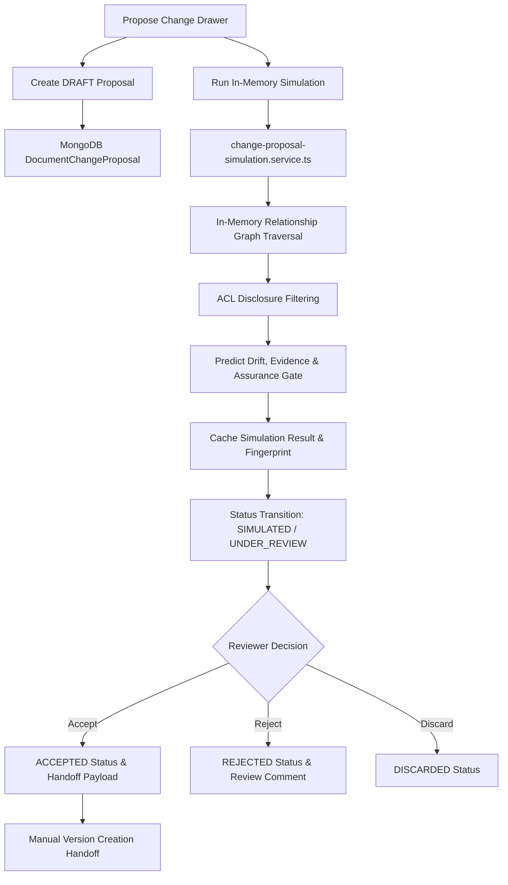
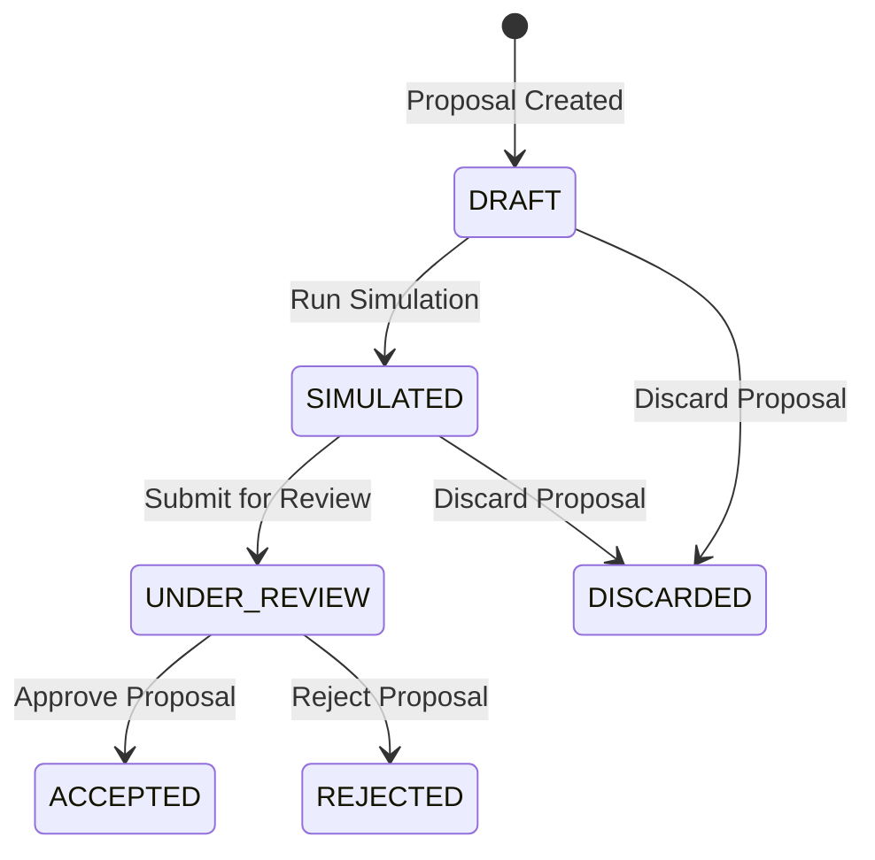
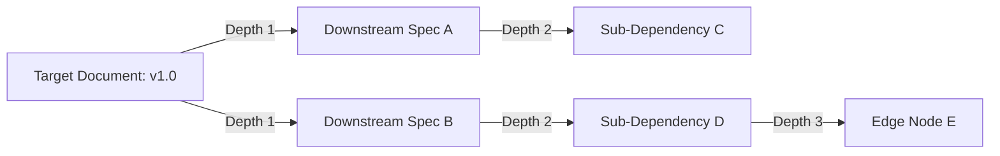

# Post-Completion Change Proposals & Impact Cascade Design Research

> **Document Status**: COMPLETED & VERIFIED  
> **Research Focus**: Change Proposals, Impact Cascade, Blast Radius Simulation & Governance Consequences  
> **Output Artifact**: `docs/research/POST-COMPLETION-CHANGE-PROPOSALS-IMPACT-DESIGN-RESEARCH.md`  
> **Baseline Commit**: `93cf49d` (Main Branch Synchronized)  

---

## 1. Executive Summary

This research document establishes the authoritative baseline for **Change Proposals** and **Impact Cascade** analysis in Documan. 

The objective is to guide the visual and interactive design for Google Stitch screen `13_CHANGE_PROPOSALS_AND_IMPACT_CASCADE` based strictly on verified repository implementations.

Documan provides a read-only, in-memory **pre-change impact simulation engine** and a structured **Change Proposal lifecycle**. It allows architects and engineering leads to evaluate hypothetical content updates, technical contract modifications, relationship changes, or deprecations before committing changes to authoritative states.

---

## 2. Authoritative Repository Evidence

### Frontend Components & Features (`apps/web/src/`)
- [`apps/web/src/features/change-proposals/change-proposal.types.ts`](file:///c:/MERN_STACK/Documan/documan/apps/web/src/features/change-proposals/change-proposal.types.ts) — TypeScript definitions for Proposals, Change Payloads, and Simulation Results.
- [`apps/web/src/features/change-proposals/change-proposal.api.ts`](file:///c:/MERN_STACK/Documan/documan/apps/web/src/features/change-proposals/change-proposal.api.ts) — API client for proposal creation, simulation, listing, status updates, and acceptance.
- [`apps/web/src/features/change-proposals/components/ProposeChangeDrawer.tsx`](file:///c:/MERN_STACK/Documan/documan/apps/web/src/features/change-proposals/components/ProposeChangeDrawer.tsx) — Slide-out drawer for inputting hypothetical changes, running read-only simulations, and saving draft proposals.
- [`apps/web/src/features/change-proposals/components/ProjectProposalsTab.tsx`](file:///c:/MERN_STACK/Documan/documan/apps/web/src/features/change-proposals/components/ProjectProposalsTab.tsx) — Project-level tab in `ProjectDetailsPage.tsx` listing proposals, simulation status, and approval controls.
- [`apps/web/src/features/documents/DocumentCrossProjectImpactSection.tsx`](file:///c:/MERN_STACK/Documan/documan/apps/web/src/features/documents/DocumentCrossProjectImpactSection.tsx) — Document-level component in `DocumentDetailsPage.tsx` displaying active upstream contract drift sources.

### Backend Services & Models (`apps/api/src/modules/`)
- [`apps/api/src/modules/change-proposals/change-proposal.model.ts`](file:///c:/MERN_STACK/Documan/documan/apps/api/src/modules/change-proposals/change-proposal.model.ts) — Mongoose model for `DocumentChangeProposal`.
- [`apps/api/src/modules/change-proposals/change-proposal-simulation.service.ts`](file:///c:/MERN_STACK/Documan/documan/apps/api/src/modules/change-proposals/change-proposal-simulation.service.ts) — Core impact cascade graph traversal (`runChangeProposalSimulation`), depth-bounded breadth-first search, and predicted governance state engine.
- [`apps/api/src/modules/change-proposals/change-proposal.service.ts`](file:///c:/MERN_STACK/Documan/documan/apps/api/src/modules/change-proposals/change-proposal.service.ts) — Proposal CRUD, state fingerprinting, staleness detection, and post-acceptance handoffs.
- [`apps/api/src/modules/change-proposals/change-proposal.routes.ts`](file:///c:/MERN_STACK/Documan/documan/apps/api/src/modules/change-proposals/change-proposal.routes.ts) — Express routes for `/api/v1/change-proposals` and `/api/v1/projects/:projectId/change-proposals`.
- [`apps/api/src/modules/change-proposals/change-proposal-fingerprint.ts`](file:///c:/MERN_STACK/Documan/documan/apps/api/src/modules/change-proposals/change-proposal-fingerprint.ts) — Hash state fingerprinting for detecting simulation staleness when underlying document relationships change.

---

## 3. Change Proposal Architecture

A **Change Proposal** is a persisted specification representing a proposed modification to an authoritative architecture document or technical contract.



---

## 4. Proposal Lifecycle & Status Model

Proposals transition through 6 formal lifecycle statuses (`change-proposal.types.ts#L8-L14`):



1. **`DRAFT`**: Initial created state when proposal parameters are saved.
2. **`SIMULATED`**: Simulation executed; blast radius and predicted governance metrics cached in `simulationResultCache`.
3. **`UNDER_REVIEW`**: Formally submitted for reviewer evaluation.
4. **`ACCEPTED`**: Approved by project owner or admin. Generates handoff payload for version creation.
5. **`REJECTED`**: Declined with reviewer comments (`reviewComment`).
6. **`DISCARDED`**: Closed without action.

### Proposal Types (`ProposalType`)
- `DOCUMENT_CONTENT_UPDATE`: Proposed markdown text revision.
- `TECHNICAL_CONTRACT_UPDATE`: Proposed OpenAPI / JSON Schema modification.
- `RELATIONSHIP_UPDATE`: Proposed addition or removal of dependency links.
- `DEPRECATION_PROPOSAL`: Proposed document deprecation.

---

## 5. Impact Analysis Architecture

The impact analysis engine (`change-proposal-simulation.service.ts`) executes an in-memory, read-only simulation without modifying any database state.

### Traversal Parameters & Limits
- **Algorithm**: Breadth-First Search (BFS) over document relationship graph (`DocumentRelationship`).
- **Maximum Depth**: `MAX_DEPTH = 3` (Traverses up to 3 levels of downstream dependencies).
- **Maximum Nodes**: `MAX_NODES = 50` (Hard cap on traversal nodes to prevent execution timeouts).
- **Truncation Flag**: If node count exceeds 50 or depth exceeds 3, `isTruncated` is set to `true` and a warning is emitted.

---

## 6. Impact Cascade & Relationship Model

The impact cascade identifies all direct and indirect downstream documents affected by a proposed change:



### Direct Relationship Scope Verified
- Documan evaluates direct (`depth = 1`), secondary (`depth = 2`), and tertiary (`depth = 3`) relationships.
- Relationship types evaluated: `DEPENDS_ON`, `REPLACES`, `REFERENCES`, `RELATED`.

---

## 7. Affected Entity Types & Traceability

Simulation results quantify blast radius across multiple architectural dimensions:

1. **Impacted Documents**: `totalImpactedCount`, `impactedDocuments` (`{ documentId, title, projectId, depth }`).
2. **Cross-Project Blast Radius**: `impactedProjectsCount`, `crossProjectNodes` (`{ projectId, projectName }`).
3. **Predicted Baseline Drift**: Evaluates `T_cert` baseline alignment (`IN_SYNC`, `DRIFTED`, `NO_BASELINE`, `CONTENT_CHECKSUM_DRIFT`, `VERSION_NUMBER_DRIFT`).
4. **Predicted Evidence Coverage**: Calculates evidence score % (`calculateEvidenceCoverage`).
5. **Predicted Assurance Gate Status**: Evaluates governance release gate (`PASSED`, `WARNING`, `FAILED`, `GOVERNANCE_DISABLED`).
6. **Predicted Verification Tasks**: Auto-generates task checklists (`CONTRACT_VERIFICATION`, `IMPACT_VERIFICATION`).
7. **Work Request Effects**: Maps affected open work requests (`DocumentationWorkRequest`).

---

## 8. Simulation vs. Execution Boundary

> **CRITICAL VERIFICATION STATEMENT**:  
> **Change execution is outside the verified capability.**

Documan is strictly a **decision-support and compliance prediction platform**:
- It **does NOT** execute code modifications, Git commits, PR merges, or CI/CD deployments.
- Accepting a proposal (`acceptProposal`) marks status as `ACCEPTED` and returns a handoff payload instructing the user to create an authoritative document version via standard API endpoints.

---

## 9. ACL & Security Boundaries

- **Strict Disclosure ACL Filtering**:
  ```typescript
  // change-proposal-simulation.service.ts#L194-L201
  for (const node of rawImpactedList) {
    const canRead = await checkUserProjectReadAccess(userId, role, node.projectId);
    if (canRead) {
      authorizedImpactedList.push(node);
      authorizedProjectIds.add(node.projectId);
    }
  }
  ```
- **Information Leakage Prevention**: If an impacted document belongs to a project the current user cannot access, that document node and its project name are omitted from the simulation result.

---

## 10. Existing Routes & Navigation Placement

- **Document Details Page** (`/documents/:id`): Contains **"Pre-Change Simulation & Proposal"** action button launching `ProposeChangeDrawer` and renders `DocumentCrossProjectImpactSection`.
- **Project Details Page** (`/projects/:id`): Contains **"Proposals"** tab rendering `ProjectProposalsTab`.

---

## 11. Existing UI States

- **Initial Form State**: Parameters selection (`proposalType`, `targetVersionType`, `title`, `description`, content/schema).
- **Simulating State**: Button loading spinner (`"Running In-Memory Simulation..."`).
- **Populated Simulation Results State**:
  - Predicted Status Banner (`COMPLETE` / `TRUNCATED_PARTIAL`).
  - Authoritative Current vs Predicted State Comparison.
  - Predicted Metrics Grid (Drift Status, Evidence Score, Impacted Count).
  - Impacted Blast Radius roster grouped by depth.
  - Predicted Verification Requirements.
- **Saving / Success State**: Success banner (`"Proposal created successfully as DRAFT"`).
- **Error State**: Banner error rendering (`bg-rose-950/60 border-rose-800 text-rose-300`).

---

## 12. Existing Shared UI Patterns

Reuses existing design primitives:
- `<Button>` (Primary `indigo-600` for simulation, Secondary `slate-800` for saving)
- `<Badge>` (Status indicators: `DRAFT`, `SIMULATED`, `ACCEPTED`, `REJECTED`)
- `<Card>` & `<CardBody>` (Dark slate containers `bg-slate-900 border-slate-800`)
- `ProposeChangeDrawer` (Slide-out drawer overlay `bg-slate-900/50 backdrop-blur-sm`)

---

## 13. Stitch Design Requirements

The Google Stitch design for `13_CHANGE_PROPOSALS_AND_IMPACT_CASCADE` must include:
1. **Proposal Creation & Simulation Drawer**: Form controls for proposal type, version type, markdown/schema payload, simulation trigger, and draft saving.
2. **Side-by-Side Current vs. Predicted State Comparison**: Highlighting current version/gate vs predicted version/gate.
3. **Blast Radius & Depth Cascade Visualization**: List/graph of impacted documents tagged with `Depth 1`, `Depth 2`, `Depth 3` and cross-project badges.
4. **Predicted Governance & Gate Impact Widgets**: Baseline drift prediction, evidence score gauge, and predicted verification task checklist.
5. **Project Proposals Management Tab**: Table listing project proposals, status badges, simulation fingerprinted staleness tags, and review action buttons (Approve, Reject, Discard).

---

## 14. Unsupported / Rejected Concepts

The following concepts are **NOT PRESENT** in the codebase and **MUST NOT** be added to the Stitch design:

- ❌ **NOT PRESENT**: Automated Code Modification / Auto-refactoring
- ❌ **NOT PRESENT**: Git Commit / Branch Creation / PR Merging
- ❌ **NOT PRESENT**: CI/CD Pipeline Execution / Deployment Triggers
- ❌ **NOT PRESENT**: AI Impact Prediction / LLM Confidence Percentages
- ❌ **NOT PRESENT**: Jira-style Task Execution Workflows
- ❌ **NOT PRESENT**: Generic APM / Telemetry Logs

---

## 15. Proposed `13_CHANGE_PROPOSALS_AND_IMPACT_CASCADE` Screen Architecture

```text
13_CHANGE_PROPOSALS_AND_IMPACT_CASCADE ARCHITECTURE:
├── 13.00 Overview & Layout Architecture
├── 13.01 Pre-Change Simulation & Proposal Drawer (1440px Desktop)
│   ├── Proposal Type Select & Version Type Config
│   ├── Content / OpenAPI Schema Editor
│   └── Read-Only Simulation Trigger Button
├── 13.02 Simulation Results Output View
│   ├── Authoritative Current vs Predicted State Comparison Header
│   ├── Predicted Metrics Summary (Drift Status, Evidence Score %, Blast Radius Count)
│   ├── Impacted Blast Radius Roster (Grouped by Depth 1, 2, 3)
│   └── Predicted Verification Tasks & Governance Requirements Checklist
├── 13.03 Project Proposals Management Tab (ProjectDetailsPage)
│   ├── Proposals Roster Table (Proposal #, Title, Target Doc, Type, Status)
│   ├── Fingerprint Staleness Indicator Tag ("Simulation Stale")
│   └── Review Action Controls (Approve, Reject with Comment, Discard)
├── 13.04 Document Cross-Project Impact Section (DocumentDetailsPage)
│   ├── Verification Status Indicator ("Verification Required" / "Contracts Aligned")
│   └── Active Upstream Contract Drift Sources Roster
├── 13.05 Simulation States & Edge Cases
│   ├── Running Simulation Loading State
│   ├── Truncated / Max Bounded Impact State (50 Node Limit Warning)
│   ├── Access Denied / ACL Filtered Impact Warning
│   └── Validation & API Error Banners
└── 13.06 Responsive Viewport Variants (1024px, 800px, 375px Mobile)
```

---

## 16. Open Questions / Verification Items

All core capabilities have been **100% VERIFIED** against the codebase:
- In-memory 3-depth BFS simulation engine: **VERIFIED** ([`change-proposal-simulation.service.ts`](file:///c:/MERN_STACK/Documan/documan/apps/api/src/modules/change-proposals/change-proposal-simulation.service.ts))
- Proposal lifecycle & review status model: **VERIFIED** ([`change-proposal.service.ts`](file:///c:/MERN_STACK/Documan/documan/apps/api/src/modules/change-proposals/change-proposal.service.ts))
- Strict ACL disclosure filtering: **VERIFIED** ([`change-proposal-simulation.service.ts#L194-L201`](file:///c:/MERN_STACK/Documan/documan/apps/api/src/modules/change-proposals/change-proposal-simulation.service.ts))
- UI components & drawer: **VERIFIED** ([`ProposeChangeDrawer.tsx`](file:///c:/MERN_STACK/Documan/documan/apps/web/src/features/change-proposals/components/ProposeChangeDrawer.tsx), [`ProjectProposalsTab.tsx`](file:///c:/MERN_STACK/Documan/documan/apps/web/src/features/change-proposals/components/ProjectProposalsTab.tsx))

---

## 17. Final Design Readiness Assessment

**Status: READY FOR GOOGLE STITCH DESIGN**  
The repository provides a complete, robust, and deterministic foundation for Change Proposals and Impact Cascade Analysis. The design for `13_CHANGE_PROPOSALS_AND_IMPACT_CASCADE` can now be created in Google Stitch with total fidelity to the actual product implementation.

---
