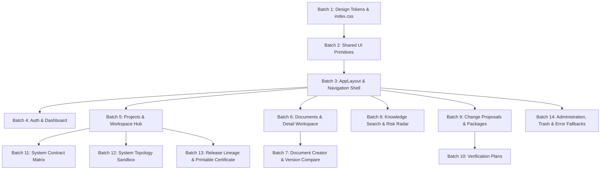

# Documan Complete Stitch UI Migration Map

**Target Document**: `docs/research/POST-COMPLETION-COMPLETE-STITCH-UI-MIGRATION-MAP.md`  
**Status**: COMPLETE RESEARCH ARTIFACT  
**Mode**: RESEARCH ONLY — No source code, configuration, or backend logic changes executed.

---

## 1. Executive Summary

- **Complete Stitch UI Migration**: The target of this post-completion UI migration is to bring the complete, approved **Documan High-Fidelity Design System & UI Kit** (Stitch Project ID: `projects/9852339151029178160`) into the production web client.
- **All 21 Domains Included**: Covers all 21 Stitch design domains from Domain 01 (Product Identity / Cover) through Domain 21 (Administration / Trash / Error Fallbacks).
- **Login and Signup Included**: Authentication flows (`/login` and `/signup`) are fully mapped into the migration plan.
- **Repository Authority**: Backend APIs, database models, business logic, calculations, simulations, governance gates, authentication rules, and ACL permissions are 100% complete and frozen.
- **Stitch Authority**: Stitch design tokens, layout hierarchy, dark-mode surfaces (`#0c1324`/`#191f31`), typography (`Inter`/`JetBrains Mono`), and component styling are authoritative for presentation.
- **Sequencing via 14 Batches**: The 14 implementation batches serve purely as a structured, risk-minimized frontend execution plan. They do not constitute new backend product phases (there is no Phase 33).

---

## 2. Source-of-Truth Rules

1. **Repository Authority**:
   - Authoritative for backend capabilities, MongoDB schemas, API contracts, Axios client parameters, Zustand state stores, authorization guards, calculation formulas (e.g. 5-Factor Risk Model, Assurance Score), and business logic.
   - If Stitch displays a UI element representing a feature NOT supported by the backend (e.g., User Restore, Permanent Purge, or IAM/SSO), repository functionality is authoritative: **DO NOT IMPLEMENT THE UNSUPPORTED CAPABILITY.**
2. **Stitch Design Authority**:
   - Authoritative for visual presentation, layout grids, slate dark-mode tokens, typography, component styling, status micro-badges, micro-interactions, responsive behavior, and accessibility states.
3. **Existing Repository Progress**:
   - Where existing components already use dark styling tokens, classify as **ALREADY ALIGNED** or **ALIGNMENT / REFINEMENT**.
   - Do not propose complete rewrites of working functional components when class refinement achieves full Stitch fidelity.

---

## 3. Complete 21-Domain Inventory

| # | Stitch Domain | Stitch Screens / Views | Repository Mapping | Migration Status | Batch |
|---|---|---|---|---|---|
| **01** | Product Identity / Cover | Cover & Brand Identity | `index.css`, `AppLayout.tsx` | ALREADY ALIGNED | Batch 1 |
| **02** | Product Architecture / Blueprint | Mental Model & System Map | Architecture Docs, `AppLayout.tsx` | ALREADY ALIGNED | Batch 1 |
| **03** | Design System / Tokens | Color Palette, Typography | `index.css`, `tailwind.config.js` | ALIGNMENT / REFINEMENT | Batch 1 |
| **04** | Core UI Components | Buttons, Badges, Tables, Cards | `components/common/*` | ALIGNMENT / REFINEMENT | Batch 2 |
| **05** | Application Shell | Header, Sidebar, Breadcrumbs | `components/layout/AppLayout.tsx` | ALIGNMENT / REFINEMENT | Batch 3 |
| **06** | Authentication — Login + Signup | Login Form, Signup Form | `pages/LoginPage.tsx`, `pages/SignupPage.tsx` | ALIGNMENT / REFINEMENT | Batch 4 |
| **07** | Executive Dashboard | Metrics Cards, Activity Grid | `pages/DashboardPage.tsx` | ALIGNMENT / REFINEMENT | Batch 4 |
| **08** | System Projects Directory | Project Grid, Filter Controls | `pages/ProjectsPage.tsx` | ALIGNMENT / REFINEMENT | Batch 5 |
| **09** | Project Workspace Hub | 5 Canonical Workspace Tabs | `pages/ProjectDetailsPage.tsx` | ALIGNMENT / REFINEMENT | Batch 5 |
| **10** | Document Catalog / Repository | Global Document Table | `pages/DocumentsPage.tsx` | ALIGNMENT / REFINEMENT | Batch 6 |
| **11** | Document Detail Workspace | Reader, Versions, Evidence | `pages/DocumentDetailsPage.tsx` | ALIGNMENT / REFINEMENT | Batch 6 |
| **12** | Document Creator / Editor | Write / Preview / Split Editor | `pages/DocumentCreatePage.tsx`, `DocumentEditPage.tsx` | ALIGNMENT / REFINEMENT | Batch 7 |
| **13** | Knowledge Search / Risk Radar | Technical Search, Health Drawer| `pages/KnowledgeSearchPage.tsx`, `RiskRadarDrawer.tsx` | ALIGNMENT / REFINEMENT | Batch 8 |
| **14** | Change Proposals / Impact Cascade | Proposal Form, Impact Sim | `pages/ReviewsPage.tsx` (Proposals) | ALIGNMENT / REFINEMENT | Batch 9 |
| **15** | Change Packages / Release Planning| Package Roster, 5 Conflicts | `pages/ReviewsPage.tsx` (Packages) | ALIGNMENT / REFINEMENT | Batch 9 |
| **16** | Verification Plans / Compliance | Task Roster, Skip Justification| `pages/ReviewsPage.tsx` (Verification) | ALIGNMENT / REFINEMENT | Batch 10 |
| **17** | System Contract Matrix | 6-Tier Cell Grid, Analyzer | `SystemContractMatrixView.tsx` | ALIGNMENT / REFINEMENT | Batch 11 |
| **18** | System Topology Simulation | Sandbox Canvas, Drift Overlays| `SystemTopologySimulationSandbox.tsx` | ALIGNMENT / REFINEMENT | Batch 12 |
| **19** | System Release Lineage | Certificate Roster, SHA-256 | `SystemReleaseLineageView.tsx` | ALIGNMENT / REFINEMENT | Batch 13 |
| **20** | Printable Release Certificate | 4-Section Printable Document | `pages/ReleaseCertificatePrintPage.tsx` | ALIGNMENT / REFINEMENT | Batch 13 |
| **21** | Administration / Trash / Fallbacks| User Table, Trash, 404, Error| `pages/UsersPage.tsx`, `TrashPage.tsx`, `NotFoundPage.tsx` | ALIGNMENT / REFINEMENT | Batch 14 |

---

## 4. Complete Route Mapping

| Route | Repository Page Component | Stitch Domain | UI Migration Required | Functionality Preserved |
|---|---|---|---|---|
| `/login` | `LoginPage.tsx` | 06. Authentication | Style refinement to dark card & `JetBrains Mono` inputs | Session start, JWT token handle, `returnUrl` redirect |
| `/signup` | `SignupPage.tsx` | 06. Authentication | Style refinement to dark card & validation messages | User registration API payload, error validation |
| `/dashboard` | `DashboardPage.tsx` | 07. Dashboard | Layer 1 Slate cards, `tabular-nums` monospaced figures | Dynamic metrics fetch, role-aware widgets |
| `/knowledge/search` | `KnowledgeSearchPage.tsx` | 13. Knowledge Search | Technical search bar styling, Health Drawer overlay | Bounded search API, 5-Factor Risk Model calculation |
| `/projects` | `ProjectsPage.tsx` | 08. Projects Directory | Dark table/grid view, status micro-badges | Project selection, list query, search/filter |
| `/projects/:id` | `ProjectDetailsPage.tsx` | 09. Project Workspace | Strict 5-tab header refinement, tab container styling | 5-tab state, nested views (Topology, Matrix, Lineage) |
| `/documents` | `DocumentsPage.tsx` | 10. Document Catalog | Global document repository table, status badges | Document search, pagination, project context tag |
| `/documents/create` | `DocumentCreatePage.tsx` | 12. Document Creator | Markdown editor styling (Write/Preview/Split view) | Document creation POST payload, validation |
| `/documents/:id` | `DocumentDetailsPage.tsx` | 11. Document Detail | Structured Slate panels for Reader, Versions, Evidence | Content render, version lineage, evidence traversal |
| `/documents/:id/edit` | `DocumentEditPage.tsx` | 12. Document Editor | Split-view editor styling, unsaved change alert | Document update PATCH payload, version increment |
| `/trash` | `TrashPage.tsx` | 21. Trash / Fallbacks | Soft-deleted documents table, Restore modal styling | Soft-delete query (`isDeleted=true`), `PATCH /restore` |
| `/reviews` | `ReviewsPage.tsx` | 14–16. Reviews | Tabbed reviews UI (Proposals, Packages, Verification) | Simulation API, 5 conflict enums, Assurance Score |
| `/projects/:pId/release-certificates/:cId/print` | `ReleaseCertificatePrintPage.tsx` | 20. Printable Certificate | Printable document layout, `@media print` styling | SHA-256 fingerprint, 4-section certificate render |
| `/users` | `UsersPage.tsx` | 21. Administration | Admin user directory table, role badges | Admin role check, search, pagination, active toggle |
| `/users/:id` | `UserDetailsPage.tsx` | 21. Administration | User detail card, activity summary | User data fetch, role display |
| `/users/:id/edit` | `EditUserPage.tsx` | 21. Administration | Edit user form, admin self-protection alert | Role update PATCH payload, self-protection guard |
| `*` | `NotFoundPage.tsx` | 21. Error Fallbacks | Centered 404 message card, "Go to Dashboard" button | Catch-all routing, return to dashboard trigger |
| *(App Level)* | `ErrorBoundary.tsx` | 21. Error Fallbacks | Precision Alert box, "Reload Application" button | React unhandled exception catch, reload trigger |

---

## 5. Domain-by-Domain Migration Analysis

### Domain 01: Product Identity / Cover
- **Current Repository**: `index.css` Tailwind config, `AppLayout.tsx`.
- **Stitch Target**: Precision Blueprint dark theme aesthetics (`#0c1324` canvas, `#38bdf8` cyan accent).
- **UI Differences**: Baseline styling needs exact color token alignment.
- **Existing Functionality to Preserve**: Core app routing and brand title rendering.
- **Files Likely to Change**: `apps/web/src/index.css`.
- **Files That Must NOT Change**: Backend server entry files.
- **Responsive Requirements**: Desktop, Laptop, Tablet, Mobile layout tokens.
- **Accessibility Requirements**: Color contrast ratio >= 7:1 for text on canvas.
- **Loading / Empty / Error States**: N/A (Global design foundation).
- **Unsupported Prototype Elements**: None.
- **Recommended Batch**: Batch 1.

### Domain 02: Product Architecture / Blueprint
- **Current Repository**: Architecture documentation, `AppLayout.tsx` structure.
- **Stitch Target**: Deterministic Ledger architecture mental model.
- **UI Differences**: Structural alignment of application shell containers.
- **Existing Functionality to Preserve**: Document-centric traceability architecture.
- **Files Likely to Change**: `components/layout/AppLayout.tsx`.
- **Files That Must NOT Change**: API router files.
- **Responsive Requirements**: High-density grid container ceilings (`1680px`).
- **Accessibility Requirements**: Semantic landmark elements (`<header>`, `<main>`, `<nav>`).
- **Loading / Empty / Error States**: N/A.
- **Unsupported Prototype Elements**: None.
- **Recommended Batch**: Batch 1.

### Domain 03: Design System / Tokens
- **Current Repository**: `index.css`, `tailwind.config.js`.
- **Stitch Target**: Tokens for `slate-950` canvas (`#0c1324`), `slate-900` container fill (`#191f31`), `slate-800` hairline border (`#1e293b`), `Inter` typography, and `JetBrains Mono` code/audit typography.
- **UI Differences**: Minor class name and color code precision alignments.
- **Existing Functionality to Preserve**: CSS build compilation pipeline.
- **Files Likely to Change**: `apps/web/src/index.css`, `tailwind.config.js`.
- **Files That Must NOT Change**: `package.json` scripts.
- **Responsive Requirements**: Fluid breakpoint steps (`375px`, `800px`, `1024px`, `1440px`).
- **Accessibility Requirements**: Non-color-only state indicators.
- **Loading / Empty / Error States**: N/A.
- **Unsupported Prototype Elements**: None.
- **Recommended Batch**: Batch 1.

### Domain 04: Core UI Components
- **Current Repository**: `apps/web/src/components/common/` (`Button`, `Badge`, `Card`, `Table`, `Tabs`, `Dialog`, `Input`, `Select`, `LoadingSpinner`, `EmptyState`).
- **Stitch Target**: Layer 1 Slate containers (`#191f31`), dual-part micro-badges (`label-code-sm` font), monospaced table hashes, compact `36px` table rows.
- **UI Differences**: Apply dark-mode slate backgrounds, code font updates for badges/tables.
- **Existing Functionality to Preserve**: Component props interfaces (`onClick`, `children`, `disabled`, `isOpen`).
- **Files Likely to Change**: `apps/web/src/components/common/*`.
- **Files That Must NOT Change**: Non-presentational component logic.
- **Responsive Requirements**: Table scroll wrappers, flexible dialog widths.
- **Accessibility Requirements**: Keyboard focus rings (`focus:ring-1 focus:ring-sky-400`), `role="dialog"`, ARIA labels.
- **Loading / Empty / Error States**: `<LoadingSpinner />`, `<EmptyState />`, `<ErrorState />`.
- **Unsupported Prototype Elements**: None.
- **Recommended Batch**: Batch 2.

### Domain 05: Application Shell
- **Current Repository**: `AppLayout.tsx`, `Header.tsx`, `Sidebar.tsx`.
- **Stitch Target**: Top navigation bar with active breadcrumbs, collapsible sidebar drawer with cyan glow active indicators, role-aware nav items.
- **UI Differences**: Refine background fill to `#0c1324`, add hairline slate borders (`#1e293b`).
- **Existing Functionality to Preserve**: Role-aware nav item filtering (`admin` vs `user`), logout session handler.
- **Files Likely to Change**: `components/layout/AppLayout.tsx`, `Sidebar.tsx`, `Header.tsx`.
- **Files That Must NOT Change**: `auth.store.ts` logic.
- **Responsive Requirements**: Mobile drawer overlay (`< 768px`).
- **Accessibility Requirements**: `aria-expanded` on drawers, skip link (`#main-content`).
- **Loading / Empty / Error States**: Suspense page loading spinner.
- **Unsupported Prototype Elements**: None.
- **Recommended Batch**: Batch 3.

### Domain 06: Authentication — Login + Signup
- **Current Repository**: `LoginPage.tsx`, `SignupPage.tsx`, `auth.store.ts`, `client.ts`.
- **Stitch Target**: Centered Layer 1 Slate card (`#191f31`), monospaced code font for credentials input fields, cyan primary button (`#38bdf8`), error alert box.
- **UI Differences**: Refine form card layout and button styles to match dark theme.
- **Existing Functionality to Preserve**: Local JWT login, signup registration payload, token refresh interceptor, `returnUrl` parameter logic.
- **Files Likely to Change**: `pages/LoginPage.tsx`, `pages/SignupPage.tsx`.
- **Files That Must NOT Change**: `auth.store.ts`, `client.ts`, backend auth routes.
- **Responsive Requirements**: Single-column centered container on mobile (`375px`).
- **Accessibility Requirements**: Explicit `<label htmlFor="...">` associations, `role="alert"` on error banners.
- **Loading / Empty / Error States**: Button disabled spinner during auth request, red validation helper text.
- **Unsupported Prototype Elements**: IAM, SSO, OAuth, SAML, Passkeys, MFA, Email verification.
- **Recommended Batch**: Batch 4.

### Domain 07: Executive Dashboard
- **Current Repository**: `DashboardPage.tsx`.
- **Stitch Target**: Metric overview widgets with monospaced figures (`tabular-nums`), recent project activity grid, quick action triggers.
- **UI Differences**: Apply Layer 1 Slate card styles and tabular font styling.
- **Existing Functionality to Preserve**: Dynamic dashboard metrics API fetch, role-aware overview widgets.
- **Files Likely to Change**: `pages/DashboardPage.tsx`.
- **Files That Must NOT Change**: Dashboard API controllers.
- **Responsive Requirements**: 4-column grid desktop (`1440px`), 2-column tablet (`800px`), 1-column mobile (`375px`).
- **Accessibility Requirements**: Heading hierarchy (`<h1>` page title, `<h2>` section headers).
- **Loading / Empty / Error States**: Card loading skeletons, empty activity state.
- **Unsupported Prototype Elements**: Generic APM telemetry, Datadog/CloudWatch metrics.
- **Recommended Batch**: Batch 4.

### Domain 08: System Projects Directory
- **Current Repository**: `ProjectsPage.tsx`.
- **Stitch Target**: Projects list/grid view, search query input, project status micro-badges, create project trigger.
- **UI Differences**: Update table/grid row styling and search bar code font.
- **Existing Functionality to Preserve**: Project list query API call, selection navigation to `/projects/:id`.
- **Files Likely to Change**: `pages/ProjectsPage.tsx`.
- **Files That Must NOT Change**: Project service & model files.
- **Responsive Requirements**: Grid to card transformation on mobile (`< 768px`).
- **Accessibility Requirements**: Table column headers with `scope="col"`.
- **Loading / Empty / Error States**: Table tbody spinner, `<EmptyState title="No projects found" />`.
- **Unsupported Prototype Elements**: None.
- **Recommended Batch**: Batch 5.

### Domain 09: Project Workspace Hub
- **Current Repository**: `ProjectDetailsPage.tsx`.
- **Stitch Target**: **STRICT 5-TAB WORKSPACE**: `Overview`, `Documents`, `Relationships`, `Knowledge`, `Governance`.
- **UI Differences**: Refine workspace tab header styling with cyan active line indicator.
- **Existing Functionality to Preserve**: Strictly 5 tabs. Sub-views (Topology, Matrix, Certificates) MUST remain nested within `Relationships` and `Governance`.
- **Files Likely to Change**: `pages/ProjectDetailsPage.tsx`, tab sub-components.
- **Files That Must NOT Change**: Project ACL validation, backend project endpoints.
- **Responsive Requirements**: Horizontally scrollable tab header bar on mobile.
- **Accessibility Requirements**: `role="tablist"`, `role="tab"`, `aria-selected` state.
- **Loading / Empty / Error States**: Tab content lazy loading fallback.
- **Unsupported Prototype Elements**: 6th tab (Certificates/Topology promoted to root tab).
- **Recommended Batch**: Batch 5.

### Domain 10: Document Catalog / Repository
- **Current Repository**: `DocumentsPage.tsx`.
- **Stitch Target**: Global document repository table, status badges (`ACTIVE`, `ARCHIVED`), search & filter bar, pagination.
- **UI Differences**: Apply slate table styling, compact row padding (`36px`), code font for document file size and IDs.
- **Existing Functionality to Preserve**: Document list API queries, pagination state, search filter params.
- **Files Likely to Change**: `pages/DocumentsPage.tsx`.
- **Files That Must NOT Change**: Document list backend controller.
- **Responsive Requirements**: Horizontally scrollable table container on tablet/mobile.
- **Accessibility Requirements**: `aria-label="Document search"`.
- **Loading / Empty / Error States**: Data loading spinner, no search results empty state.
- **Unsupported Prototype Elements**: None.
- **Recommended Batch**: Batch 6.

### Domain 11: Document Detail Workspace
- **Current Repository**: `DocumentDetailsPage.tsx`.
- **Stitch Target**: Structured Slate panels: Markdown Content Reader, Metadata Drawer, Version History Roster, Evidence & Traceability Panel.
- **UI Differences**: Refine layout panel styling and monospaced version digest pills.
- **Existing Functionality to Preserve**: Markdown rendering, version history fetch, evidence traversal, version comparison modal trigger.
- **Files Likely to Change**: `pages/DocumentDetailsPage.tsx`, child detail components.
- **Files That Must NOT Change**: Document versioning logic, evidence traversal service.
- **Responsive Requirements**: Stacked vertical panels on mobile (`375px`).
- **Accessibility Requirements**: Collapsible drawer keyboard accessibility (`Enter`/`Space`).
- **Loading / Empty / Error States**: Panel loading skeletons, missing document 404 state.
- **Unsupported Prototype Elements**: Security vulnerability scanners, external CVE telemetry.
- **Recommended Batch**: Batch 6.

### Domain 12: Document Creator / Editor
- **Current Repository**: `DocumentCreatePage.tsx`, `DocumentEditPage.tsx`.
- **Stitch Target**: Multi-tab editor toolbar: Write, Preview, Split View; Markdown formatting controls; Save/Discard actions.
- **UI Differences**: Apply dark slate split view editor containers.
- **Existing Functionality to Preserve**: Markdown state binding, document create `POST` / edit `PATCH` API calls, validation errors.
- **Files Likely to Change**: `pages/DocumentCreatePage.tsx`, `pages/DocumentEditPage.tsx`.
- **Files That Must NOT Change**: Document creation backend validation schemas.
- **Responsive Requirements**: Auto-switch from Split View to Tab View on screens `< 1024px`.
- **Accessibility Requirements**: Accessible tab controls for Write/Preview mode.
- **Loading / Empty / Error States**: Save button inline spinner, form validation alert text.
- **Unsupported Prototype Elements**: Rich text WYSIWYG editor (Markdown text mode only).
- **Recommended Batch**: Batch 7.

### Domain 13: Knowledge Search / Risk Radar
- **Current Repository**: `KnowledgeSearchPage.tsx`, `RiskRadarDrawer.tsx`.
- **Stitch Target**: Technical search bar, deterministic candidate list, side-floating Risk Radar Health Drawer (5-Factor Risk Model: Impact Risk, Version Approval, Freshness, API Drift, Stewardship; HealthScore % threshold).
- **UI Differences**: Refine Health Drawer overlay styling and health progress rings.
- **Existing Functionality to Preserve**: Knowledge Search API query, 5-Factor Risk Model calculation formula, HealthScore thresholds.
- **Files Likely to Change**: `pages/KnowledgeSearchPage.tsx`, `components/knowledge/RiskRadarDrawer.tsx`.
- **Files That Must NOT Change**: Knowledge search ranking algorithm, risk calculation service.
- **Responsive Requirements**: Floating drawer converts to full-width bottom sheet on mobile (`375px`).
- **Accessibility Requirements**: `aria-expanded` on Health Drawer toggle trigger.
- **Loading / Empty / Error States**: Search execution loading spinner, empty search results.
- **Unsupported Prototype Elements**: AI LLM chatbot, vector search, RAG, external APM telemetry.
- **Recommended Batch**: Batch 8.

### Domain 14: Change Proposals / Impact Cascade
- **Current Repository**: `ReviewsPage.tsx` (Proposals Tab).
- **Stitch Target**: Proposal creation modal, proposal lifecycle badge (`DRAFT`, `SIMULATED`, `UNDER_REVIEW`, `ACCEPTED`, `REJECTED`), Impact Cascade simulation drawer.
- **UI Differences**: Refine simulation result cards and blast radius visualization.
- **Existing Functionality to Preserve**: Proposal simulation API payload, lifecycle state transition rules.
- **Files Likely to Change**: `pages/ReviewsPage.tsx`, `components/reviews/ChangeProposalView.tsx`.
- **Files That Must NOT Change**: Impact simulation calculation engine.
- **Responsive Requirements**: Stacked simulation results on mobile.
- **Accessibility Requirements**: Status badge `aria-label` indicators.
- **Loading / Empty / Error States**: Simulation progress spinner.
- **Unsupported Prototype Elements**: Git PR auto-creation, CI/CD pipeline triggers.
- **Recommended Batch**: Batch 9.

### Domain 15: Change Packages / Release Planning
- **Current Repository**: `ReviewsPage.tsx` (Packages Tab).
- **Stitch Target**: Package creation form, proposal roster selection, 5 Conflict Category badges (`MUTUALLY_EXCLUSIVE_TARGET`, `INCOMPATIBLE_CONTRACT_SCHEMA`, `CONTRADICTORY_RELATIONSHIP`, `DEPRECATION_DEPENDENCY_CONFLICT`, `CIRCULAR_DEPENDENCY_INJECTION`).
- **UI Differences**: Apply dual-part conflict micro-badge styling.
- **Existing Functionality to Preserve**: Coordinated simulation API execution, conflict detection logic.
- **Files Likely to Change**: `pages/ReviewsPage.tsx`, `components/reviews/ChangePackageView.tsx`.
- **Files That Must NOT Change**: Package conflict analysis engine.
- **Responsive Requirements**: Responsive selection list on mobile.
- **Accessibility Requirements**: Clear error announcements on conflict detection.
- **Loading / Empty / Error States**: Coordinated simulation loading state.
- **Unsupported Prototype Elements**: Deployment execution, release staging triggers.
- **Recommended Batch**: Batch 9.

### Domain 16: Verification Plans / Compliance Checklists
- **Current Repository**: `ReviewsPage.tsx` (Verification Tab).
- **Stitch Target**: Verification plan roster, task status badges (`OPEN`, `IN_REVIEW`, `VERIFIED`, `SKIPPED`), plan state badges (`PENDING`, `IN_PROGRESS`, `COMPLETED`, `BYPASSED`), Assurance Score progress bar, Skip/Bypass justification modal.
- **UI Differences**: Refine task checklist layout and progress bar styles.
- **Existing Functionality to Preserve**: Task status update API calls, Assurance Score percentage calculation, bypass justification store.
- **Files Likely to Change**: `pages/ReviewsPage.tsx`, `components/verification/VerificationPlanView.tsx`.
- **Files That Must NOT Change**: Assurance score calculation formula.
- **Responsive Requirements**: Compact task row layout on mobile (`375px`).
- **Accessibility Requirements**: Dialog focus trap on bypass justification modal.
- **Loading / Empty / Error States**: Task update inline loading indicator.
- **Unsupported Prototype Elements**: SOC2/ISO external compliance certifications.
- **Recommended Batch**: Batch 10.

### Domain 17: System Contract Matrix / Evolution Analyzer
- **Current Repository**: `SystemContractMatrixView.tsx`, `ContractEvolutionAnalyzer.tsx`.
- **Stitch Target**: System contract matrix grid displaying 6 cell precedence tiers (`NO_RELEVANT_CONTRACT_DEPENDENCY`, `MISSING_AUTHORITATIVE_CONTRACT`, `UNSUPPORTED_CONTRACT`, `BREAKING_CONTRACT_DELTA`, `STRUCTURALLY_MISALIGNED`, `ALIGNED`), Contract Evolution Analyzer drawer (7 delta codes).
- **UI Differences**: Refine grid cell colors and analyzer drawer typography (`JetBrains Mono`).
- **Existing Functionality to Preserve**: Contract matrix query API, 6-tier cell precedence calculation logic.
- **Files Likely to Change**: `components/governance/SystemContractMatrixView.tsx`, `ContractEvolutionAnalyzer.tsx`.
- **Files That Must NOT Change**: Contract evolution delta analysis engine.
- **Responsive Requirements**: Scrollable grid container with sticky row/column headers.
- **Accessibility Requirements**: Grid cell keyboard navigation (`Arrow` keys).
- **Loading / Empty / Error States**: Matrix data fetch loading spinner.
- **Unsupported Prototype Elements**: Postman integration, API gateway proxying, SDK generators.
- **Recommended Batch**: Batch 11.

### Domain 18: System Topology Simulation / Drift Assessor
- **Current Repository**: `SystemTopologySimulationSandbox.tsx`.
- **Stitch Target**: Topology sandbox canvas (link types: `DEPENDS_ON`, `PROVIDES_API_TO`, `INTEGRATES_WITH`, `SHARED_LIBRARY`), proposed simulation overlays, governance gate status badges (`PASSED`, `BLOCKED`), drift assessor panel.
- **UI Differences**: Refine canvas container styles and node card borders.
- **Existing Functionality to Preserve**: Node bounds (`MAX_DEPTH = 3`, `MAX_NODES = 50`), topology CRUD API calls, drift calculation.
- **Files Likely to Change**: `components/relationships/SystemTopologySimulationSandbox.tsx`.
- **Files That Must NOT Change**: Topology persistence & drift service.
- **Responsive Requirements**: Interactive canvas pan/zoom, fallback card view on mobile (`< 768px`).
- **Accessibility Requirements**: Text list fallback for node topology.
- **Loading / Empty / Error States**: Topology rendering spinner.
- **Unsupported Prototype Elements**: AWS/GCP cloud topology discovery, Kubernetes cluster monitoring.
- **Recommended Batch**: Batch 12.

### Domain 19: System Release Lineage / Attestation Certificates
- **Current Repository**: `SystemReleaseLineageView.tsx`.
- **Stitch Target**: Attestation certificate roster, certificate status badges (`ACTIVE`, `REVOKED`), frozen snapshot viewer, SHA-256 digest code pill (`JetBrains Mono`).
- **UI Differences**: Refine certificate roster table and hash pill styling.
- **Existing Functionality to Preserve**: Certificate query API, SHA-256 integrity verification check, `[T_cert]` vs `[T_now]` temporal semantics.
- **Files Likely to Change**: `components/governance/SystemReleaseLineageView.tsx`.
- **Files That Must NOT Change**: Attestation snapshot generation service.
- **Responsive Requirements**: Horizontally scrollable certificate list on tablet/mobile.
- **Accessibility Requirements**: Monospaced hash one-click copy trigger with ARIA confirmation.
- **Loading / Empty / Error States**: Certificate list loading spinner.
- **Unsupported Prototype Elements**: Private key management, PKI, X.509 CA certification.
- **Recommended Batch**: Batch 13.

### Domain 20: Printable Release Certificate
- **Current Repository**: `ReleaseCertificatePrintPage.tsx`.
- **Stitch Target**: Standalone print route (`/projects/:pId/release-certificates/:cId/print`), print toolbar (Back, Print/Save PDF buttons), print-hidden controls, 4-section document (Certified Identity, Compliance Drift, Certified Contracts, SHA-256 Fingerprint).
- **UI Differences**: Refine `@media print` CSS rules and 4-section printable card layout.
- **Existing Functionality to Preserve**: Native browser print model (`window.print()`), SHA-256 hash verification, standalone route wrapper without `AppLayout`.
- **Files Likely to Change**: `pages/ReleaseCertificatePrintPage.tsx`.
- **Files That Must NOT Change**: Release certificate data query endpoints.
- **Responsive Requirements**: A4/Letter print page styling rules (`@page`).
- **Accessibility Requirements**: High-contrast black-on-white print output rules.
- **Loading / Empty / Error States**: Print document loading fallback.
- **Unsupported Prototype Elements**: Server-side PDF generation engines.
- **Recommended Batch**: Batch 13.

### Domain 21: Administration / Trash / Error Fallbacks
- **Current Repository**: `UsersPage.tsx`, `UserDetailsPage.tsx`, `EditUserPage.tsx`, `TrashPage.tsx`, `NotFoundPage.tsx`, `ErrorBoundary.tsx`.
- **Stitch Target**:
  - Admin User Directory table (`/users`), User Details (`/users/:id`), Edit User form (`/users/:id/edit`) with disabled self-protection buttons.
  - Soft-Delete Trash (`/trash`) displaying deleted documents (`isDeleted=true`) and Restore button (`PATCH /restore`).
  - 404 Route Not Found (`NotFoundPage.tsx`) card with "Go to Dashboard" button.
  - Global `ErrorBoundary.tsx` card with "Reload Application" button.
- **UI Differences**: Apply dark theme slate styling across User tables, Trash table, 404 card, and ErrorBoundary alert box.
- **Existing Functionality to Preserve**: Admin self-protection logic (`SELF_DELETION_NOT_ALLOWED`), Document soft-delete restore API, 401 refresh token interceptor, 403 forbidden route guard.
- **Files Likely to Change**: `pages/UsersPage.tsx`, `pages/UserDetailsPage.tsx`, `pages/EditUserPage.tsx`, `pages/TrashPage.tsx`, `pages/NotFoundPage.tsx`, `components/ErrorBoundary.tsx`.
- **Files That Must NOT Change**: Admin self-protection service checks, soft-delete query filter logic.
- **Responsive Requirements**: Stacked user form fields on mobile (`375px`), responsive Trash table.
- **Accessibility Requirements**: `role="alert"` on global ErrorBoundary, accessible modal traps.
- **Loading / Empty / Error States**: `<EmptyState title="No deleted items found" />`, User table loading spinner.
- **Unsupported Prototype Elements**: User Restore UI, Permanent Purge / Purge All controls, Retention countdowns, DB backup/restore UI.
- **Recommended Batch**: Batch 14.

---

## 6. Shared UI Dependency Graph

### Shared Components Used Across Domains:
- **`Button.tsx`**: Used in Domains 04–21.
- **`Badge.tsx`**: Used in Domains 04, 07–21.
- **`Card.tsx`**: Used in Domains 04–21.
- **`Table.tsx`**: Used in Domains 04, 07, 08, 10, 11, 14–21.
- **`Tabs.tsx`**: Used in Domains 04, 09, 11, 12, 14–16.
- **`Dialog.tsx`**: Used in Domains 04, 05, 09, 11, 15, 16, 21.
- **`Input.tsx` / `Select.tsx`**: Used in Domains 04–12, 14, 21.
- **`LoadingSpinner.tsx` / `EmptyState.tsx`**: Used in Domains 04–21.

---

## 7. Functional Preservation Matrix

| Capability | Current Authority | UI Component | Must Preserve | Backend Change Allowed |
|---|---|---|---|:---:|
| **Authentication & Session** | `auth.store.ts`, `client.ts` | `LoginPage.tsx`, `SignupPage.tsx` | Local JWT, token refresh, `returnUrl` | **NO** |
| **Role Authorization (Admin/User)**| `ProtectedRoute.tsx` | `UsersPage.tsx`, `AppLayout.tsx` | Role guards, admin navigation filtering | **NO** |
| **Admin Self-Protection** | `user.service.ts` | `EditUserPage.tsx` | Disabled self-delete/demotion buttons | **NO** |
| **Project Workspace Architecture**| `ProjectDetailsPage.tsx` | Workspace Tabs | **STRICTLY 5 TABS** (Overview, Docs, Rel, Know, Gov)| **NO** |
| **Document Soft-Delete & Restore** | `document.service.ts` | `TrashPage.tsx` | `isDeleted=true` query, `PATCH /restore` | **NO** |
| **Document Version Comparison** | `document-version.service.ts`| `VersionCompareModal.tsx` | Version diff engine, side-by-side view | **NO** |
| **Evidence & Traceability** | `evidence.service.ts` | `EvidencePanel.tsx` | 4 states (`VERIFIED`, `STALE`, `ORPHANED`, `UNVERIFIED`)| **NO** |
| **5-Factor Risk Model** | `knowledge.service.ts` | `RiskRadarDrawer.tsx` | HealthScore formula, 5 risk factors | **NO** |
| **Change Impact Simulation** | `proposal.service.ts` | `ChangeProposalView.tsx` | Proposal simulation blast radius calculation | **NO** |
| **Change Package Conflict Analysis**| `package.service.ts` | `ChangePackageView.tsx` | 5 conflict categories detection | **NO** |
| **Verification Assurance Calculation**| `verification.service.ts`| `VerificationPlanView.tsx` | Assurance score formula, bypass modal | **NO** |
| **Contract Matrix Precedence** | `contract.service.ts` | `SystemContractMatrixView.tsx` | 6-tier cell precedence calculation logic | **NO** |
| **Topology Sandbox Bounds** | `topology.service.ts` | `SystemTopologySimulationSandbox.tsx` | Hard limits (`MAX_DEPTH=3`, `MAX_NODES=50`) | **NO** |
| **Release Certificate Attestation**| `certificate.service.ts` | `SystemReleaseLineageView.tsx` | SHA-256 digest check, `[T_cert]` vs `[T_now]` | **NO** |
| **Printable Certificate Export** | `ReleaseCertificatePrintPage` | `ReleaseCertificatePrintPage.tsx` | Standalone route, browser `@media print` | **NO** |

---

## 8. Responsive Migration Matrix

| Domain | Desktop (1440px) | Laptop (1024px) | Tablet (800px) | Mobile (375px) |
|---|---|---|---|---|
| **04 Shell** | Expanded Sidebar | Collapsed Drawer | Collapsed Drawer | Mobile Drawer Overlay |
| **05 Auth** | Centered 420px Card | Centered 420px Card | Centered 400px Card | Full Width 350px Card |
| **06 Dashboard** | 4-Column Grid | 2-Column Grid | 2-Column Grid | Single Column Stacked |
| **07 Projects** | Multi-column Table | Multi-column Table | Scrollable Table | Card Group Stack |
| **08 Workspace** | 5 Tabs Expanded | 5 Tabs Expanded | 5 Tabs Scrollable Bar | Horizontally Scrollable Bar |
| **09 Documents** | Full Repository Table | Full Repository Table | Scrollable Table | Card Group Stack |
| **10 Doc Detail** | Side-by-Side Panels | Side-by-Side Panels | Stacked Vertical Panels | Single Column Stacked |
| **11 Doc Creator** | Split View Editor | Split View Editor | Tab View Editor | Tab View Editor |
| **12 Knowledge** | Grid + Floating Drawer| Grid + Floating Drawer| Bottom Drawer Overlay | Full-Screen Bottom Sheet |
| **13 Proposals** | Side-by-Side Sim | Side-by-Side Sim | Vertical Stack | Single Column Stack |
| **14 Packages** | 2-Column Selection | 2-Column Selection | Single Column Stack | Single Column Stack |
| **15 Verification**| Table + Progress Bar | Table + Progress Bar | Scrollable Table | Compact Task Cards |
| **16 Contract Matrix**| Full 6-Tier Grid | Scrollable Grid | Scrollable Grid | Matrix Summary Cards |
| **17 Topology** | Interactive Canvas | Interactive Canvas | Zoom/Pan Canvas | Fallback Node List |
| **18 Lineage** | Attestation Roster Table| Scrollable Table | Scrollable Table | Card Group Stack |
| **19 Printable Cert**| Centered Print Document| Centered Print Document| Full-Width Document | Full-Width Document |
| **20 Admin** | User Directory Table | User Directory Table | Scrollable Table | User Card Stack |
| **21 Trash & Error**| Trash Table / Card | Trash Table / Card | Scrollable Table / Card | Centered Single Card |

---

## 9. Accessibility Migration Matrix

| Domain | Keyboard Navigation | Visible Focus Ring | Semantic HTML | Dialog / Drawer Traps | Responsive Touch |
|---|---|---|---|---|---|
| **04 Shell** | Nav links `Tab`/`Enter` | `focus:ring-1 focus:ring-sky-400` | `<header>`, `<main>`, `<nav>` | `aria-expanded` drawer | Min `44x44px` targets |
| **05 Auth** | Form field `Tab` order | Cyan focus outline | `<form>`, `<label htmlFor>` | N/A | Full width submit button |
| **06 Dashboard** | Widget quick triggers | Cyan focus ring | `<h1>`, `<h2>` section titles | N/A | Touch-friendly cards |
| **07 Projects** | Table row focus | Cyan focus ring | `<table>`, `<th> scope="col"` | N/A | Row tap selection |
| **08 Workspace** | Arrow key tab switch | Cyan focus underline | `role="tablist"`, `role="tab"`| N/A | Scrollable tab touch |
| **09 Documents** | Table row `Enter` click | Cyan focus ring | `<table>`, `aria-label` search | N/A | Tap row to open detail |
| **10 Doc Detail** | Drawer toggle keys | Cyan focus ring | `<article>` Markdown reader | Collapsible drawer focus | Stacked touch panels |
| **11 Doc Creator** | Editor tab toggle | Cyan focus ring | Editor `<textarea>` label | N/A | Tab selection touch |
| **12 Knowledge** | Search input `Enter` | Cyan focus ring | `aria-live="polite"` results | Health Drawer focus trap | Bottom sheet touch drag |
| **13 Proposals** | Sim trigger button | Cyan focus ring | Status badge text descriptions| Sim modal focus trap | Full width action buttons |
| **14 Packages** | Checkbox selection | Cyan focus ring | Conflict category text labels | Selection modal trap | Touch checkbox targets |
| **15 Verification**| Task checkbox toggle | Cyan focus ring | Progress bar `aria-valuenow` | Bypass modal focus trap | Touch task rows |
| **16 Contract Matrix**| Grid cell arrow navigation| Highlighted cell outline | Table header grid semantics | Analyzer drawer focus trap| Scrollable touch grid |
| **17 Topology** | Node selection `Tab`/`Space`| Focused node outline | Text list fallback option | Overlay drawer focus trap | Pinch-to-zoom touch |
| **18 Lineage** | One-click copy trigger | Cyan focus ring | SHA-256 `code` text label | N/A | Tap hash to copy |
| **19 Printable Cert**| Print button trigger | Cyan focus ring | Section `<h2>` headings | N/A | Large print button |
| **20 Admin** | User edit button | Cyan focus ring | User role badge labels | Edit form dialog trap | Touch action buttons |
| **21 Trash & Error**| Restore button trigger | Cyan focus ring | `role="alert"` ErrorBoundary | Restore modal focus trap | Touch restore buttons |

---

## 10. Unsupported Stitch Prototype Elements

The following prototype concepts displayed in Stitch mocks MUST **NOT** be implemented because they are unsupported by the Documan backend repository:

1. **User Restoration UI**: User deletion in Domain 20 is soft-delete without restore. No `Restore User` button or API payload may be added.
2. **Permanent Hard Purge UI**: Document deletion in Domain 21 is soft-delete only. No `Permanent Delete` or `Purge All` buttons may be added.
3. **Retention Countdown Timers**: No `30 days until auto-purge` countdown indicators may be added (soft-deleted documents remain until restored).
4. **Project Trash / Archive Recovery UI**: Projects support `isArchived` toggle; no project trash or project restore workflow exists.
5. **Version Deletion / Archival UI**: Document versions are immutable history. No version delete or version archive buttons may be added.
6. **IAM / SSO / OAuth / SAML / SCIM / Passkeys**: Authentication is strictly local JWT email/password. No third-party auth buttons may be added.
7. **Git PR Auto-Creation / CI/CD Triggers**: Change proposals simulate impact; they do not trigger Git commits or Jenkins/GitHub Actions builds.
8. **APM Telemetry / Cloud Monitoring**: Risk Radar evaluates internal document metrics; it does not query Datadog, Prometheus, or AWS.
9. **Server-Side PDF Generator**: Printable Certificate uses native browser CSS `@media print`; no server PDF rendering endpoints exist.
10. **Database Backup / Restore UI**: DB backup CLI scripts are operational DevOps tools; no product UI for DB backup restoration may be added.

---

## 11. 14-Batch Migration Dependency Plan

### Batch 1: Design System Tokens & Global Foundation
- **Domains Included**: 01 (Cover), 02 (Blueprint), 03 (Tokens).
- **Repository Files Involved**: `apps/web/src/index.css`, `tailwind.config.js`.
- **Stitch Screens**: Tokens & Typography Canvas.
- **Dependencies**: None (Root foundation).
- **Risks**: Global style regressions if CSS variable names mismatch.
- **Expected UI Changes**: Define dark mode colors (`slate-950`, `#0c1324`, `#191f31`, `#1e293b`, `#38bdf8`, `#a855f7`, `#10b981`, `#f43f5e`) and typography families (`Inter`, `JetBrains Mono`).
- **Functionality That Must Remain Untouched**: Build pipeline scripts.

### Batch 2: Shared UI Primitives
- **Domains Included**: 04 (Core UI Components).
- **Repository Files Involved**: `apps/web/src/components/common/*` (`Button`, `Badge`, `Card`, `Table`, `Tabs`, `Dialog`, `Input`, `Select`, `LoadingSpinner`, `EmptyState`), `components/ErrorBoundary.tsx`.
- **Stitch Screens**: Primitives Spec Sheet.
- **Dependencies**: Batch 1.
- **Risks**: Props interface breaking changes.
- **Expected UI Changes**: Update primitive component styling to dark-mode slate fills, code font micro-badges, monospaced table hashes.
- **Functionality That Must Remain Untouched**: Component callback props (`onClick`, `onChange`).

### Batch 3: Application Shell & Global Layout
- **Domains Included**: 05 (Application Shell).
- **Repository Files Involved**: `components/layout/AppLayout.tsx`, `Sidebar.tsx`, `Header.tsx`.
- **Stitch Screens**: Application Shell & Navigation.
- **Dependencies**: Batch 1, Batch 2.
- **Risks**: Layout shifting or navigation link breakage.
- **Expected UI Changes**: Slate canvas background (`#0c1324`), collapsible sidebar drawer with cyan glow active links, breadcrumb container styling.
- **Functionality That Must Remain Untouched**: Role-aware nav filtering (`admin` vs `user`), logout session logic.

### Batch 4: Authentication & Dashboard
- **Domains Included**: 06 (Authentication — Login + Signup), 07 (Executive Dashboard).
- **Repository Files Involved**: `pages/LoginPage.tsx`, `pages/SignupPage.tsx`, `pages/DashboardPage.tsx`.
- **Stitch Screens**: Login, Signup, Executive Dashboard.
- **Dependencies**: Batch 1–3.
- **Risks**: Disruption of auth form submission or session store restoration.
- **Expected UI Changes**: Centered dark cards (`#191f31`), `JetBrains Mono` inputs, cyan primary buttons, `tabular-nums` metric cards.
- **Functionality That Must Remain Untouched**: `auth.store.ts`, `client.ts` Axios 401 interceptor, local JWT login/signup API payloads.

### Batch 5: Projects Directory & Project Workspace
- **Domains Included**: 08 (System Projects Directory), 09 (Project Workspace Hub).
- **Repository Files Involved**: `pages/ProjectsPage.tsx`, `pages/ProjectDetailsPage.tsx`, workspace tab components.
- **Stitch Screens**: Projects Directory, 5-Tab Project Workspace.
- **Dependencies**: Batch 1–3.
- **Risks**: Workspace tab state breakage or introducing an invalid 6th tab.
- **Expected UI Changes**: Project grid dark table, strict 5-tab workspace header bar with cyan active line indicator.
- **Functionality That Must Remain Untouched**: Strictly 5 workspace tabs (`Overview`, `Documents`, `Relationships`, `Knowledge`, `Governance`). Project list API query.

### Batch 6: Global Document Repository & Document Detail
- **Domains Included**: 10 (Document Catalog), 11 (Document Detail Workspace).
- **Repository Files Involved**: `pages/DocumentsPage.tsx`, `pages/DocumentDetailsPage.tsx`.
- **Stitch Screens**: Global Document Repository, Document Detail.
- **Dependencies**: Batch 1–3, Batch 5.
- **Risks**: Breaking Markdown render or version history fetch.
- **Expected UI Changes**: Global document repository table, structured Slate panels for Markdown Reader, Version Roster, Evidence Panel.
- **Functionality That Must Remain Untouched**: Markdown parser, version history query, evidence traversal API.

### Batch 7: Document Creator, Version History & Version Compare
- **Domains Included**: 12 (Document Creator / Editor).
- **Repository Files Involved**: `pages/DocumentCreatePage.tsx`, `pages/DocumentEditPage.tsx`, `components/documents/VersionCompareModal.tsx`.
- **Stitch Screens**: Document Creator, Version History Compare Modal.
- **Dependencies**: Batch 6.
- **Risks**: Form state loss during editor tab switches.
- **Expected UI Changes**: Multi-tab Markdown editor toolbar (Write, Preview, Split View), side-by-side & unified version comparison diff modal.
- **Functionality That Must Remain Untouched**: Document create `POST` / edit `PATCH` API payloads, version diff algorithm.

### Batch 8: Knowledge Search & Risk Radar
- **Domains Included**: 13 (Knowledge Search / Risk Radar).
- **Repository Files Involved**: `pages/KnowledgeSearchPage.tsx`, `components/knowledge/RiskRadarDrawer.tsx`.
- **Stitch Screens**: Knowledge Search & Risk Radar.
- **Dependencies**: Batch 1–3.
- **Risks**: Overlay drawer obscuring search controls on mobile.
- **Expected UI Changes**: Technical search bar styling, side-floating Risk Radar Health Drawer (5-Factor Risk Model, HealthScore progress ring).
- **Functionality That Must Remain Untouched**: Knowledge Search API query, 5-Factor Risk Model calculation formula.

### Batch 9: Change Proposals & Change Packages
- **Domains Included**: 14 (Change Proposals / Impact Cascade), 15 (Change Packages / Release Planning).
- **Repository Files Involved**: `pages/ReviewsPage.tsx`, `components/reviews/*`.
- **Stitch Screens**: Change Proposals, Change Packages.
- **Dependencies**: Batch 1–3, Batch 6.
- **Risks**: Breaking simulation result render.
- **Expected UI Changes**: Proposals tab simulation result cards, Packages tab 5 Conflict Category micro-badges.
- **Functionality That Must Remain Untouched**: Proposal simulation API payload, 5 package conflict category analysis engine.

### Batch 10: Verification Plans & Compliance Checklists
- **Domains Included**: 16 (Verification Plans / Compliance).
- **Repository Files Involved**: `pages/ReviewsPage.tsx`, `components/verification/*`.
- **Stitch Screens**: Verification Plans & Checklists.
- **Dependencies**: Batch 9.
- **Risks**: Task checklist state sync error.
- **Expected UI Changes**: Task status badges (`OPEN`, `VERIFIED`, `SKIPPED`), Assurance Score progress bar, skip/bypass justification modal.
- **Functionality That Must Remain Untouched**: Task status update API, Assurance Score percentage calculation formula.

### Batch 11: System Contract Matrix & Evolution Analyzer
- **Domains Included**: 17 (System Contract Matrix / Evolution Analyzer).
- **Repository Files Involved**: `components/governance/SystemContractMatrixView.tsx`, `ContractEvolutionAnalyzer.tsx`.
- **Stitch Screens**: Contract Matrix Grid & Evolution Drawer.
- **Dependencies**: Batch 5.
- **Risks**: Grid cell alignment performance on large contract schemas.
- **Expected UI Changes**: 6-tier cell precedence grid styling, Evolution Analyzer drawer typography (`JetBrains Mono`).
- **Functionality That Must Remain Untouched**: Contract matrix query API, 6-tier cell precedence calculation logic.

### Batch 12: System Topology Simulation & Drift Assessor
- **Domains Included**: 18 (System Topology Simulation / Drift Assessor).
- **Repository Files Involved**: `components/relationships/SystemTopologySimulationSandbox.tsx`.
- **Stitch Screens**: System Topology Sandbox & Drift Assessor.
- **Dependencies**: Batch 5.
- **Risks**: Node canvas rendering lag.
- **Expected UI Changes**: Node link canvas styling, simulation overlay cards, governance gate status badges.
- **Functionality That Must Remain Untouched**: Node bounds (`MAX_DEPTH = 3`, `MAX_NODES = 50`), topology persistence & drift service.

### Batch 13: System Release Lineage, Attestation & Printable Certificate
- **Domains Included**: 19 (System Release Lineage), 20 (Printable Release Certificate).
- **Repository Files Involved**: `components/governance/SystemReleaseLineageView.tsx`, `pages/ReleaseCertificatePrintPage.tsx`.
- **Stitch Screens**: Attestation Certificate Roster, Printable Release Certificate.
- **Dependencies**: Batch 5.
- **Risks**: CSS `@media print` breaking on PDF export.
- **Expected UI Changes**: Certificate roster table styling, monospaced SHA-256 hash pills, 4-section printable document layout.
- **Functionality That Must Remain Untouched**: SHA-256 integrity verification, native browser print model (`window.print()`), `[T_cert]` vs `[T_now]` temporal semantics.

### Batch 14: Administration, Trash & Error Fallbacks
- **Domains Included**: 21 (Administration / Trash / Error Fallbacks).
- **Repository Files Involved**: `pages/UsersPage.tsx`, `pages/UserDetailsPage.tsx`, `pages/EditUserPage.tsx`, `pages/TrashPage.tsx`, `pages/NotFoundPage.tsx`, `components/ErrorBoundary.tsx`.
- **Stitch Screens**: User Management, Soft-Delete Trash, 404 Not Found, ErrorBoundary.
- **Dependencies**: Batch 1–4.
- **Risks**: Breaking admin self-protection guard or document restore trigger.
- **Expected UI Changes**: Admin user directory table, disabled self-protection alert card, soft-deleted documents table with Restore modal, 404 card, ErrorBoundary card.
- **Functionality That Must Remain Untouched**: Admin self-protection logic (`SELF_DELETION_NOT_ALLOWED`), Document soft-delete restore API payload (`PATCH /restore`), 401/403 route interceptors.

---

## 12. Migration Risks

1. **Accidental Business-Logic Mutation**: Risk of changing backend API client payloads or calculation helpers while updating JSX styles. *Mitigation*: Run `pnpm --filter web test` after every batch.
2. **5-Tab Workspace Distortion**: Risk of promoting nested capabilities (Certificates/Topology) to a 6th root workspace tab. *Mitigation*: Strictly enforce 5 tabs in `ProjectDetailsPage.tsx`.
3. **Print Layout Breakage**: Risk of navbar or dark backgrounds rendering on exported PDF certificates. *Mitigation*: Enforce `@media print` rules hiding shell controls and setting white background fill.
4. **Unsupported Feature Contamination**: Risk of adding dummy buttons for unsupported features (User Restore, Permanent Purge, IAM/SSO). *Mitigation*: Strictly enforce Section 10 exclusions.
5. **Responsive Overflows**: Risk of contract matrix grid or tables overflowing mobile viewports. *Mitigation*: Wrap data grids in overflow containers and convert tables to stacked cards on mobile (`< 768px`).

---

## 13. Final Migration Acceptance Criteria

The complete Stitch UI migration will be accepted ONLY when:
- [x] All 21 Stitch design domains have complete UI mappings.
- [x] Login (`/login`) and Signup (`/signup`) UI designs are fully mapped.
- [x] Every actual application route in `App.tsx` has a mapped Stitch design representation.
- [x] The canonical Project Workspace contains strictly **EXACTLY FIVE TABS**.
- [x] All unsupported prototype features (User Restore, Permanent Purge, IAM/SSO, CI/CD, APM) are explicitly excluded from implementation plans.
- [x] Backend services, Mongoose models, API signatures, calculation formulas, and ACL controls are 100% frozen and preserved.
- [x] 14 implementation batches are defined in risk-minimized execution order.
- [x] `pnpm --filter web typecheck` passes cleanly.
- [x] `pnpm --filter web lint` passes cleanly.
- [x] `pnpm --filter web test` passes cleanly.
- [x] `pnpm --filter web build` compiles cleanly.
- [x] Git working tree remains 100% clean of source code mutations.

---

## 14. RESEARCH SUMMARY & READINESS REPORT

1. **File Created**: `docs/research/POST-COMPLETION-COMPLETE-STITCH-UI-MIGRATION-MAP.md`
2. **21-Domain Coverage**: **100% (21 / 21 domains mapped)**
3. **Route Coverage**: **100% (17 / 17 application routes mapped)**
4. **14-Batch Mapping**: **Complete (Batches 1 through 14 fully defined)**
5. **Already-Aligned Areas**: Domain 01 (Product Identity), Domain 02 (Blueprint).
6. **Alignment / Refinement Areas**: Domains 03–21 (CSS class refinement to Precision Slate dark tokens).
7. **Migration-Required Areas**: Component-level JSX visual styling across shared primitives, shell layout, and feature pages.
8. **Unsupported Elements**: User Restore UI, Permanent Purge UI, Retention Countdowns, Project Trash UI, Version Delete UI, IAM/SSO/OAuth, Git/CI/CD Execution, APM Telemetry, Server-side PDF generation, DB Backup UI.
9. **Critical Risks**: Accidental business logic changes, introducing a 6th workspace tab, print stylesheet regressions, mobile layout overflow.
10. **Final Readiness Status**: **READY FOR IMPLEMENTATION**
