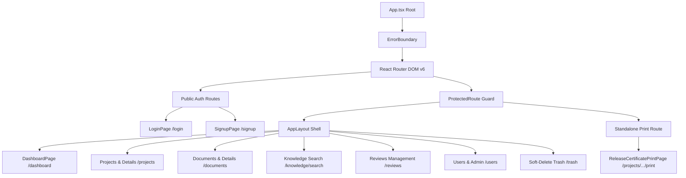
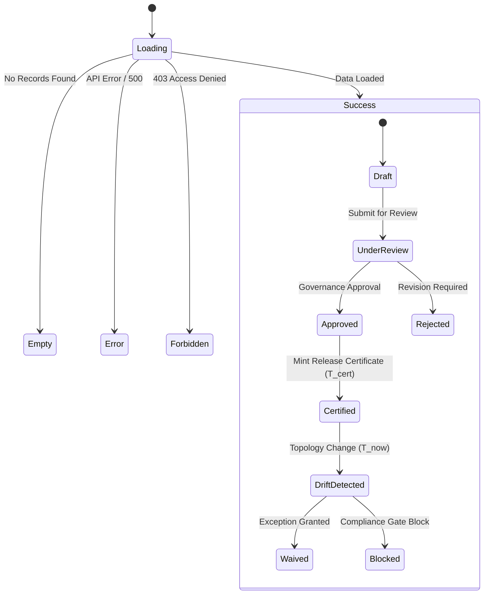

# Post-Completion Complete UI/UX Inventory for Google Stitch Design

> **Document Status**: APPROVED & COMPLETED  
> **Target System**: Documan Enterprise Architecture Governance Platform  
> **Output Artifact**: `docs/research/POST-COMPLETION-COMPLETE-UI-UX-INVENTORY.md`  
> **Baseline Commit**: `93cf49d` (Main Branch Synchronized)  

---

## 1. Objective

The objective of this research inventory is to perform a comprehensive, repository-wide UI/UX audit of the entire Documan web application to prepare a complete, pixel-faithful design specification for **Google Stitch**.

Before implementing further UI/UX refinement batches (such as Batch 6 and beyond), Stitch requires a holistic blueprint of the real product. This document catalogs every user-facing route, page component, modal, drawer, interaction pattern, state representation, and design system primitive currently implemented in `apps/web/src`.

---

## 2. Repository UI Architecture

The web frontend is built using React 18, Vite, TypeScript, React Router DOM v6, Zustand for auth state management (`auth.store.ts`), and TailwindCSS augmented with CSS custom properties in `apps/web/src/index.css`.



### Layout Patterns

1. **App Shell Layout (`AppLayout.tsx`)**:
   - **Sticky Top Bar (`AppHeader`)**: Displays logo, workspace selector, global search shortcut trigger, active route breadcrumb, and user profile avatar.
   - **Navigation Rail / Sidebar (`AppNav`)**: Displays hierarchical domain navigation (Dashboard, Projects, Documents, Knowledge, Reviews, Admin, Trash).
   - **Notification Bell (`NotificationBell`)**: Interactive dropdown displaying system governance alerts and review assignments.
   - **Main Content (`#main-content`)**: Standardized container with skip-link accessibility support.
2. **Public Auth Layout**:
   - Centered, dark slate card elevation (`slate-900`) over dark canvas (`slate-950`) with indigo accent branding.
3. **Printable Document Layout (`ReleaseCertificatePrintPage.tsx`)**:
   - Headerless, full-page clean attestation document layout optimized for browser printing (`@media print`) and PDF exporting.

---

## 3. Complete Route Inventory

The repository contains **18 total routes** declared in [`apps/web/src/App.tsx`](file:///c:/MERN_STACK/Documan/documan/apps/web/src/App.tsx):

| Route Path | Page Component | Auth Level | Role Access | Parent Layout | Purpose & Capabilities | Key Components & State Dependencies |
| :--- | :--- | :---: | :---: | :---: | :--- | :--- |
| `/` | `Navigate` | Public | All | N/A | Default root redirect to `/dashboard`. | Automatic redirect logic. |
| `/login` | `LoginPage` | Public | Guest | Standalone | Authenticates users via email/password. Supports `returnUrl` parsing. | Card, Input, Button, Error Alert. State: Loading, Validation Error. |
| `/signup` | `SignupPage` | Public | Guest | Standalone | Registers new user accounts. Restores session if token present. | Card, Input, Button, LoadingSpinner. State: Session Check, Submitting. |
| `/dashboard` | `DashboardPage` | Protected | All | `AppLayout` | Executive governance overview, quick stats, active work requests, workspace cards. | GovernanceBanner, Card, Badge, Table, Quick Actions. |
| `/projects` | `ProjectsPage` | Protected | All | `AppLayout` | Lists system projects with filtering, baseline counts, and drift status badges. | Project Cards, Search Input, Create Project Modal trigger. |
| `/projects/:id` | `ProjectDetailsPage` | Protected | All | `AppLayout` | Deep-dive project workspace: architecture, governance gates, baselines, contract matrix, releases. | Tabs, SystemGovernanceGateSection, ContractMatrix, Simulation Sandbox. |
| `/documents` | `DocumentsPage` | Protected | All | `AppLayout` | Global document repository with search, project filtering, status badges, folder tree. | Table, Badge, Search, Folder Tree, Create Button. |
| `/documents/create` | `DocumentCreatePage` | Protected | All | `AppLayout` | Form for creating structured architecture/governance documents with template selection. | Form, Inputs, Select, Template Preview, Markdown Editor. |
| `/documents/:id` | `DocumentDetailsPage` | Protected | All | `AppLayout` | Comprehensive document view: markdown viewer, versions, relationships, audit history, reviews. | DocumentHeader, VersionHistory, Relationships, Reviews, Shares, Audit Log. |
| `/documents/:id/edit` | `DocumentEditPage` | Protected | All | `AppLayout` | Form for updating document metadata, content, and triggering review workflows. | Form, Markdown Editor, Tag Input, Version Increment Select. |
| `/knowledge/search` | `KnowledgeSearchPage` | Protected | All | `AppLayout` | Semantic knowledge exploration, risk radar, domain tagging, and health drawers. | KnowledgeRiskRadarPanel, KnowledgeHealthDrawer, Search Filter. |
| `/reviews` | `ReviewsPage` | Protected | All | `AppLayout` | Personal and project-wide document review queue for approval/rejection workflows. | Table, Review Decision Modal, Badge, Filter Tabs. |
| `/trash` | `TrashPage` | Protected | All | `AppLayout` | Soft-deleted items management allowing item restoration or permanent purge. | Table, Restore Button, Purge Button, Confirmation Modal. |
| `/projects/:projectId/release-certificates/:certificateId/print` | `ReleaseCertificatePrintPage` | Protected | All | Standalone (No Shell) | Immutable compliance release attestation certificate printable view (`T_cert`). | Certificate Watermark, Digital Signatures, Compliance Audit Table. |
| `/users` | `UsersPage` | Protected | `admin` | `AppLayout` | User administration directory listing users, roles, and status flags. | User Table, Role Badges, Action Dropdown, Status Toggle. |
| `/users/:id` | `UserDetailsPage` | Protected | `admin` | `AppLayout` | Single user detail view with activity history, assigned reviews, and permission scopes. | User Profile Card, Activity Timeline, Role Badge. |
| `/users/:id/edit` | `EditUserPage` | Protected | `admin` | `AppLayout` | Form to update user role (`admin`/`user`), email, and status. | Form, Role Select, Status Toggle, Save Button. |
| `*` | `NotFoundPage` | Public | All | Standalone | 404 Error handler for undefined routes. | Error Illustration, Back to Dashboard Button. |

---

## 4. Complete Page Inventory

### 4.1 Authentication Pages
- **`LoginPage.tsx`**: High-contrast login card (`slate-900`) with email/password validation, visible focus rings, error alert banner (`bg-red-950/60`), and redirection link to `/signup`.
- **`SignupPage.tsx`**: Registration form utilizing shared `<Button>` and `<LoadingSpinner>` components for session restoration, password match validation, and agreement checks.

### 4.2 Core Workspace & Governance Pages
- **`DashboardPage.tsx`**: Central command center featuring a gradient welcome header (`from-indigo-950 via-slate-900 to-indigo-900`), role badge (`<Badge variant="historical">`), Quick Workspace cards with hover transitions (`group-hover:translate-x-1`), active work requests summary, and system compliance status.
- **`ProjectsPage.tsx`**: System topology list displaying project metadata, architecture tiers, baseline counts, drift status, and project search/filter controls.
- **`ProjectDetailsPage.tsx`**: Comprehensive tabbed hub containing 7 domain sub-views:
  1. *Overview & Topology* (`ProjectArchitecturePanel`)
  2. *Governance Gates* (`SystemGovernanceGateSection`)
  3. *Baselines & Drift* (`ProjectBaselinesTab`, `BaselineDriftSummaryCard`)
  4. *Contract Matrix & Evolution* (`SystemContractMatrixView`, `ContractEvolutionAnalyzer`)
  5. *Contract Planning & Simulation* (`SystemContractPlanningView`, `SystemTopologySimulationSandbox`)
  6. *Release Lineage & Certificates* (`SystemReleaseLineageView`, `ReleaseCertificateComplianceAuditView`)
  7. *Change Packages & Proposals* (`ProjectChangePackagesTab`, `ProjectProposalsTab`)

### 4.3 Document Lifecycle Pages
- **`DocumentsPage.tsx`**: Tabular catalog with column sorting, folder navigation tree, search filter, document type badges, review status indicators, and bulk actions.
- **`DocumentCreatePage.tsx`**: Form wizard for drafting governance specifications, architecture decision records (ADRs), and technical standards with template presets.
- **`DocumentDetailsPage.tsx`**: Multi-panel view rendering rendered markdown content alongside tabbed side panels:
  - *Header Metadata & State* (`DocumentHeaderSection`)
  - *Version History & Diffs* (`VersionHistorySection`, `VersionCompareModal`)
  - *Document Relationships* (`DocumentRelationshipsSection`)
  - *Cross-Project Impact* (`DocumentCrossProjectImpactSection`)
  - *Document Reviews* (`DocumentReviewsSection`)
  - *Document Sharing* (`DocumentSharesSection`)
  - *Audit Trail* (`DocumentAuditHistorySection`)
- **`DocumentEditPage.tsx`**: Content editor for publishing new document revisions with version incrementing logic (`patch`/`minor`/`major`).

### 4.4 Knowledge & Quality Pages
- **`KnowledgeSearchPage.tsx`**: High-density semantic search interface featuring risk categorization radar (`KnowledgeRiskRadarPanel`), domain filter pills, health score drawer (`KnowledgeHealthDrawer`), and knowledge evidence cards.
- **`ReviewsPage.tsx`**: Task queue for peer reviews and governance approvals, allowing line-item feedback, approval stamping, or rejection with reason logs.
- **`ReleaseCertificatePrintPage.tsx`**: Formally formatted compliance attestation document detailing cryptographic hashes, baseline alignment snapshots (`T_cert`), verification logs, and digital signature blocks.

### 4.5 Administration & System Pages
- **`UsersPage.tsx`**: Admin control panel for managing user access, role assignments (`admin`/`user`), and active session flags.
- **`UserDetailsPage.tsx` & `EditUserPage.tsx`**: Deep-dive profile and role editing forms.
- **`TrashPage.tsx`**: System recycle bin for soft-deleted documents and projects with restore/purge capabilities.
- **`NotFoundPage.tsx`**: Clean 404 fallback page.

---

## 5. Feature & Domain Inventory

Documan is organized into **15 functional product domains**:

```
1. Authentication & Access Control (JWT, RBAC, returnUrl)
2. Executive Dashboard (KPIs, Work Requests, Quick Workspaces)
3. Project & Topology Management (Tiers, Systems, Repositories)
4. Document Architecture & Lifecycle (ADRs, RFCs, Specifications, Versions)
5. Knowledge Engine & Risk Radar (Health Scores, Risk Density, Semantic Index)
6. Change Proposals & Impact Cascade (Upstream/Downstream Dependency Analysis)
7. Change Packages (Release Bundling, Package Approval Workflow)
8. Verification Plans & Checklists (Task Execution, Compliance Sign-off)
9. System Governance & Compliance Drift (T_cert vs T_now Drift Detection)
10. System Contract Matrix (Interface Bindings, Breaking Change Warnings)
11. Contract Evolution & Planning (Version Compatibility, Simulation Sandbox)
12. Release Lineage & Attestation (Minting Certificates, Crypto Hashes)
13. Evidence Engine & Audit Export (Attestation Bundles, JSON Export)
14. User & Role Administration (User Management, ACL Enforcement)
15. Soft-Delete Trash & System Notifications (Recycle Bin, In-App Alerts)
```

---

## 6. Interaction Inventory

| Interaction Surface | Trigger Element | UI Component | Expected Output / State Transition | Accessibility & Keyboard Behavior |
| :--- | :--- | :--- | :--- | :--- |
| **Auth Submission** | Submit Button | `<Button variant="primary">` | Triggers JWT auth flow, shows spinner loading state, redirects on success. | `Enter` key submits form; `role="alert"` announces error messages. |
| **Global Search** | `Cmd+K` / Top Header Input | `<AppHeader>` Search Bar | Opens search overlay filtering documents and projects in real time. | `Esc` closes overlay; `Tab` cycles search results. |
| **Version Compare** | "Compare Versions" Button | `<VersionCompareModal>` | Renders side-by-side or inline diff highlighting additions (+) and deletions (-). | Traps focus within modal; `Esc` dismisses modal. |
| **Governance Simulation**| "Run Simulation" Button | `<SystemTopologySimulationSandbox>` | Computes breaking change risks across interconnected project nodes. | Screen reader announcement on calculation complete. |
| **Propose Change** | "Propose Change" Action | `<ProposeChangeDrawer>` | Slides out right drawer to submit architectural modification proposal. | Focus moves to drawer header; `Esc` closes drawer. |
| **Review Sign-off** | "Approve" / "Reject" Button | `<DocumentReviewsSection>` | Opens modal requiring sign-off commentary before updating status. | Required comment field validated before submit button enables. |
| **Baseline Creation** | "Create Baseline" Button | `<CreateBaselineModal>` | Freezes current project topology and contract matrix into immutable snapshot (`T_cert`). | Clear confirmation dialog explaining snapshot immutability. |
| **Certificate Print** | "Print Attestation" | `<ReleaseCertificatePrintPage>` | Triggers native browser print dialog (`window.print()`). | Hides non-printable shell elements via `@media print`. |

---

## 7. State Inventory

The application implements standard state paradigms across all views:



### Categorized State Definitions

1. **System & Data States**:
   - `Loading` (LoadingSpinner presentation)
   - `Empty` (EmptyState graphics with CTA)
   - `Error` (Red alert box with retry button)
   - `Forbidden` (403 Access Denied barrier)
   - `Not Found` (404 Page container)
2. **Document & Change States**:
   - `Draft` (Yellow border indicator)
   - `Under Review` (Sky blue badge)
   - `Approved` (Emerald green badge)
   - `Rejected` (Red badge)
   - `Deprecated` (Gray badge)
   - `Archived` (Slate badge)
3. **Governance & Compliance States**:
   - `Compliant` (`T_cert` alignment — Emerald token pair)
   - `Drift Detected` (`T_now` live drift — Sky token pair)
   - `Pending Waiver` (Amber token pair)
   - `Waived` (Purple token pair)
   - `Blocked` (Dark red gate barrier)

---

## 8. Component & Design System Inventory

### 8.1 Shared UI Primitives (`apps/web/src/components/ui/`)

- **`<Button>`**: Supports `primary`, `secondary`, `outline`, `ghost`, `danger`, `success` variants; `sm`, `md`, `lg` sizes; `fullWidth` and `isLoading` props.
- **`<Badge>`**: Supports `default`, `success`, `warning`, `danger`, `info`, `historical` (`T_cert`), `live` (`T_now`) variants.
- **`<Card>`**, **`<CardHeader>`**, **`<CardBody>`**: Dark slate panel container (`bg-slate-900 border-slate-800/80`) with hover elevation support.
- **`<Tabs>`**: Horizontal navigation bar for sub-views with active pill/underline indicators.
- **`<Table>`**: Responsive data table with high-density padding, hover row highlights, and sticky headers.
- **`<Breadcrumb>`**: Hierarchical navigation path.
- **`<LoadingSpinner>`**: Accessible loading indicator with label support.
- **`<EmptyState>`**: Centered graphic placeholder for empty data lists.
- **`<Modal>`**: Accessible dialog backdrop with focus trapping and ESC dismissal.

### 8.2 Complex Governance & Domain Components

- **`<GovernanceBanner>`**: Top alert banner displaying project governance health, compliance mode, and drift count.
- **`<AssuranceGateCard>`**: Visual indicator for automated governance rules and gate evaluation results.
- **`<SystemBaselineAlignmentSection>`**: Side-by-side comparison table evaluating `T_cert` baseline vs `T_now` state.
- **`<SystemContractMatrixView>`**: Matrix grid plotting producer/consumer API interfaces across microservices.
- **`<SystemTopologySimulationSandbox>`**: Interactive simulation tool for testing dependency changes prior to committing.
- **`<KnowledgeRiskRadarPanel>`**: Visual risk density chart grouping documents by stability and drift risk.
- **`<VersionCompareModal>`**: Side-by-side markdown text comparison tool.

---

## 9. Product Information Architecture

```
DOCUMAN ENTERPRISE IA
├── 01. AUTHENTICATION
│   ├── Login (/login)
│   └── Signup (/signup)
├── 02. EXECUTIVE DASHBOARD (/dashboard)
│   ├── Compliance Overview & Governance Banner
│   ├── Quick Workspaces
│   └── Active Review & Work Request Queue
├── 03. SYSTEM PROJECTS (/projects)
│   ├── Project Directory & Topology Search
│   └── Project Workspace (/projects/:id)
│       ├── Topology & Architecture
│       ├── Governance Gates & Drift Summary
│       ├── Baselines (T_cert Snapshot)
│       ├── Contract Matrix & Evolution
│       ├── Simulation Sandbox
│       ├── Release Lineage & Certificates
│       └── Change Packages & Proposals
├── 04. DOCUMENT MANAGEMENT (/documents)
│   ├── Document Catalog & Filter Tree
│   ├── Document Creator (/documents/create)
│   ├── Document Details (/documents/:id)
│   │   ├── Content & Version Control
│   │   ├── Relationship & Impact Map
│   │   └── Peer Review & Audit Log
│   └── Document Editor (/documents/:id/edit)
├── 05. KNOWLEDGE & RISK RADAR (/knowledge/search)
│   ├── Semantic Search Engine
│   ├── Risk Radar Breakdown
│   └── Knowledge Health Drawer
├── 06. REVIEWS & SIGN-OFFS (/reviews)
│   └── Approval Work Queue
├── 07. ADMINISTRATION & TRASH
│   ├── User Directory (/users)
│   ├── User Details & Edit (/users/:id)
│   └── System Trash (/trash)
└── 08. COMPLIANCE ATTESTATION (PRINT)
    └── Release Certificate Print View (/projects/:p/release-certificates/:c/print)
```

---

## 10. Current Visual-Language Audit

The application enforces a **Dark-First Enterprise Visual Language**:

- **Canvas Background**: `slate-950` (`#020617`)
- **Card Surface**: `slate-900` (`#0f172a`)
- **Elevated Borders**: `slate-800` (`#1e293b`)
- **Text Primary**: `slate-50` (`#f8fafc`)
- **Text Muted**: `slate-400` (`#94a3b8`)
- **Brand Primary**: `indigo-400` (`#818cf8`)
- **`T_cert` Snapshot Color Token**: Purple pair (`#581c87` bg, `#c084fc` text)
- **`T_now` Drift Color Token**: Sky pair (`#0c4a6e` bg, `#38bdf8` text)
- **Typography**: `Inter` for UI sans-serif body; `JetBrains Mono` for code snippets, hashes, and matrix cells.

---

## 11. Existing Stitch Design Assessment

The existing Google Stitch design direction correctly captures the core dark-first aesthetic, typography hierarchy, and governance-focused color tokens. However, to fully represent the entire product, Stitch generation must expand from high-level prototypes to cover all 17 distinct pages, 25+ domain components, and modal/drawer interaction states documented in this inventory.

---

## 12. Complete Stitch Screen Architecture

We propose organizing the Google Stitch screen library into **22 dedicated modules**:

```
STITCH SCREEN LIBRARY ARCHITECTURE:
├── 00 Cover & Product Identity
├── 01 Product Story & Architectural Blueprint
├── 02 Design System Tokens & Typography Scale
├── 03 Core UI Primitives (Buttons, Cards, Badges, Tables, Inputs)
├── 04 Application Shell & Layout System (AppHeader, AppNav, Bell)
├── 05 Authentication Screens (Login, Signup, Session Restore)
├── 06 Executive Dashboard (Banner, Workspaces, KPIs)
├── 07 System Projects Directory (Cards, Filters, Topology Tiers)
├── 08 Project Workspace Hub (7 Tabbed Governance Views)
├── 09 Document Catalog & Repository (Tree View, Filter Grid)
├── 10 Document Detail Workspace (Markdown Viewer, Versions, Audit)
├── 11 Document Creator & Markdown Editor
├── 12 Knowledge Search & Risk Radar (Health Drawer, Semantic Queries)
├── 13 Change Proposals & Impact Cascade Drawers
├── 14 Change Packages & Release Planning
├── 15 Verification Plans & Compliance Checklists
├── 16 System Contract Matrix & Evolution Analyzer
├── 17 Topology Simulation Sandbox & Drift Assessor
├── 18 System Release Lineage & Attestation Certificates
├── 19 Printable Release Certificate (PDF/Paper View)
├── 20 Administration & User Management (Role Editor, User Profile)
└── 21 Soft-Delete Trash & Error Fallbacks (404, 403, 500)
```

---

## 13. Screen Priority Classification

| Priority | Category | Target Screens / Views |
| :---: | :--- | :--- |
| **P0** | **Critical Product Journey** | Dashboard (`/dashboard`), Project Workspace (`/projects/:id`), Document Details (`/documents/:id`), Contract Matrix, Release Certificate Print (`/projects/.../print`). |
| **P1** | **Primary Workflows** | Document Catalog (`/documents`), Knowledge Search (`/knowledge/search`), Document Creator (`/documents/create`), Reviews Queue (`/reviews`), Login/Signup (`/login`, `/signup`). |
| **P2** | **Supporting Capabilities** | Projects Catalog (`/projects`), Version Comparison Modal, Propose Change Drawer, Simulation Sandbox, User Management (`/users`). |
| **P3** | **Administrative & Polish** | User Details (`/users/:id`), Trash Bin (`/trash`), 404 Not Found Page (`/notFound`). |

---

## 14. Responsive Design Requirements

All Stitch screens must demonstrate clean layout adaptations across 4 standard viewports:

1. **Desktop (1440px)**: Full multi-column grid, persistent navigation sidebar, side-by-side diff views.
2. **Laptop (1024px)**: Compact padding, flexible contract matrix tables with horizontal scroll.
3. **Tablet (800px)**: Navigation rail collapses into top bar, single-column workspace cards.
4. **Mobile (375px)**: Stacked form controls, full-screen mobile drawers, hidden secondary metadata tables.

---

## 15. Accessibility Requirements (WCAG 2.1 AA)

- **Contrast**: Minimum 4.5:1 text-to-background contrast across all dark slate surfaces.
- **Focus Rings**: High-visibility focus indicators (`focus:ring-2 focus:ring-indigo-500 focus:ring-offset-slate-950`).
- **Screen Reader Semantics**: `role="alert"` for error boxes, `aria-expanded` for drawers/modals, `aria-selected` for tabs.
- **Keyboard Navigation**: Complete tab sequence for all interactive inputs and action triggers.

---

## 16. Product Boundary Constraints

To maintain product clarity, Documan **must NOT** be designed as:

- A generic task board (Jira, Trello, Asana)
- A free-form canvas or whiteboarding tool (Figma, Miro)
- An API testing client (Postman, Insomnia)
- A team chat application (Slack, Teams)
- A generic wiki or document suite (Notion, Google Docs)
- An infrastructure APM / telemetry tool (Datadog, Grafana)

Documan is strictly an **Enterprise Architecture & Compliance Governance Platform**.

---

## 17. Mock Data Guidance

Stitch screen generation should utilize realistic, domain-specific mock data strings:

- **Document IDs**: `DOC-8921` (*OAuth2 & OIDC Authentication Specification*), `ADR-0042` (*Event-Driven Microservice Bus Architecture*).
- **Project Systems**: `SYS-CORE-AUTH` (*Identity & Access Gateway*), `SYS-PAYMENT-SVC` (*Payment Processing Service*).
- **Certificates**: `CERT-2026-09A` (*Production Release Compliance Certificate*).
- **Hashes**: `sha256:7f8a9b1c2d3e4f5a6b7c8d9e0f1a2b3c4d5e6f7a8b9c0d1e2f3a4b5c6d7e8f9a`.

---

## 18. Recommended Stitch Workflow

1. Generate base design system tokens and app shell in Google Stitch.
2. Build P0 core screens (Dashboard, Project Details, Document Details, Certificate Print).
3. Build P1 primary workflow screens (Knowledge Search, Reviews, Document Editor).
4. Build P2/P3 supporting screens, modals, and responsive mobile variants.
5. Review generated Stitch screens against this inventory for complete visual coverage.

---

## 19. Implementation Implications

Creating the complete visual design in Stitch prior to code implementation ensures:
- Visual consistency across all future batches.
- Zero ambiguity regarding component hierarchy or color token mappings.
- Clean separation of UI polish from underlying business logic and API contracts.

---

## 20. Final Recommendation

It is recommended to finalize the complete 22-module screen design in Google Stitch based on this inventory before resuming code implementation for Batch 6.

---
