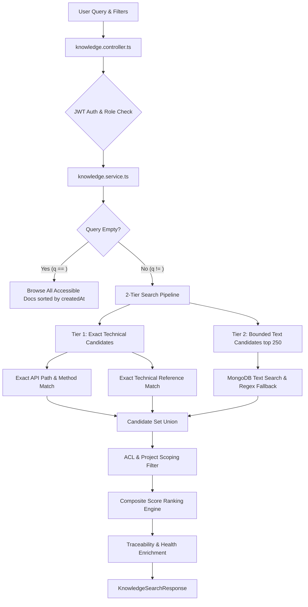
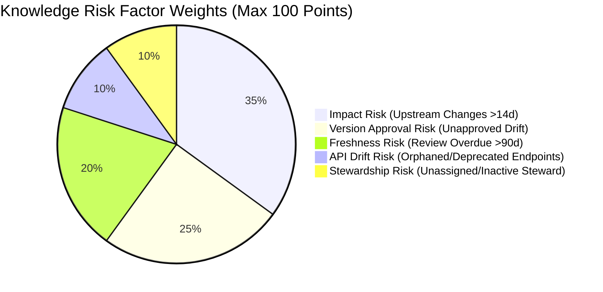

# Post-Completion Knowledge Search & Risk Radar Design Research

> **Document Status**: COMPLETED & VERIFIED  
> **Research Focus**: Knowledge Search Engine & Risk Radar / Knowledge Health Capabilities  
> **Output Artifact**: `docs/research/POST-COMPLETION-KNOWLEDGE-SEARCH-RISK-RADAR-DESIGN-RESEARCH.md`  
> **Baseline Commit**: `93cf49d` (Main Branch Synchronized)  

---

## 1. Executive Summary

This research document establishes the authoritative, empirical repository baseline for **Knowledge Search** and **Risk Radar / Knowledge Risk** capabilities in Documan. 

The objective is to guide the visual and interactive design for Google Stitch screen `12_KNOWLEDGE_SEARCH` without inventing non-existent AI/LLM, vector search, or synthetic security features.

Both Knowledge Search and Risk Radar are fully implemented in the Documan codebase with deterministic ranking algorithms, multi-factor risk calculations, project-level ACL isolation, traceability enrichment, and dedicated UI components.

---

## 2. Authoritative Repository Evidence

The following files represent the exact, verified implementation in the repository:

### Frontend Components & Pages (`apps/web/src/`)
- [`apps/web/src/pages/KnowledgeSearchPage.tsx`](file:///c:/MERN_STACK/Documan/documan/apps/web/src/pages/KnowledgeSearchPage.tsx) — Main Knowledge Search & Technical Knowledge Discovery Page.
- [`apps/web/src/components/KnowledgeRiskRadarPanel.tsx`](file:///c:/MERN_STACK/Documan/documan/apps/web/src/components/KnowledgeRiskRadarPanel.tsx) — Embeddable Project Technical Knowledge Risk Radar Panel.
- [`apps/web/src/components/KnowledgeHealthDrawer.tsx`](file:///c:/MERN_STACK/Documan/documan/apps/web/src/components/KnowledgeHealthDrawer.tsx) — Slide-out Document Health & Risk Factor Detail Drawer.
- [`apps/web/src/features/knowledge/knowledge.api.ts`](file:///c:/MERN_STACK/Documan/documan/apps/web/src/features/knowledge/knowledge.api.ts) — Web API client for Knowledge Search (`/knowledge/search`).
- [`apps/web/src/features/knowledge/knowledge.types.ts`](file:///c:/MERN_STACK/Documan/documan/apps/web/src/features/knowledge/knowledge.types.ts) — TypeScript interfaces for Knowledge Search results, ranking, and traceability.
- [`apps/web/src/features/documents/health.api.ts`](file:///c:/MERN_STACK/Documan/documan/apps/web/src/features/documents/health.api.ts) — Web API client for Document Health & Project Knowledge Risk.
- [`apps/web/src/features/documents/health.types.ts`](file:///c:/MERN_STACK/Documan/documan/apps/web/src/features/documents/health.types.ts) — TypeScript interfaces for Risk Distribution, Factors, and Remediations.

### Backend Services & Controllers (`apps/api/src/modules/`)
- [`apps/api/src/modules/knowledge/knowledge.routes.ts`](file:///c:/MERN_STACK/Documan/documan/apps/api/src/modules/knowledge/knowledge.routes.ts) — Express router for `GET /api/v1/knowledge/search`.
- [`apps/api/src/modules/knowledge/knowledge.controller.ts`](file:///c:/MERN_STACK/Documan/documan/apps/api/src/modules/knowledge/knowledge.controller.ts) — Controller handling validation & search execution.
- [`apps/api/src/modules/knowledge/knowledge.service.ts`](file:///c:/MERN_STACK/Documan/documan/apps/api/src/modules/knowledge/knowledge.service.ts) — Core 2-tier search execution, composite ranking formula, and traceability enrichment.
- [`apps/api/src/modules/documents/knowledge-risk-calculator.ts`](file:///c:/MERN_STACK/Documan/documan/apps/api/src/modules/documents/knowledge-risk-calculator.ts) — Deterministic 5-factor risk scoring engine.
- [`apps/api/src/modules/documents/knowledge-risk.service.ts`](file:///c:/MERN_STACK/Documan/documan/apps/api/src/modules/documents/knowledge-risk.service.ts) — Project knowledge risk aggregation & steward management service.

---

## 3. Knowledge Search Architecture

Knowledge Search operates as a centralized, high-density discovery engine designed to find trusted technical knowledge, verify authority, and trace system dependencies.



---

## 4. Knowledge Search Capabilities

### 4.1 Search Query Input & Fields
Knowledge Search evaluates queries against multiple technical fields:
- **Exact API Path & Method**: Matches paths like `/api/v1/auth/token` or `POST /api/v1/projects` via `ProjectApiEndpoint` and `DocumentEndpointLink`.
- **Exact Technical Identifiers**: Matches references like `ADR-001`, `RFC-2119`, or URLs via `DocumentReference`.
- **Document Title**: Exact string and token matches.
- **Tags & Keywords**: Matches normalized tag arrays (`tags`).
- **File Name**: Matches uploaded file names (`fileName`).
- **Description**: Substring text matches in document abstracts.

### 4.2 Deterministic Ranking Engine
The ranking formula (`knowledge.service.ts#L363-L450`) calculates a composite relevance score combining 4 weighted components:

$$\text{Composite Score} = \text{TechnicalScore} + \text{TextRelevanceScore} + \text{AuthorityScore} + \text{StewardshipScore}$$

1. **Technical Score** (Max 35 pts):
   - +35 pts for Exact HTTP Method & Path Match
   - +30 pts for Exact API Path Match
   - +25 pts for Exact Technical Reference Match
2. **Text Relevance Score** (Max 40 pts):
   - +40 pts for Exact Title Match
   - +30 pts for Title Token Match
   - +20 pts for Tag Match or Description Match
   - +10 pts for File Name Match
3. **Authority Score** ($-10$ to $+30$ pts):
   - +20 pts for `APPROVED` status (+10 for `IN_REVIEW`, +5 for `DRAFT`, -10 for `DEPRECATED`)
   - +10 pts if current version equals `lastApprovedVersion`
4. **Stewardship Score** (Max 10 pts):
   - +10 pts for Active Explicit Steward assigned
   - +5 pts for Active Owner fallback contact

### 4.3 Traceability Enrichment
Every result item is enriched with live system graph relationships:
- **Linked OpenAPI Endpoints**: HTTP method, path, summary, link status (`LINKED`).
- **Related Documents & Dependencies**: Document title, type (`DEPENDS_ON`, `SUPERSEDES`, `IMPLEMENTS`), status.

---

## 5. Risk Radar / Knowledge Risk Architecture

Risk Radar is **NOT** a standalone route, but a core analytical section and component embedded within:
1. **Knowledge Search Page** (`/knowledge/search`): Embedded risk badges on result cards.
2. **Project Details Page** (`/projects/:id`): Embedded `<KnowledgeRiskRadarPanel>` summarizing project-level documentation health.
3. **Document Details Page** (`/documents/:id`): Slide-out `<KnowledgeHealthDrawer>` providing granular factor breakdowns and steward transfer controls.

---

## 6. Risk Calculation & Data Sources

Documan calculates document risk using a **100% deterministic, 5-factor scoring engine** (`knowledge-risk-calculator.ts`):

$$\text{Risk Score} = \min(100, \text{Impact} + \text{Version} + \text{Freshness} + \text{APIDrift} + \text{Stewardship})$$

$$\text{Health Score} = 100 - \text{Risk Score}$$



### 6.1 The 5 Risk Factors

| Factor | Max Pts | Trigger Conditions | Remediation Code |
| :--- | :---: | :--- | :--- |
| **1. Impact Risk** | 35 | Active unverified upstream change impacts (`needsVerification = true`). Base: 20 pts for 1 source, 35 pts for $\ge 2$ sources. Aged penalty: +5 pts if unverified $>14$ days. | `VERIFY_UPSTREAM_IMPACT` |
| **2. Version Approval Risk** | 25 | Current version $v$ is newer than `lastApprovedVersion` (15 pts drift penalty) or document revision has never been approved (25 pts penalty). | `REVIEW_UNAPPROVED_VERSION` |
| **3. Freshness Risk** | 20 | Status is `STALE` (20 pts) OR `lastReviewedAt` / `createdAt` exceeds maximum unreviewed threshold (`maxUnreviewedDays`, default 90 days). | `REVIEW_DOCUMENT_FRESHNESS` |
| **4. API Drift Risk** | 10 | Linked OpenAPI endpoint path is orphaned (5 pts for 1, 10 pts for $\ge 2$) or marked deprecated in API specification (10 pts). | `RESOLVE_API_ENDPOINT_DRIFT` |
| **5. Stewardship Risk** | 10 | No explicit technical steward assigned (5 pts penalty for owner fallback); inactive or deleted steward/owner (10 pts penalty). | `ASSIGN_STEWARD` / `REASSIGN_INACTIVE_STEWARD` |

### 6.2 Risk Thresholds & Color Tokens

- **`LOW`** ($0 - 24$): Emerald Token Pair (`bg-emerald-100 text-emerald-800`)
- **`MEDIUM`** ($25 - 49$): Amber Token Pair (`bg-amber-100 text-amber-800`)
- **`HIGH`** ($50 - 74$): Orange Token Pair (`bg-orange-100 text-orange-800`)
- **`CRITICAL`** ($75 - 100$): Rose Token Pair (`bg-rose-100 text-rose-800`)

---

## 7. ACL / Privacy Boundaries

- **Project Scoping**: Both search and risk radar support filtering by `projectId`.
- **Role Enforcement**:
  - `admin` role has global visibility across all non-deleted documents.
  - `user` role is restricted strictly to owned documents (`ownerId === userId`) or explicitly shared documents (`DocumentShare`).
- **Stewardship Management**: Updating a document's technical steward (`updateDocumentSteward`) requires `EDIT` share permission, document ownership, or `admin` role.

---

## 8. Existing UI States

- **Loading State**: Rendered via `<LoadingSpinner label="Loading knowledge search results..." />` and skeleton loaders.
- **Empty State**: Rendered via `<EmptyState title="No matching technical knowledge found" description="..." />`.
- **Error State**: Banner displaying error message (`bg-red-50 text-red-700`).
- **Traceability Drawer State**: Expandable inline card accordion showing linked endpoints and dependency graph.
- **Pagination State**: Bottom controls (`<- Previous`, `Page X of Y`, `Next ->`) enabled when `totalPages > 1`.

---

## 9. Existing Routes & Navigation

- **Primary Route**: `/knowledge/search` (`KnowledgeSearchPage.tsx`)
- **Navigation Placement**: Navigation rail entry `Knowledge` under main workspace domain.

---

## 10. Stitch Design Requirements

The Google Stitch design for `12_KNOWLEDGE_SEARCH` must incorporate:
1. **Top Header**: "Authoritative Technical Knowledge Discovery" subtitle and quick project selector.
2. **Search Control Bar**: Search input with debounced querying, project dropdown filter, and search submit button.
3. **Risk Radar Summary Widget**: Embeddable project risk distribution header displaying average risk score, document counts, and risk distribution pills (`LOW`, `MEDIUM`, `HIGH`, `CRITICAL`).
4. **High-Density Result Cards**: Displaying title link, project tag, file size, owner, steward status, status badge, version badge, risk badge, "Why this result" relevance tags, and expandable traceability drawer.
5. **Interactive Health & Risk Drawer**: Slide-out panel showing 5-factor breakdown, health score gauge, steward assignment input, and recommended remediations.

---

## 11. Unsupported / Rejected Concepts

The following concepts are **NOT PRESENT** in the codebase and **MUST NOT** be added to the Stitch design:

- ❌ **NOT PRESENT**: AI Chatbot / Conversational Assistant
- ❌ **NOT PRESENT**: Vector / RAG (Retrieval-Augmented Generation) Search
- ❌ **NOT PRESENT**: Neural / Embedding Search Models
- ❌ **NOT PRESENT**: Automated AI Remediation / Auto-fixing
- ❌ **NOT PRESENT**: Generic CVE Security Vulnerability Scanner
- ❌ **NOT PRESENT**: Cloud Infrastructure APM Telemetry / Log Monitoring
- ❌ **NOT PRESENT**: Fabricated / Synthetic AI Confidence Percentages

---

## 12. Proposed `12_KNOWLEDGE_SEARCH` Screen Architecture

```text
12_KNOWLEDGE_SEARCH SCREEN ARCHITECTURE:
├── 12.00 Overview & Layout Architecture
├── 12.01 Primary Knowledge Search View (1440px Desktop)
│   ├── Top Header & Subtitle
│   ├── Search Query Input & Project Filter Select
│   ├── Risk Radar Summary Widget (Avg Score, Risk Distribution)
│   └── Result Card Roster (Relevance Reasons, Badges, Traceability Accordion)
├── 12.02 Traceability Drawer Expanded Variant
│   ├── Linked OpenAPI Endpoints List (Method, Path, Summary)
│   └── Related Document Dependencies List (Type, Status)
├── 12.03 Knowledge Health & Risk Drawer Slide-Out
│   ├── Health Score Gauge (0-100) & Risk Level Badge
│   ├── Operational Responsibility & Steward Assignment Input
│   ├── Recommended Remediation Actions List
│   └── 5-Factor Risk Breakdown (Impact, Version, Freshness, API Drift, Stewardship)
├── 12.04 Search States & Edge Cases
│   ├── Initial / Empty Query Browse State
│   ├── Loading State (LoadingSpinner)
│   ├── No Results Found (EmptyState)
│   └── Error Alert Banner State
└── 12.05 Responsive Viewport Variants (1024px, 800px, 375px Mobile)
```

---

## 13. Open Questions / Repository Verification Items

All core capabilities have been **100% VERIFIED** against the codebase:
- Search API & 2-tier ranking formula: **VERIFIED** ([`knowledge.service.ts`](file:///c:/MERN_STACK/Documan/documan/apps/api/src/modules/knowledge/knowledge.service.ts))
- 5-factor risk scoring engine: **VERIFIED** ([`knowledge-risk-calculator.ts`](file:///c:/MERN_STACK/Documan/documan/apps/api/src/modules/documents/knowledge-risk-calculator.ts))
- UI Page, Risk Radar Panel, and Health Drawer: **VERIFIED** ([`KnowledgeSearchPage.tsx`](file:///c:/MERN_STACK/Documan/documan/apps/web/src/pages/KnowledgeSearchPage.tsx), [`KnowledgeRiskRadarPanel.tsx`](file:///c:/MERN_STACK/Documan/documan/apps/web/src/components/KnowledgeRiskRadarPanel.tsx), [`KnowledgeHealthDrawer.tsx`](file:///c:/MERN_STACK/Documan/documan/apps/web/src/components/KnowledgeHealthDrawer.tsx))

---

## 14. Final Design Readiness Assessment

**Status: READY FOR GOOGLE STITCH DESIGN**  
The repository provides a complete, robust, and deterministic foundation for both Knowledge Search and Risk Radar. The design for `12_KNOWLEDGE_SEARCH` can now be created in Google Stitch with total fidelity to the actual product implementation.

---
