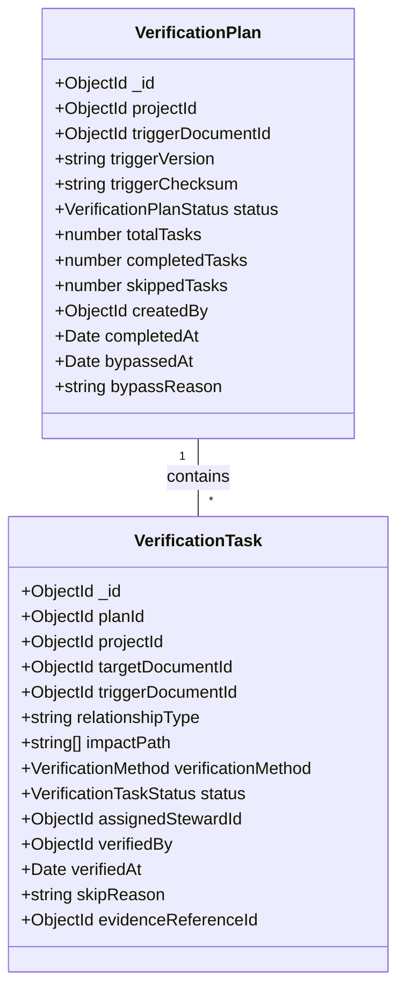
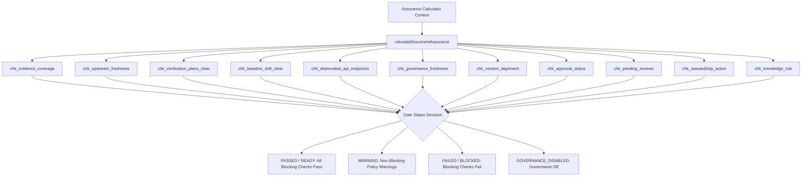

# Post-Completion Verification Plans & Compliance Checklists Design Research

> **Document Status**: COMPLETED & VERIFIED  
> **Research Focus**: Verification Plans, Task Checklists, Assurance Gates & Internal Policy Compliance  
> **Output Artifact**: `docs/research/POST-COMPLETION-VERIFICATION-PLANS-COMPLIANCE-DESIGN-RESEARCH.md`  
> **Baseline Commit**: `93cf49d` (Main Branch Synchronized)  

---

## 1. Executive Summary

This research document establishes the authoritative baseline for **Verification Plans & Compliance Checklists** in Documan.

The objective is to guide the visual and interactive design for Google Stitch screen `15_VERIFICATION_PLANS_AND_COMPLIANCE_CHECKLISTS` based strictly on verified repository implementations.

Documan provides an automated **Change Intelligence & Verification Engine**, a **Verification Plan lifecycle**, an interactive **Verification Task Checklist**, an **Assurance Gate Evaluator**, and a **Governance Waiver mechanism**. It ensures that whenever an authoritative technical document or contract is updated, all downstream dependencies undergo verified technical review, evidence renewal, or API alignment before approval release gates pass.

---

## 2. Authoritative Repository Evidence

### Frontend Components & Features (`apps/web/src/`)
- [`apps/web/src/components/VerificationPlanSection.tsx`](file:///c:/MERN_STACK/Documan/documan/apps/web/src/components/VerificationPlanSection.tsx) — Main verification workspace section embedded in `DocumentDetailsPage.tsx`.
- [`apps/web/src/components/AssuranceGateCard.tsx`](file:///c:/MERN_STACK/Documan/documan/apps/web/src/components/AssuranceGateCard.tsx) — Release gate status card displaying check summaries, blocking reasons, and active waivers.
- [`apps/web/src/components/EvidencePanel.tsx`](file:///c:/MERN_STACK/Documan/documan/apps/web/src/components/EvidencePanel.tsx) — Evidence coverage panel detailing linked items and orphan ratios.
- [`apps/web/src/features/governance/VerificationPlanCard.tsx`](file:///c:/MERN_STACK/Documan/documan/apps/web/src/features/governance/VerificationPlanCard.tsx) — Card component displaying plan status, progress counts, and bypass triggers.
- [`apps/web/src/features/governance/VerificationTaskChecklist.tsx`](file:///c:/MERN_STACK/Documan/documan/apps/web/src/features/governance/VerificationTaskChecklist.tsx) — Task checklist table for verifying, skipping, or reviewing downstream impact items.
- [`apps/web/src/features/governance/verification-plan.api.ts`](file:///c:/MERN_STACK/Documan/documan/apps/web/src/features/governance/verification-plan.api.ts) — Web API client for fetching plans, generating plans, updating task statuses, and bypassing plans.

### Backend Services & Models (`apps/api/src/modules/`)
- [`apps/api/src/modules/governance/verification-plan.model.ts`](file:///c:/MERN_STACK/Documan/documan/apps/api/src/modules/governance/verification-plan.model.ts) — Mongoose model for `VerificationPlan`.
- [`apps/api/src/modules/governance/verification-task.model.ts`](file:///c:/MERN_STACK/Documan/documan/apps/api/src/modules/governance/verification-task.model.ts) — Mongoose model for `VerificationTask`.
- [`apps/api/src/modules/governance/verification-plan.service.ts`](file:///c:/MERN_STACK/Documan/documan/apps/api/src/modules/governance/verification-plan.service.ts) — Core service generating plan checklists from Change Intelligence, updating task statuses, tracking completion, and executing plan bypasses.
- [`apps/api/src/modules/governance/verification-plan.routes.ts`](file:///c:/MERN_STACK/Documan/documan/apps/api/src/modules/governance/verification-plan.routes.ts) — Express routes for `/api/v1/projects/:projectId/verification-plans`, `/api/v1/verification-plans/:planId`, and `/api/v1/verification-tasks/:taskId/status`.
- [`apps/api/src/modules/governance/assurance-calculator.ts`](file:///c:/MERN_STACK/Documan/documan/apps/api/src/modules/governance/assurance-calculator.ts) — Deterministic 11-check Assurance Gate Evaluator (`calculateDocumentAssurance`).

---

## 3. Verification Model

In Documan, **Verification** is the process of confirming that a downstream document, API specification, or technical contract remains valid, accurate, and compliant following an upstream change.



---

## 4. Verification Plans & Checklists

### Plan Generation Trigger
- **Automatic Generation**: Triggered automatically via `createVerificationPlanInternal` whenever a document version is created or published (`triggerDocumentId`, `triggerVersion`).
- **Manual Generation**: Can be manually generated via `POST /api/v1/documents/:documentId/verification-plans/generate` in `VerificationPlanSection.tsx`.

### Plan Status Model (`VerificationPlanStatus`)
1. **`PENDING`**: Plan generated with open tasks awaiting verification.
2. **`IN_PROGRESS`**: Tasks are actively being updated (`VERIFIED`, `SKIPPED`, `IN_REVIEW`).
3. **`COMPLETED`**: All tasks verified (`completedTasks === totalTasks`).
4. **`COMPLETED_WITH_SKIPS`**: All tasks finished, but at least one task was skipped (`skippedTasks > 0`).
5. **`BYPASSED`**: Plan explicitly bypassed with mandatory `bypassReason` (requires Project Owner or Admin authority).

---

## 5. Verification Requirements & Methods

Each `VerificationTask` represents a specific downstream verification requirement assigned to a technical steward (`verification-task.model.ts#L3-L9`):

### Verification Methods (`VerificationMethod`)
- **`EVIDENCE_RENEWAL`**: Re-evaluating evidence items or attestation attachments.
- **`API_ALIGNMENT`**: Verifying OpenAPI spec path, method, and JSON schema alignment.
- **`TECHNICAL_REVIEW`**: Peer review of technical content and architectural decision records.
- **`CONTENT_AUDIT`**: Audit of document metadata, versioning, or specification text.

### Task Status Lifecycle (`VerificationTaskStatus`)
- **`OPEN`**: Initial task state requiring steward attention.
- **`IN_REVIEW`**: Currently under steward evaluation.
- **`VERIFIED`**: Verified by assigned steward, document owner, project owner, or admin (`verifiedBy`, `verifiedAt`, optional `evidenceReferenceId`).
- **`SKIPPED`**: Skipped with mandatory `skipReason` (requires Target Document Owner, Project Owner, or Admin authority).

---

## 6. Verification Results & Audit Trail

Updating a task status (`updateVerificationTaskStatus`) generates an immutable audit log entry in `DocumentAudit`:
- Action: `VERIFICATION_TASK_COMPLETED` or `VERIFICATION_TASK_SKIPPED`.
- When all tasks in a plan are completed or skipped, the plan transitions to `COMPLETED` or `COMPLETED_WITH_SKIPS` and logs `VERIFICATION_PLAN_COMPLETED`.
- Bypassing a plan logs `VERIFICATION_PLAN_BYPASSED` with the `bypassReason`.

---

## 7. Evidence & Traceability Integration

- **Evidence Linking**: Tasks can cite an `evidenceReferenceId` pointing to a specific `EvidenceItem`.
- **Evidence Panel** (`EvidencePanel.tsx`): Displays evidence coverage score %, orphaned endpoint counts, and stale evidence items.

---

## 8. Assurance Gate Semantics

The Assurance Gate Evaluator (`assurance-calculator.ts`) evaluates 11 policy checks to determine approval release readiness:



### Supported Gate Statuses (`AssuranceStatus`)
1. **`PASSED` / `READY`**: All blocking checks pass.
2. **`WARNING`**: Non-blocking policy warnings exist (e.g., stale review window or unverified non-blocking upstream impact).
3. **`FAILED` / `BLOCKED`**: At least one blocking check fails (e.g., version misalignment, unapproved changes, or unresolved verification tasks).
4. **`GOVERNANCE_DISABLED`**: Project governance settings disabled; no gate enforced.

---

## 9. Compliance Meaning & Product Boundaries

> **CRITICAL DOMAIN BOUNDARY**:  
> **Documan compliance is strictly INTERNAL GOVERNANCE & TECHNICAL POLICY COMPLIANCE.**

- Documan measures technical evidence coverage %, baseline drift alignment, unverified upstream change impacts, active steward assignments, API endpoint drift, and document review freshness.
- **NO EXTERNAL REGULATORY COMPLIANCE FRAMEWORKS** exist in the repository:
  > **External regulatory compliance framework (SOC 2, ISO 27001, GDPR, HIPAA, PCI DSS, NIST): NOT PRESENT.**

---

## 10. Relationship to Change Proposals & Packages

- **Change Proposals (Phase 13)**: Ephemeral simulation predicts required verification tasks (`predictedVerificationTasks`).
- **Change Packages (Phase 14)**: Package simulation aggregates deduplicated verification requirements across all constituent proposals (`predictedVerificationTasks`).
- **Phase 15 (Verification Plans)**: When proposals/packages are accepted and document versions are published, `createVerificationPlanInternal` generates the actual persisted `VerificationPlan` and `VerificationTask` checklist.

---

## 11. Document Detail Integration

Verification is integrated directly into `DocumentDetailsPage.tsx`:
- **Header**: Renders `AssuranceGateCard` showing release gate readiness badge (`PASSED`, `WARNING`, `BLOCKED`) and active waivers.
- **Body**: Renders `VerificationPlanSection` with plan selector cards, task checklist table (`VerificationTaskChecklist`), and bypass modal.
- **Side Panel**: Renders `EvidencePanel` detailing coverage score % and linked evidence items.

---

## 12. Governance Relationship & Waiver Management

- **Governance Waivers**: Authoritative project owners or admins can grant waivers (`GOVERNANCE_WAIVER_GRANTED`) for specific failed checks (e.g. `chk_upstream_freshness`).
- Active waivers transition waivable failed checks to `WAIVED`, unblocking release gate evaluations.

---

## 13. ACL & Security Boundaries

- **Task Status Updates**: Updating a task to `IN_REVIEW` or `VERIFIED` requires Assigned Steward, Target Document Owner, Project Owner, or Admin authority.
- **Task Skipping**: Skipping a task (`SKIPPED`) with a skip reason requires Target Document Owner, Project Owner, or Admin authority.
- **Plan Bypass**: Bypassing an entire plan (`BYPASSED`) requires Project Owner or Admin authority with a mandatory 10+ character justification.

---

## 14. Existing Routes & Navigation Placement

- **Document Details Page** (`/documents/:id`): Primary workspace for viewing and executing verification plans for a document.
- **Project Details Page** (`/projects/:id`): Renders project-level verification plan roster via `getProjectVerificationPlans(projectId)`.

---

## 15. Existing UI States

- **Loading State**: `"Loading verification plans..."`.
- **Empty State**: `"No active verification plans for this project..."`.
- **Populated Checklist State**: Plan cards, task checklist table (`OPEN`, `IN_REVIEW`, `VERIFIED`, `SKIPPED`), progress bars (`completedTasks / totalTasks`).
- **Plan Bypassed State**: Purple badge (`BYPASSED`) with bypass reason and bypasser identity.
- **Plan Completed State**: Emerald badge (`COMPLETED`) or Amber badge (`COMPLETED_WITH_SKIPS`).

---

## 16. Existing Shared UI Patterns

Reuses existing design primitives:
- `<Button>` (Primary `blue-600` for Generate Plan, Purple for Bypass)
- `<Badge>` (Status indicators: `PENDING`, `IN_PROGRESS`, `COMPLETED`, `COMPLETED_WITH_SKIPS`, `BYPASSED`)
- `<Card>` (Dark slate containers `bg-slate-900 border-slate-800`)
- `VerificationTaskChecklist` (Table with inline status dropdowns and skip reason inputs)

---

## 17. Boundary with Later Release Certification Domains

> **CRITICAL DOMAIN BOUNDARY**:  
> **Verification Plans & Compliance Checklists is NOT System Release Certification.**

- Phase 15 handles document-level and project-level verification tasks, evidence renewal, and assurance gate checks.
- System Release Certificates (`T_cert` minting), Release Certificate Lineage, and Release Compliance Drift Audits belong strictly to later system release domains.

---

## 18. Unsupported / Rejected Concepts

The following concepts are **NOT PRESENT** in the codebase and **MUST NOT** be added to the Stitch design:

- ❌ **NOT PRESENT**: External Regulatory Compliance Dashboards (SOC 2, ISO 27001, GDPR, HIPAA, PCI DSS, NIST)
- ❌ **NOT PRESENT**: Jira / Kanban Task Execution Boards
- ❌ **NOT PRESENT**: CI/CD Test Runner Integrations or Automated Code Execution
- ❌ **NOT PRESENT**: AI Compliance Assistant / LLM Auto-verification
- ❌ **NOT PRESENT**: System-Wide Release Certificate Minting (Belongs to later release domain)

---

## 19. Proposed `15_VERIFICATION_PLANS_AND_COMPLIANCE_CHECKLISTS` Architecture

```text
15_VERIFICATION_PLANS_AND_COMPLIANCE_CHECKLISTS ARCHITECTURE:
├── 15.00 Overview & Layout Architecture
├── 15.01 Document Verification Workspace (DocumentDetailsPage)
│   ├── Assurance Gate Status Card (PASSED, WARNING, BLOCKED, Active Waivers)
│   ├── Evidence Coverage Panel (Coverage Score %, Orphaned API Links)
│   └── Verification Plans Section Header & "Generate Plan" Action Trigger
├── 15.02 Verification Plan Selector Cards Roster
│   ├── Trigger Document Version & Checksum Tag (e.g. v1.1.0)
│   ├── Plan Progress Bar (e.g. 3 of 5 Tasks Verified)
│   └── Plan Status Badge (PENDING, IN_PROGRESS, COMPLETED, COMPLETED_WITH_SKIPS, BYPASSED)
├── 15.03 Verification Task Checklist Table
│   ├── Target Document Title & Relationship Type (DEPENDS_ON, REFERENCES)
│   ├── Verification Method Badge (EVIDENCE_RENEWAL, API_ALIGNMENT, TECHNICAL_REVIEW, CONTENT_AUDIT)
│   ├── Assigned Steward Avatar & Name
│   └── Inline Task Status Controls (OPEN, IN_REVIEW, VERIFIED, SKIPPED with Reason)
├── 15.04 Plan Bypass Modal (Project Owner / Admin Only)
│   ├── Bypass Justification Input (Minimum 10 Characters Required)
│   └── Confirm Bypass Trigger Button
├── 15.05 Verification States & Edge Cases
│   ├── Loading Verification Plans State
│   ├── Empty Verification Plans Placeholder
│   ├── Completed / Bypassed Plan Summary Banner
│   └── Permission Error Banner (Unauthorized Skip / Bypass Attempt)
└── 15.06 Responsive Viewport Variants (1024px, 800px, 375px Mobile)
```

---

## 20. Open Questions / Verification Items

All core capabilities have been **100% VERIFIED** against the codebase:
- `VerificationPlan` & `VerificationTask` models: **VERIFIED** ([`verification-plan.model.ts`](file:///c:/MERN_STACK/Documan/documan/apps/api/src/modules/governance/verification-plan.model.ts), [`verification-task.model.ts`](file:///c:/MERN_STACK/Documan/documan/apps/api/src/modules/governance/verification-task.model.ts))
- Automated plan generation & task status updating: **VERIFIED** ([`verification-plan.service.ts`](file:///c:/MERN_STACK/Documan/documan/apps/api/src/modules/governance/verification-plan.service.ts))
- 11-check Assurance Gate Evaluator: **VERIFIED** ([`assurance-calculator.ts`](file:///c:/MERN_STACK/Documan/documan/apps/api/src/modules/governance/assurance-calculator.ts))
- UI components, checklist & bypass modal: **VERIFIED** ([`VerificationPlanSection.tsx`](file:///c:/MERN_STACK/Documan/documan/apps/web/src/components/VerificationPlanSection.tsx), [`VerificationTaskChecklist.tsx`](file:///c:/MERN_STACK/Documan/documan/apps/web/src/features/governance/VerificationTaskChecklist.tsx), [`AssuranceGateCard.tsx`](file:///c:/MERN_STACK/Documan/documan/apps/web/src/components/AssuranceGateCard.tsx))

---

## 21. Final Design Readiness Assessment

**Status: READY FOR GOOGLE STITCH DESIGN**  
The repository provides a complete, robust, and deterministic foundation for Verification Plans, Task Checklists, Assurance Gates, and Internal Governance Compliance. The design for `15_VERIFICATION_PLANS_AND_COMPLIANCE_CHECKLISTS` can now be created in Google Stitch with total fidelity to the actual product implementation.

---
